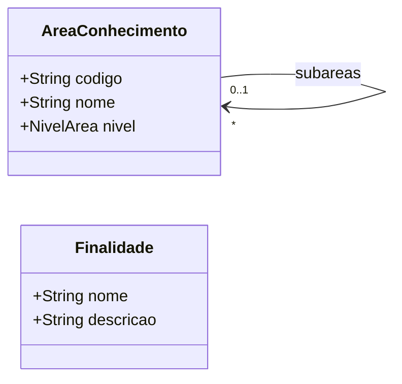

# Modelo Estrutural - Classificacoes

[M008](../README.md) | [Backlog](backlog.md)

## Entidades

| Entidade | Documento | Responsabilidade |
|----------|-----------|------------------|
| AreaConhecimento | [area-conhecimento](area-conhecimento/README.md) | Classificacao CNPq de areas de conhecimento |
| Finalidade | [finalidade](finalidade/README.md) | Classificacao transversal de proposito institucional |

## Diagrama

