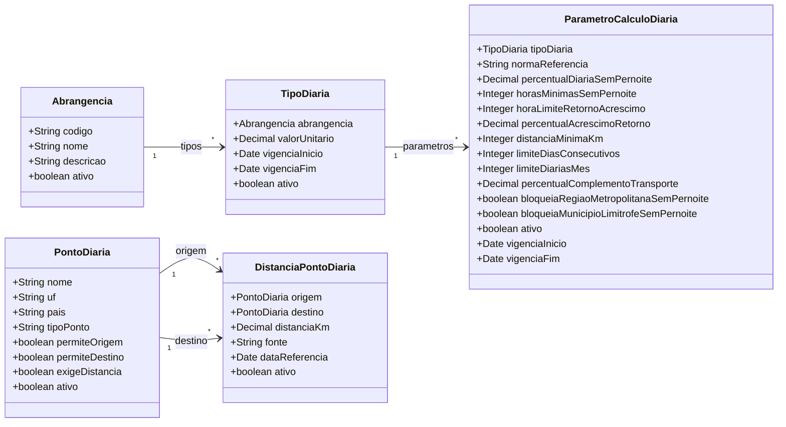

# Modelo Estrutural - Diarias

[M008](../README.md) | [Backlog](backlog.md)

## Entidades

| Entidade | Responsabilidade |
|----------|------------------|
| Abrangencia | Classifica o deslocamento para diaria |
| TipoDiaria | Define valor vigente, vigencia e abrangencia da viagem |
| ParametroCalculoDiaria | Define parametros normativos vigentes vinculados a um TipoDiaria |
| PontoDiaria | Define pontos selecionaveis como origem ou destino da viagem |
| DistanciaPontoDiaria | Mantem tabela/cache de distancias entre pontos para viagens dentro do Estado |

## Diagrama



## Dicionario de Dados

### Abrangencia

`Abrangencia` e a classe corporativa que classifica o deslocamento para diaria.

| Atributo | Definicao | Obrig. | Tipo | Dominio | Tamanho | Unico |
|----------|-----------|--------|------|---------|---------|-------|
| codigo | Codigo canonico da abrangencia | Sim | String | DENTRO_ESTADO, NACIONAL, INTERNACIONAL | 40 | Sim |
| nome | Nome de exibicao | Sim | String | Ex: Dentro do Estado | 150 | |
| descricao | Descricao da abrangencia | Nao | String | | 500 | |
| ativo | Indica se a abrangencia esta ativa para novos tipos de diaria | Sim | Boolean | true/false | | |

### TipoDiaria

`TipoDiaria` e o cadastro corporativo do valor vigente de diaria, sua vigencia e abrangencia da viagem.

| Atributo | Definicao | Obrig. | Tipo | Dominio | Tamanho | Unico |
|----------|-----------|--------|------|---------|---------|-------|
| abrangencia | Abrangencia administrativa do deslocamento | Sim | FK -> Abrangencia | Via `tipos` | | |
| valorUnitario | Valor unitario vigente da diaria | Sim | Decimal | Maior que zero | | |
| vigenciaInicio | Inicio da vigencia | Sim | Date | | | |
| vigenciaFim | Fim da vigencia | Nao | Date | | | |
| ativo | Indica se o cadastro esta ativo | Sim | Boolean | true/false | | |

### ParametroCalculoDiaria

`ParametroCalculoDiaria` e o cadastro corporativo dos parametros normativos vigentes vinculados a um `TipoDiaria`, usados pelo M003 para calcular quantidade, acrescimos, bloqueios e memoria de calculo da diaria.

| Atributo | Definicao | Obrig. | Tipo | Dominio | Tamanho | Unico |
|----------|-----------|--------|------|---------|---------|-------|
| tipoDiaria | Tipo de diaria ao qual os parametros pertencem | Sim | FK -> TipoDiaria | Via `parametros` | | |
| normaReferencia | Decreto, resolucao ou ato normativo que fundamenta os parametros | Sim | String | Ex: Decreto ES no 5533-R/2023 | 200 | |
| percentualDiariaSemPernoite | Percentual aplicado quando nao ha pernoite e o afastamento atinge minimo normativo | Sim | Decimal | Ex: 0.40 | | |
| horasMinimasSemPernoite | Horas minimas para diaria sem pernoite | Sim | Integer | Ex: 6 | | |
| horaLimiteRetornoAcrescimo | Hora de retorno a partir da qual ha acrescimo normativo | Sim | Integer | Ex: 14 | | |
| percentualAcrescimoRetorno | Percentual acrescido quando retorno ocorrer apos o horario limite | Sim | Decimal | Ex: 0.40 | | |
| distanciaMinimaKm | Distancia minima para elegibilidade quando aplicavel | Nao | Integer | Ex: 150 | | |
| limiteDiasConsecutivos | Limite de dias consecutivos com diaria | Nao | Integer | Ex: 15 | | |
| limiteDiariasMes | Limite mensal de diarias por beneficiario | Nao | Integer | Ex: 15 | | |
| percentualComplementoTransporte | Percentual de complemento para transporte urbano quando aplicavel | Nao | Decimal | Ex: 0.20 | | |
| bloqueiaRegiaoMetropolitanaSemPernoite | Indica bloqueio para regiao metropolitana sem pernoite | Sim | Boolean | true/false | | |
| bloqueiaMunicipioLimitrofeSemPernoite | Indica bloqueio para municipio limitrofe sem pernoite | Sim | Boolean | true/false | | |
| ativo | Indica se os parametros estao vigentes para novas consultas | Sim | Boolean | true/false | | |
| vigenciaInicio | Inicio da vigencia normativa | Sim | Date | | | |
| vigenciaFim | Fim da vigencia normativa | Nao | Date | | | |

### PontoDiaria

`PontoDiaria` e o cadastro corporativo dos pontos selecionaveis como origem ou destino da diaria. Para municipios do Espirito Santo, o ponto pode participar da tabela de distancias. Para destinos especiais, como fora do Estado ou fora do Pais, o ponto serve apenas para classificar a abrangencia e nao exige distancia.

| Atributo | Definicao | Obrig. | Tipo | Dominio | Tamanho | Unico |
|----------|-----------|--------|------|---------|---------|-------|
| nome | Nome exibido para selecao | Sim | String | Ex: Vitoria, Linhares, Fora do Estado, Fora do Pais | 150 | |
| uf | Unidade federativa do ponto, quando aplicavel | Nao | String | Ex: ES | 2 | |
| pais | Pais do ponto | Sim | String | Ex: Brasil | 100 | |
| tipoPonto | Tipo operacional do ponto | Sim | String | MUNICIPIO_ES, FORA_ESTADO, FORA_PAIS | 40 | |
| permiteOrigem | Indica se o ponto pode ser usado como origem | Sim | Boolean | true/false | | |
| permiteDestino | Indica se o ponto pode ser usado como destino | Sim | Boolean | true/false | | |
| exigeDistancia | Indica se a solicitacao deve obter distancia para o par origem-destino | Sim | Boolean | true/false | | |
| ativo | Indica se o ponto esta ativo para novas solicitacoes | Sim | Boolean | true/false | | |

### DistanciaPontoDiaria

`DistanciaPontoDiaria` e a tabela corporativa/cache de distancia rodoviaria entre dois pontos. Ela e usada pelo M003 na memoria de calculo de solicitacoes dentro do Estado, especialmente quando a regra normativa depende de distancia minima.

| Atributo | Definicao | Obrig. | Tipo | Dominio | Tamanho | Unico |
|----------|-----------|--------|------|---------|---------|-------|
| origem | Ponto de origem | Sim | FK -> PontoDiaria | `permiteOrigem = true` | | Com `destino` |
| destino | Ponto de destino | Sim | FK -> PontoDiaria | `permiteDestino = true` | | Com `origem` |
| distanciaKm | Distancia rodoviaria em quilometros | Sim | Decimal | Maior ou igual a zero | | |
| fonte | Origem da informacao de distancia | Sim | String | GOOGLE_ROUTES, TABELA_OFICIAL, MANUAL, SEP_ES | 40 | |
| dataReferencia | Data em que a distancia foi calculada ou validada | Sim | Date | | | |
| ativo | Indica se a distancia esta ativa para calculos | Sim | Boolean | true/false | | |

## Regras

- A abrangencia da viagem e definida pela classe corporativa `Abrangencia`.
- `TipoDiaria` sempre possui uma abrangencia.
- Nao pode haver vigencia ativa sobreposta para a mesma abrangencia.
- `Abrangencia.codigo` deve ser unico.
- `ParametroCalculoDiaria` sempre pertence a exatamente um `TipoDiaria`.
- Nao pode haver `ParametroCalculoDiaria` ativo com vigencia sobreposta para o mesmo `TipoDiaria`.
- M003 consome `TipoDiaria` e `ParametroCalculoDiaria` por referencia e grava snapshots na `SolicitacaoDiaria`.
- `PontoDiaria` com `tipoPonto = MUNICIPIO_ES` pode ser usado como origem e destino.
- `PontoDiaria` com `tipoPonto = FORA_ESTADO` ou `FORA_PAIS` deve ser usado apenas como destino especial.
- `DistanciaPontoDiaria` deve ser preenchida apenas para pares entre municipios do Espirito Santo.
- Para viagens dentro do Estado, M003 deve buscar a distancia primeiro em `DistanciaPontoDiaria`; se nao houver par ativo, pode acionar provedor externo autorizado e gravar/cachear o resultado.
- Para destinos `FORA_ESTADO` e `FORA_PAIS`, M003 nao usa `DistanciaPontoDiaria` para elegibilidade, pois a abrangencia ja define o tipo de diaria.
- Nao pode existir mais de uma distancia ativa para o mesmo par `origem` + `destino`.
- Quando a distancia for simetrica, o sistema pode armazenar os dois sentidos ou normalizar a consulta para reutilizar o mesmo par, desde que a regra esteja consistente no servico de calculo.

## Exemplos de Carga

### Abrangencias

```json
{
  "abrangencias": [
    {
      "id": "ABR-001",
      "codigo": "DENTRO_ESTADO",
      "nome": "Dentro do Estado",
      "descricao": "Deslocamento dentro do Espirito Santo.",
      "ativo": true
    },
    {
      "id": "ABR-002",
      "codigo": "NACIONAL",
      "nome": "Nacional",
      "descricao": "Deslocamento para outros estados do Brasil.",
      "ativo": true
    },
    {
      "id": "ABR-003",
      "codigo": "INTERNACIONAL",
      "nome": "Internacional",
      "descricao": "Deslocamento para fora do Brasil.",
      "ativo": true
    }
  ]
}
```

## Referência funcional de Diária

### Contexto

Diária é um recurso financeiro destinado a cobrir despesas com alimentação, hospedagem e locomoção decorrentes de afastamento da sede, em caráter eventual, para outro ponto do estado, do país ou do exterior relacionadas a atividades de pesquisa, inovação, extensão e capacitação vinculadas aos objetivos do projeto financiado apoiado pela Fundação de Amparo à Pesquisa e Inovação do Espírito Santo (FAPES).

Os valores atuais de Diária são:

- Dentro do Estado do Espírito Santo: R$ 220,00
- Fora do Estado (Brasil): R$ 450,00
- Internacional: US$ 220,00 a US$ 550,00, conforme o grupo de países de destino

Esses valores devem ser parametrizados para quando forem alterados no futuro.

### Comportamento

- Para o projeto usar Diária, ele deve ter esse recurso disponibilizado em seu Edital.
- Se o valor total da Diária for maior que o valor que o projeto tiver disponível para essa categoria, o coordenador deve fazer primeiro o Remanejamento de Recursos, pegar um valor que não usou em outra categoria e incluir em Diária.
- Antes de realizar a Diária é necessário fazer a Solicitação. Nela todas as informações ficam registradas.
- O Bolsista selecionado para a Diária deve fazer o aceite.
- A distância mínima para solicitar uma Diária é de 150km.
- Diária deve ter o período máximo de 15 dias por viagem dentro de um mês (Decreto Estadual e Norma Itens Financiáveis). Pode permitir mais de 15 dias entre um mês e outro, pois o Decreto não especifica essa situação.
- Diária é destinada apenas a membros do projeto. É proibido pagar diária para terceiros.
- O Coordenador deve retirar o valor da Diária da conta do Projeto e enviar para a conta Banestes do Bolsista.
- Após a data da Diária, o Bolsista ou Coordenador devem comprovar com texto e imagem que foram na viagem.
- Após o valor sair da conta do projeto, a Diária acontecer e seu relatório ser enviado, o Coordenador deve em Prestação de Contas Financeira associar a saída do valor a Diária solicitada.

### Pontos de Diaria

| ID | Nome | UF | Pais | Tipo do Ponto | Origem | Destino | Exige Distancia | Ativo |
|----|------|----|------|---------------|--------|---------|-----------------|-------|
| PTO-ES-001 | Vitoria | ES | Brasil | MUNICIPIO_ES | Sim | Sim | Sim | Sim |
| PTO-ES-002 | Linhares | ES | Brasil | MUNICIPIO_ES | Sim | Sim | Sim | Sim |
| PTO-ES-003 | Cachoeiro de Itapemirim | ES | Brasil | MUNICIPIO_ES | Sim | Sim | Sim | Sim |
| PTO-ES-004 | Serra | ES | Brasil | MUNICIPIO_ES | Sim | Sim | Sim | Sim |
| PTO-ES-005 | Vila Velha | ES | Brasil | MUNICIPIO_ES | Sim | Sim | Sim | Sim |
| PTO-EXT-001 | Fora do Estado | | Brasil | FORA_ESTADO | Nao | Sim | Nao | Sim |
| PTO-EXT-002 | Fora do Pais | | | FORA_PAIS | Nao | Sim | Nao | Sim |

```json
{
  "pontosDiaria": [
    {
      "id": "PTO-ES-001",
      "nome": "Vitoria",
      "uf": "ES",
      "pais": "Brasil",
      "tipoPonto": "MUNICIPIO_ES",
      "permiteOrigem": true,
      "permiteDestino": true,
      "exigeDistancia": true,
      "ativo": true
    },
    {
      "id": "PTO-ES-002",
      "nome": "Linhares",
      "uf": "ES",
      "pais": "Brasil",
      "tipoPonto": "MUNICIPIO_ES",
      "permiteOrigem": true,
      "permiteDestino": true,
      "exigeDistancia": true,
      "ativo": true
    },
    {
      "id": "PTO-ES-003",
      "nome": "Cachoeiro de Itapemirim",
      "uf": "ES",
      "pais": "Brasil",
      "tipoPonto": "MUNICIPIO_ES",
      "permiteOrigem": true,
      "permiteDestino": true,
      "exigeDistancia": true,
      "ativo": true
    },
    {
      "id": "PTO-ES-004",
      "nome": "Serra",
      "uf": "ES",
      "pais": "Brasil",
      "tipoPonto": "MUNICIPIO_ES",
      "permiteOrigem": true,
      "permiteDestino": true,
      "exigeDistancia": true,
      "ativo": true
    },
    {
      "id": "PTO-ES-005",
      "nome": "Vila Velha",
      "uf": "ES",
      "pais": "Brasil",
      "tipoPonto": "MUNICIPIO_ES",
      "permiteOrigem": true,
      "permiteDestino": true,
      "exigeDistancia": true,
      "ativo": true
    },
    {
      "id": "PTO-EXT-001",
      "nome": "Fora do Estado",
      "uf": null,
      "pais": "Brasil",
      "tipoPonto": "FORA_ESTADO",
      "permiteOrigem": false,
      "permiteDestino": true,
      "exigeDistancia": false,
      "ativo": true
    },
    {
      "id": "PTO-EXT-002",
      "nome": "Fora do Pais",
      "uf": null,
      "pais": null,
      "tipoPonto": "FORA_PAIS",
      "permiteOrigem": false,
      "permiteDestino": true,
      "exigeDistancia": false,
      "ativo": true
    }
  ]
}
```

### Distancias entre Pontos

```json
{
  "distanciasPontoDiaria": [
    {
      "id": "DST-ES-001",
      "origemId": "PTO-ES-001",
      "destinoId": "PTO-ES-002",
      "distanciaKm": 133.86,
      "fonte": "GOOGLE_ROUTES",
      "dataReferencia": "2026-05-01",
      "ativo": true
    },
    {
      "id": "DST-ES-002",
      "origemId": "PTO-ES-001",
      "destinoId": "PTO-ES-003",
      "distanciaKm": 143.40,
      "fonte": "GOOGLE_ROUTES",
      "dataReferencia": "2026-05-01",
      "ativo": true
    },
    {
      "id": "DST-ES-003",
      "origemId": "PTO-ES-001",
      "destinoId": "PTO-ES-004",
      "distanciaKm": 26.22,
      "fonte": "GOOGLE_ROUTES",
      "dataReferencia": "2026-05-01",
      "ativo": true
    },
    {
      "id": "DST-ES-004",
      "origemId": "PTO-ES-001",
      "destinoId": "PTO-ES-005",
      "distanciaKm": 6.40,
      "fonte": "GOOGLE_ROUTES",
      "dataReferencia": "2026-05-01",
      "ativo": true
    },
    {
      "id": "DST-ES-005",
      "origemId": "PTO-ES-002",
      "destinoId": "PTO-ES-003",
      "distanciaKm": 270.50,
      "fonte": "GOOGLE_ROUTES",
      "dataReferencia": "2026-05-01",
      "ativo": true
    },
    {
      "id": "DST-ES-006",
      "origemId": "PTO-ES-002",
      "destinoId": "PTO-ES-004",
      "distanciaKm": 108.70,
      "fonte": "GOOGLE_ROUTES",
      "dataReferencia": "2026-05-01",
      "ativo": true
    },
    {
      "id": "DST-ES-007",
      "origemId": "PTO-ES-002",
      "destinoId": "PTO-ES-005",
      "distanciaKm": 140.90,
      "fonte": "GOOGLE_ROUTES",
      "dataReferencia": "2026-05-01",
      "ativo": true
    },
    {
      "id": "DST-ES-008",
      "origemId": "PTO-ES-003",
      "destinoId": "PTO-ES-004",
      "distanciaKm": 167.80,
      "fonte": "GOOGLE_ROUTES",
      "dataReferencia": "2026-05-01",
      "ativo": true
    },
    {
      "id": "DST-ES-009",
      "origemId": "PTO-ES-003",
      "destinoId": "PTO-ES-005",
      "distanciaKm": 137.20,
      "fonte": "GOOGLE_ROUTES",
      "dataReferencia": "2026-05-01",
      "ativo": true
    },
    {
      "id": "DST-ES-010",
      "origemId": "PTO-ES-004",
      "destinoId": "PTO-ES-005",
      "distanciaKm": 34.10,
      "fonte": "GOOGLE_ROUTES",
      "dataReferencia": "2026-05-01",
      "ativo": true
    }
  ]
}
```

### Tipos de Diaria

```json
{
  "tiposDiaria": [
    {
      "id": "DIA-2026-001",
      "abrangenciaId": "ABR-001",
      "valorUnitario": 260.00,
      "vigenciaInicio": "2026-05-01",
      "vigenciaFim": null,
      "ativo": true
    },
    {
      "id": "DIA-2026-002",
      "abrangenciaId": "ABR-002",
      "valorUnitario": 320.00,
      "vigenciaInicio": "2026-05-01",
      "vigenciaFim": null,
      "ativo": true
    },
    {
      "id": "DIA-2026-003",
      "abrangenciaId": "ABR-003",
      "valorUnitario": 620.00,
      "vigenciaInicio": "2026-05-01",
      "vigenciaFim": null,
      "ativo": true
    }
  ]
}
```

### Parametros de Calculo

```json
{
  "parametrosCalculoDiaria": [
    {
      "id": "PCD-2026-001",
      "tipoDiariaId": "DIA-2026-001",
      "normaReferencia": "Decreto ES no 5533-R/2023",
      "percentualDiariaSemPernoite": 0.5,
      "horasMinimasSemPernoite": 6,
      "horaLimiteRetornoAcrescimo": 14,
      "percentualAcrescimoRetorno": 0.5,
      "distanciaMinimaKm": 150,
      "limiteDiasConsecutivos": 15,
      "limiteDiariasMes": 15,
      "percentualComplementoTransporte": 0.0,
      "bloqueiaRegiaoMetropolitanaSemPernoite": true,
      "bloqueiaMunicipioLimitrofeSemPernoite": true,
      "vigenciaInicio": "2026-05-01",
      "vigenciaFim": null,
      "ativo": true
    },
    {
      "id": "PCD-2026-002",
      "tipoDiariaId": "DIA-2026-002",
      "normaReferencia": "Decreto ES no 5533-R/2023",
      "percentualDiariaSemPernoite": 0.5,
      "horasMinimasSemPernoite": 6,
      "horaLimiteRetornoAcrescimo": 14,
      "percentualAcrescimoRetorno": 0.5,
      "distanciaMinimaKm": 150,
      "limiteDiasConsecutivos": 15,
      "limiteDiariasMes": 15,
      "percentualComplementoTransporte": 0.2,
      "bloqueiaRegiaoMetropolitanaSemPernoite": false,
      "bloqueiaMunicipioLimitrofeSemPernoite": false,
      "vigenciaInicio": "2026-05-01",
      "vigenciaFim": null,
      "ativo": true
    },
    {
      "id": "PCD-2026-003",
      "tipoDiariaId": "DIA-2026-003",
      "normaReferencia": "Decreto ES no 5533-R/2023",
      "percentualDiariaSemPernoite": 0.5,
      "horasMinimasSemPernoite": 6,
      "horaLimiteRetornoAcrescimo": 14,
      "percentualAcrescimoRetorno": 0.5,
      "distanciaMinimaKm": null,
      "limiteDiasConsecutivos": 15,
      "limiteDiariasMes": 15,
      "percentualComplementoTransporte": 0.2,
      "bloqueiaRegiaoMetropolitanaSemPernoite": false,
      "bloqueiaMunicipioLimitrofeSemPernoite": false,
      "vigenciaInicio": "2026-05-01",
      "vigenciaFim": null,
      "ativo": true
    }
  ]
}
```
