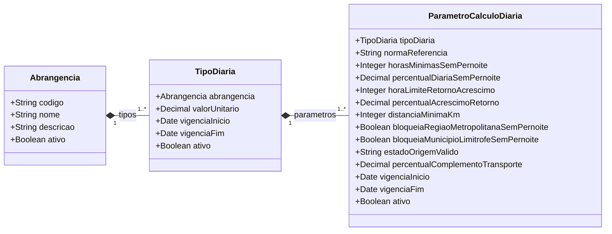

# Modelo Estrutural - Diarias

[M008](../README.md) | [Contrato](contrato.md) | [Backlog](backlog.md)

## Entidades

| Entidade | Responsabilidade |
|----------|------------------|
| `Abrangencia` | Classifica o tipo de deslocamento: dentro do estado, nacional ou internacional |
| `TipoDiaria` | Define o valor unitário vigente por abrangência em um período |
| `ParametroCalculoDiaria` | Define os parâmetros normativos usados pelo M003 para calcular quantidade, acréscimos, bloqueios e elegibilidade |

## Diagrama

## Dicionario de Dados

### Abrangencia

Classifica o escopo geográfico do deslocamento para fins de diária. Determina qual `TipoDiaria` e `ParametroCalculoDiaria` o M003 deve usar.

| Atributo | Definicao | Obrig. | Tipo | Dominio |
|----------|-----------|--------|------|---------|
| codigo | Código canônico. Usado pelo M003 como chave de lookup | Sim | String | `DENTRO_ESTADO`, `NACIONAL`, `INTERNACIONAL` |
| nome | Nome de exibição nos formulários e listagens | Sim | String | Ex: `Dentro do Estado` |
| descricao | Descrição operacional da abrangência | Não | String | |
| ativo | Indica se a abrangência aceita novos `TipoDiaria` | Sim | Boolean | |

**Regra:** `Abrangencia.codigo` é único.

---

### TipoDiaria

Define o valor unitário de diária para uma `Abrangencia` em um período de vigência. Quando o valor muda, cria-se um novo `TipoDiaria` com nova vigência — o anterior é desativado. O M003 faz snapshot do valor no momento da criação da `SolicitacaoDiaria`.

| Atributo | Definicao | Obrig. | Tipo | Dominio |
|----------|-----------|--------|------|---------|
| abrangencia | Abrangência à qual este tipo pertence | Sim | FK → Abrangencia | |
| valorUnitario | Valor unitário vigente (R$ ou US$ conforme abrangência) | Sim | Decimal | > 0 |
| vigenciaInicio | Data de início da vigência | Sim | Date | |
| vigenciaFim | Data de fim da vigência. Nulo = vigente | Não | Date | |
| ativo | Indica se o tipo está disponível para novas solicitações | Sim | Boolean | |

**Regra:** Não pode haver dois `TipoDiaria` ativos com vigências sobrepostas para a mesma `Abrangencia`.

---

### ParametroCalculoDiaria

Define os parâmetros normativos que o M003 aplica no algoritmo de cálculo da diária. Vinculado a um `TipoDiaria` e possui vigência própria — parâmetros podem mudar sem alterar o valor unitário. O M003 faz snapshot do parâmetro no momento da criação da `SolicitacaoDiaria`.

| Atributo | Definicao | Obrig. | Tipo | Aplicavel a | Dominio |
|----------|-----------|--------|------|-------------|---------|
| tipoDiaria | Tipo de diária ao qual estes parâmetros pertencem | Sim | FK → TipoDiaria | Todos | |
| normaReferencia | Decreto, resolução ou ato normativo que fundamenta os parâmetros | Sim | String | Todos | Ex: `Decreto ES nº 5533-R/2023` |
| horasMinimasSemPernoite | Horas mínimas de afastamento para gerar meia diária sem pernoite | Sim | Integer | Todos | Ex: `6` |
| percentualDiariaSemPernoite | Fração do valor unitário aplicada quando não há pernoite e o mínimo de horas é atingido | Sim | Decimal | Todos | Ex: `0.5` |
| horaLimiteRetornoAcrescimo | Hora de retorno a partir da qual incide acréscimo no último dia | Sim | Integer | Todos | Ex: `14` |
| percentualAcrescimoRetorno | Fração do valor unitário acrescida quando retorno ocorre após o limite | Sim | Decimal | Todos | Ex: `0.5` |
| distanciaMinimaKm | Distância mínima em km para elegibilidade. Nulo = sem exigência | Não | Integer | DENTRO_ESTADO | Ex: `150` |
| bloqueiaRegiaoMetropolitanaSemPernoite | Bloqueia viagem sem pernoite quando origem e destino estão na mesma região metropolitana | Sim | Boolean | DENTRO_ESTADO | |
| bloqueiaMunicipioLimitrofeSemPernoite | Bloqueia viagem sem pernoite entre municípios limítrofes | Sim | Boolean | DENTRO_ESTADO | |
| estadoOrigemValido | UF válida para a cidade de origem. Parametrizável para permitir mudanças sem deploy | Sim | String | DENTRO_ESTADO | Ex: `ES` |
| percentualComplementoTransporte | Percentual adicional sobre o valor total para complemento de transporte urbano. Nulo = sem complemento | Não | Decimal | NACIONAL | Ex: `0.2` |
| vigenciaInicio | Data de início da vigência dos parâmetros | Sim | Date | | |
| vigenciaFim | Data de fim da vigência. Nulo = vigente | Não | Date | | |
| ativo | Indica se estes parâmetros estão ativos para novas consultas | Sim | Boolean | | |

**Regra:** Não pode haver dois `ParametroCalculoDiaria` ativos com vigências sobrepostas para o mesmo `TipoDiaria`.

---

## Regras

- `Abrangencia.codigo` é único.
- Não pode haver dois `TipoDiaria` ativos com vigências sobrepostas para a mesma `Abrangencia`.
- Não pode haver dois `ParametroCalculoDiaria` ativos com vigências sobrepostas para o mesmo `TipoDiaria`.
- O M003 consome `TipoDiaria` e `ParametroCalculoDiaria` por referência e grava snapshots imutáveis na `SolicitacaoDiaria`.
- Distância entre origem e destino é calculada pelo M003 via provedor externo (Google Routes API) no momento da criação da solicitação e gravada no snapshot.

---

