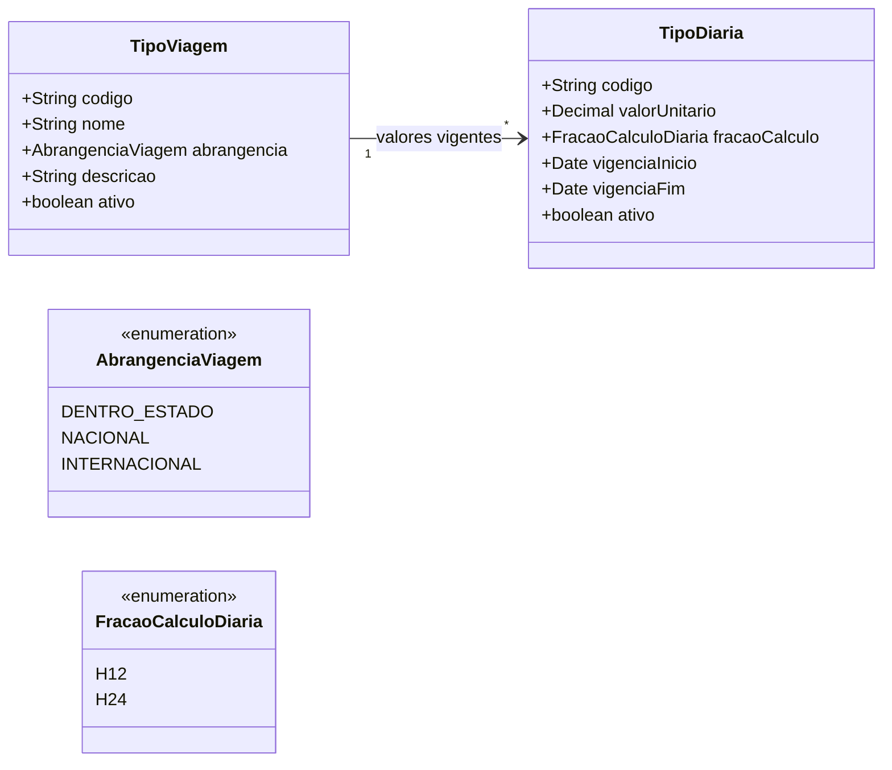

# Modelo Estrutural - Diarias

[M008](../README.md) | [Backlog](backlog.md)

## Entidades

| Entidade | Documento | Responsabilidade |
|----------|-----------|------------------|
| TipoViagem | [Contexto Diarias](README.md#tipoviagem) | Classifica a abrangencia do deslocamento usado em solicitacoes de diaria |
| TipoDiaria | [Contexto Diarias](README.md#tipodiaria) | Define valor vigente, fracao de calculo e vigencia por tipo de viagem |

## Diagrama

## Regras

- `TipoViagem` nao possui valor unitario.
- `TipoDiaria` sempre pertence a um `TipoViagem`.
- Nao pode haver vigencia ativa sobreposta para o mesmo `TipoViagem`.
- M003 consome estes cadastros por referencia e grava snapshots na `SolicitacaoDiaria`.
