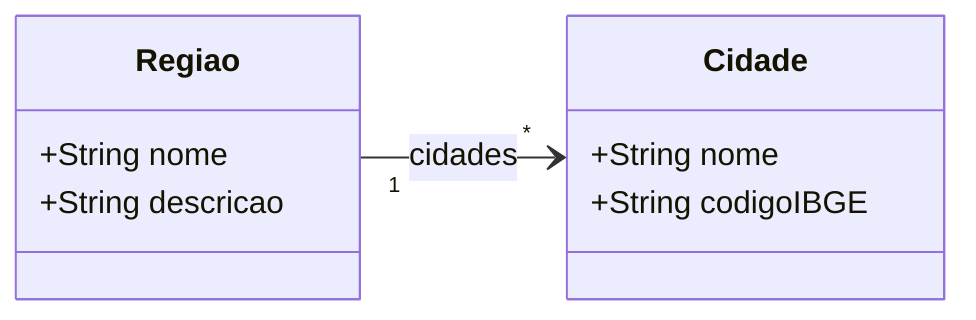

# Modelo Estrutural - Geografia

[M008](../README.md) | [Backlog](backlog.md)

## Entidades

| Entidade | Documento | Responsabilidade |
|----------|-----------|------------------|
| Cidade | [cidade](cidade/README.md) | Cadastro geografico de municipios |
| Regiao | [regiao](regiao/README.md) | Agrupamento geografico de cidades |

## Diagrama

