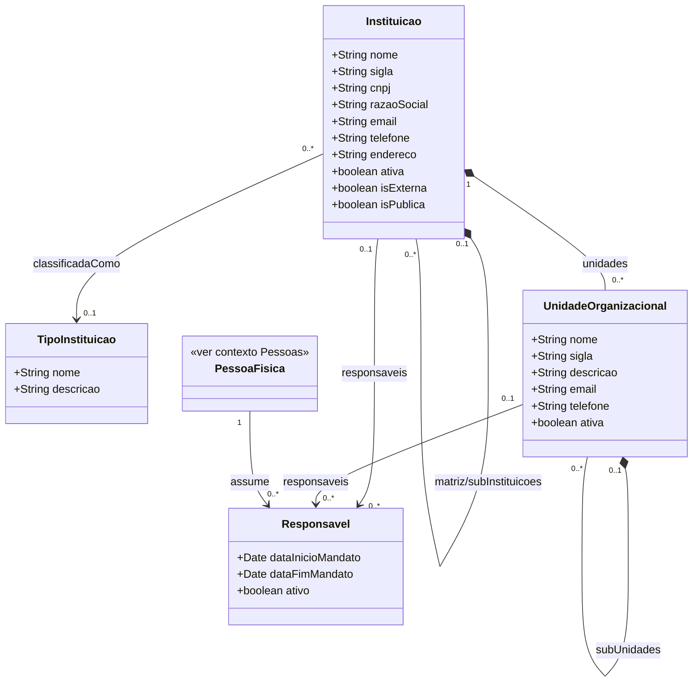

# Modelo Estrutural — Instituicoes

Submodulo do M008. Modelo consolidado: [../modelo-estrutural.md](../modelo-estrutural.md) | Contexto: [README.md](README.md)

---

### Entidades do Contexto

| Entidade | Documento |
|----------|-----------|
| Instituicao | [Contexto Instituicoes](README.md#instituicao) |
| UnidadeOrganizacional | [Contexto Instituicoes](README.md#unidadeorganizacional) |
| TipoInstituicao | [Contexto Instituicoes](README.md#tipoinstituicao) |
| Responsavel | [Contexto Instituicoes](README.md#responsavel) |

---

### Diagrama de Classes

### Criterio de Modelagem

- **Instituicao** representa entidade juridicamente identificavel: matriz, filial ou campus com CNPJ proprio. CNPJ e obrigatorio em toda `Instituicao`.
- **UnidadeOrganizacional** representa subdivisao interna sem CNPJ proprio: centro, departamento, coordenacao, laboratorio, setor.
- Composicao:
  - uma `Instituicao` pode ser composta por outras `Instituicao` (matriz com filiais juridicamente identificaveis) e/ou por `UnidadeOrganizacional`;
  - uma `UnidadeOrganizacional` pode ser composta por outras `UnidadeOrganizacional`;
  - toda `UnidadeOrganizacional` deve ser rastreavel transitivamente a uma `Instituicao` raiz (atraves de `instituicaoPai` direto ou via cadeia de `unidadeSuperior`).
- Invariante na `UnidadeOrganizacional`: exatamente um entre `instituicaoPai` e `unidadeSuperior` deve estar preenchido.
- Ex.: UFES e `Instituicao` (CNPJ proprio); IFES matriz e IFES Campus Serra, com CNPJ proprio cada, sao duas `Instituicao` ligadas por `matriz/subInstituicoes`; Centro Tecnologico (vinculado a UFES) e Departamento de Informatica (vinculado ao Centro Tecnologico) sao `UnidadeOrganizacional`.
- `Responsavel` e o vinculo temporal entre `PessoaFisica` e uma entidade organizacional (`Instituicao` OU `UnidadeOrganizacional`), com periodo de mandato. Cada `Responsavel` aponta exatamente para uma das duas entidades (xor).
- `TipoInstituicao` classifica apenas `Instituicao`. `UnidadeOrganizacional` nao possui classificacao tipologica neste modelo.

### Dicionario de Dados

| Classe | Atributo | Definicao | Obrig. | Tipo | Dominio | Tamanho | Unico |
|--------|----------|-----------|--------|------|---------|---------|-------|
| **Instituicao** | nome | Nome comum de exibicao da instituicao | Sim | String | Ex: UFES, IFES Campus Serra | 300 | |
| | sigla | Sigla comum da instituicao | Nao | String | Ex: UFES | 20 | |
| | cnpj | CNPJ proprio da instituicao (somente digitos) | Sim | String | Ex: 12345678000199 | 14 | Sim |
| | razaoSocial | Razao social da instituicao | Sim | String | | 300 | |
| | email | Email institucional ou de contato | Sim | String | | 200 | |
| | telefone | Telefone institucional ou de contato | Nao | String | | 20 | |
| | endereco | Endereco completo | Sim | String | | 500 | |
| | ativa | Indica se a instituicao esta ativa | Sim | Boolean | true/false | | |
| | isExterna | Indica se a instituicao e externa a agencia de fomento | Sim | Boolean | true/false | | |
| | isPublica | Indica se a instituicao e publica (`true`) ou privada (`false`) | Sim | Boolean | true/false | | |
| | instituicaoSuperior (relacao) | Instituicao matriz quando esta for filial juridicamente identificavel | Nao | FK → Instituicao | Via `matriz/subInstituicoes` | | |
| | subInstituicoes (relacao) | Instituicoes filhas ligadas a esta como matriz | Nao | Lista FK → Instituicao | Via `matriz/subInstituicoes` | | |
| | unidades (relacao) | Unidades organizacionais internas vinculadas diretamente a esta instituicao | Nao | Lista FK → UnidadeOrganizacional | Via `unidades` | | |
| | responsaveis (relacao) | Vinculos de responsavel associados a esta instituicao | Nao | Lista FK → Responsavel | Via `responsaveis` | | |
| | tipoInstituicao (relacao) | Classificacao institucional | Nao | FK → TipoInstituicao | Via `classificadaComo` | | |
| **UnidadeOrganizacional** | nome | Nome de exibicao da unidade | Sim | String | Ex: Centro Tecnologico, Departamento de Informatica | 300 | |
| | sigla | Sigla da unidade | Nao | String | Ex: CT, DI | 20 | |
| | descricao | Descricao da unidade | Nao | String | | 500 | |
| | email | Email de contato da unidade | Nao | String | | 200 | |
| | telefone | Telefone de contato da unidade | Nao | String | | 20 | |
| | ativa | Indica se a unidade esta ativa | Sim | Boolean | true/false | | |
| | instituicaoPai (relacao) | Instituicao a qual a unidade esta diretamente vinculada (quando o pai for Instituicao) | Cond. | FK → Instituicao | Via `unidades`. Obrigatorio quando `unidadeSuperior` nao informada | | |
| | unidadeSuperior (relacao) | Unidade superior na hierarquia interna (quando o pai for outra unidade) | Cond. | FK → UnidadeOrganizacional | Via `subUnidades`. Obrigatorio quando `instituicaoPai` nao informada | | |
| | subUnidades (relacao) | Unidades filhas vinculadas a esta unidade | Nao | Lista FK → UnidadeOrganizacional | Via `subUnidades` | | |
| | responsaveis (relacao) | Vinculos de responsavel associados a esta unidade | Nao | Lista FK → Responsavel | Via `responsaveis` | | |
| **TipoInstituicao** | nome | Nome do tipo de instituicao | Sim | String | Ex: Ensino, Empresa, Agencia de Fomento | 200 | Sim |
| | descricao | Descricao do tipo | Nao | String | | 500 | |
| **Responsavel** | dataInicioMandato | Data de inicio do mandato | Sim | Date | | | |
| | dataFimMandato | Data de termino do mandato | Sim | Date | | | |
| | ativo | Indica se o mandato esta vigente | Gerado | Boolean | true/false | | |
| | pessoa (relacao) | Pessoa fisica que assume o papel de responsavel | Sim | FK → PessoaFisica | Via `assume` | | |
| | instituicao (relacao) | Instituicao onde a pessoa assume o papel (xor com `unidade`) | Cond. | FK → Instituicao | Via `responsaveis`. Obrigatorio quando `unidade` nao informada | | |
| | unidade (relacao) | Unidade organizacional onde a pessoa assume o papel (xor com `instituicao`) | Cond. | FK → UnidadeOrganizacional | Via `responsaveis`. Obrigatorio quando `instituicao` nao informada | | |

### Regras Relacionadas

- RN02: Instituicao e identificada unicamente pelo CNPJ (obrigatorio)
- RN03: Instituicoes formam hierarquia matriz/subInstituicoes; Instituicoes podem conter UnidadeOrganizacional; UnidadeOrganizacional formam sub-hierarquia interna
- RN04: Responsavel e o vinculo temporal entre uma PessoaFisica e uma entidade organizacional (Instituicao OU UnidadeOrganizacional), com mandato definido
- RN11: Instituicao deve possuir exatamente um Responsavel ativo
- RN12: Toda organizacao, campus ou filial com CNPJ proprio deve ser cadastrada como Instituicao
- RN13: Setor interno e cadastrado como UnidadeOrganizacional vinculada a uma Instituicao ou a outra UnidadeOrganizacional
- RN14: Toda Instituicao deve possuir CNPJ proprio (raiz ou filial)
- RN25: Toda UnidadeOrganizacional deve ser rastreavel transitivamente a uma Instituicao raiz
- RN26: UnidadeOrganizacional deve possuir exatamente um Responsavel ativo ao mesmo tempo
- RI1: Uma Instituicao so pode ter um Responsavel ativo ao mesmo tempo
- RI3: Uma UnidadeOrganizacional so pode ter um Responsavel ativo ao mesmo tempo
- RI4: Em UnidadeOrganizacional, exatamente um entre `instituicaoPai` e `unidadeSuperior` deve estar preenchido
- RI5: Em Responsavel, exatamente um entre `instituicao` e `unidade` deve estar preenchido

### Consumidores

| Modulo | Entidade consumida | Uso |
|--------|-------------------|-----|
| M010 | Instituicao | Origem de AporteFinanceiro em Parcerias |
| M010 | Instituicao | Responsavel pela Parceria, quando area responsavel for entidade juridica |
| M010 | UnidadeOrganizacional | Responsavel pela Parceria, quando area responsavel for unidade interna |
| M010 | PessoaFisica | Coordenacao temporal de Parcerias |
| M001 | Instituicao | Referencia de Moeda (cadastro corporativo), quando aplicavel |

> Nota: M010 ainda referencia "setor interno (Instituicao sem CNPJ)". Atualizacao de M010 fora do escopo desta rodada.
