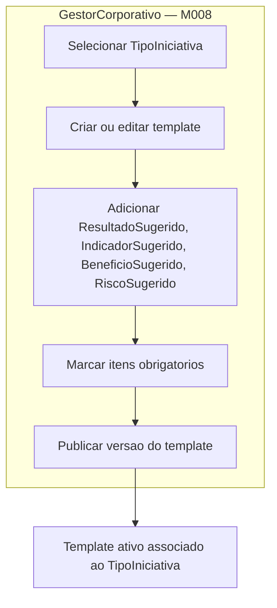
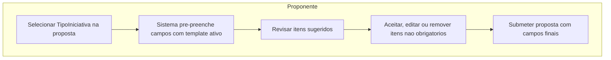

# Proposta — Templates por Tipo de Iniciativa

## Objetivo

Associar a cada `TipoIniciativa` um conjunto de sugestoes padrao de resultados esperados,
indicadores, beneficios e riscos. Quando o coordenador seleciona o tipo de iniciativa na
proposta, esses campos vem pre-preenchidos com os valores do template. O coordenador pode
aceitar, editar ou remover cada item. O que nao se aplica ao projeto e simplesmente descartado.

**Beneficio principal:** padroniza a analise de impacto da FAPES sem engessar o coordenador.
A FAPES ganha comparabilidade entre propostas do mesmo tipo; o coordenador ganha ponto de
partida, nao uma camisa de forca.

---

## Conceito

```
TipoIniciativa (ex: Pesquisa, Inovacao, Extensao, Visita Tecnica)
    └── TemplateIniciativa
            ├── ResultadoSugerido[]     (ex: "Artigo cientifico publicado")
            ├── IndicadorSugerido[]     (ex: "Numero de publicacoes em periodico A1/A2")
            ├── BeneficioSugerido[]     (ex: "Formacao de pesquisadores na area de X")
            └── RiscoSugerido[]         (ex: "Atraso na coleta de dados por indisponibilidade de laboratorio")
```

Cada sugestao tem:
- `descricao` — texto pre-preenchido para o coordenador
- `obrigatorio` — se `true`, o coordenador pode editar mas nao pode remover
- `categoria` — agrupa sugestoes para facilitar a visualizacao

Quando o coordenador seleciona o `TipoIniciativa` na proposta:
1. Sistema carrega o template ativo do tipo
2. Campos de resultados, indicadores, beneficios e riscos sao pre-preenchidos
3. Coordenador aceita, edita ou remove cada item (exceto os marcados como obrigatorios)
4. Proposta registra o estado final — nao o template original

---

## Modelo de Dados Proposto

### Entidades novas em M008

```yaml
TipoIniciativa:
  description: "Tipo de iniciativa gerenciado pela FAPES (ex: Pesquisa, Inovacao, Extensao, Visita Tecnica)."
  fields:
    codigo:       string, required, unique, generated
    nome:         string, required, max 100
    descricao:    string, optional, max 500
    ativo:        boolean, required
    template:     ref:TemplateIniciativa, optional

TemplateIniciativa:
  description: "Template de sugestoes associado a um TipoIniciativa. Versionado — cada publicacao gera nova versao."
  fields:
    versao:          string, required, generated
    publicado:       boolean, required
    dataPublicacao:  date, optional
    resultados:      list:ResultadoSugerido
    indicadores:     list:IndicadorSugerido
    beneficios:      list:BeneficioSugerido
    riscos:          list:RiscoSugerido

ResultadoSugerido:
  fields:
    descricao:    string, required, max 500
    tipo:         enum:TipoResultado (PRODUTO / SERVICO / PROCESSO)
    obrigatorio:  boolean, required
    categoria:    string, optional

IndicadorSugerido:
  fields:
    descricao:    string, required, max 300
    unidade:      string, optional, max 50   (ex: "publicacoes", "patentes", "horas")
    metaMinima:   string, optional            (ex: "1", ">= 2")
    obrigatorio:  boolean, required

BeneficioSugerido:
  fields:
    descricao:    string, required, max 500
    publico:      string, optional, max 200   (ex: "Pesquisadores", "Comunidade local")
    obrigatorio:  boolean, required

RiscoSugerido:
  fields:
    descricao:      string, required, max 500
    probabilidade:  enum:NivelRisco (BAIXA / MEDIA / ALTA)
    impacto:        enum:NivelRisco (BAIXO / MEDIO / ALTO)
    mitigacao:      string, optional, max 500
    obrigatorio:    boolean, required
```

---

## Fluxo de Uso

### Gestao do template (M008 — backoffice FAPES)



### Uso na proposta (M011/M013 — Proponente)



---

## Impacto nos Modulos

| Modulo | Impacto |
|--------|---------|
| M008 | Adicionar entidade `TipoIniciativa`, `TemplateIniciativa` e tipos de sugestao. CRUD no backoffice. |
| M011 | `Fomento.tiposProjetoFomentados` e `FaixaInvestimento.tiposIniciativa` ja referenciam `TipoIniciativa`. Nenhuma mudança na ontologia do M011. |
| M013 (proposta) | Ao selecionar tipo de iniciativa, carregar template ativo e pre-preencher campos. Salvar estado final na proposta, nao o template. |
| M003 (iniciativa) | Iniciativa herda os campos finais da proposta aprovada. Template ja foi consumido — nao ha referencia ao template na iniciativa. |

---

## Regras de Negocio

| ID | Responsavel | Regra |
|----|-------------|-------|
| RN-TI01 | GestorCorporativo | Cada TipoIniciativa pode ter no maximo um template publicado ativo por vez. |
| RN-TI02 | GestorCorporativo | Publicar nova versao do template nao altera propostas ja submetidas — snapshot na submissao. |
| RN-TI03 | Sistema | Ao selecionar TipoIniciativa, o sistema carrega a versao ativa do template no momento da selecao. |
| RN-TI04 | Proponente | Itens marcados como `obrigatorio = true` podem ser editados mas nao removidos. |
| RN-TI05 | Proponente | Itens marcados como `obrigatorio = false` podem ser removidos ou substituidos livremente. |
| RN-TI06 | Sistema | A proposta registra o conteudo final dos campos — nao referencia o template. Template e apenas ponto de partida. |
| RN-TI07 | GestorCorporativo | TipoIniciativa sem template publicado funciona normalmente — campos aparecem vazios para o proponente preencher livremente. |

---

## Pendencias antes da Implementacao

- [ ] Definir quais tipos de iniciativa existem hoje na FAPES (Pesquisa, Inovacao, Extensao, Visita Tecnica — outros?)
- [ ] Definir quem e o `GestorCorporativo` — mesmo papel que gerencia o M008 ou papel especifico por tipo de iniciativa?
- [ ] Definir se indicadores tem meta minima obrigatoria ou apenas sugestao
- [ ] Definir se o template de riscos deve incluir plano de mitigacao obrigatorio ou opcional
- [ ] Validar com a equipe tecnica da FAPES quais resultados/indicadores sao comparaveis entre captacoes
