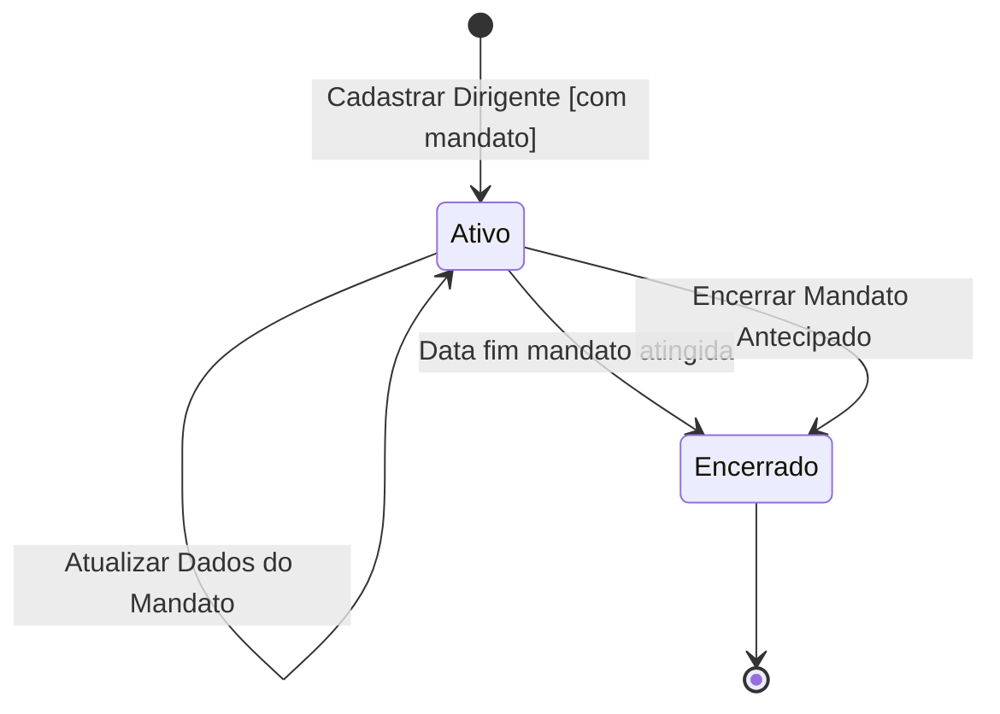
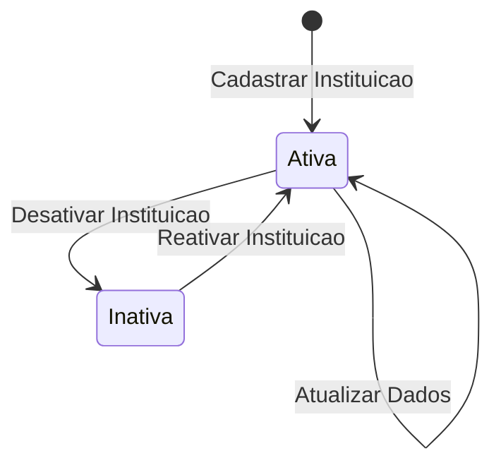

# Modelo Comportamental

Dominio e regras de negocio: ver [README.md](README.md)

### Ciclo de Vida: PessoaFisica

```mermaid
stateDiagram-v2
    [*] --> Ativa : Cadastrar Pessoa (manual ou via Acesso Cidadao)

    Ativa --> Ativa : Atualizar Dados
    Ativa --> Suspensa : Suspender Pessoa [com justificativa]

    Suspensa --> Ativa : Reativar Pessoa [com justificativa]
    Suspensa --> Suspensa : entry / Bloquear operacoes vinculadas

    state Ativa : Pessoa habilitada para todas as operacoes
    state Suspensa : Submissoes, bolsas e pagamentos bloqueados

    note right of Suspensa : Reativacao exige justificativa\nregistrada no historico
```

### Ciclo de Vida: Dirigente (Mandato)



### Ciclo de Vida: Instituicao


