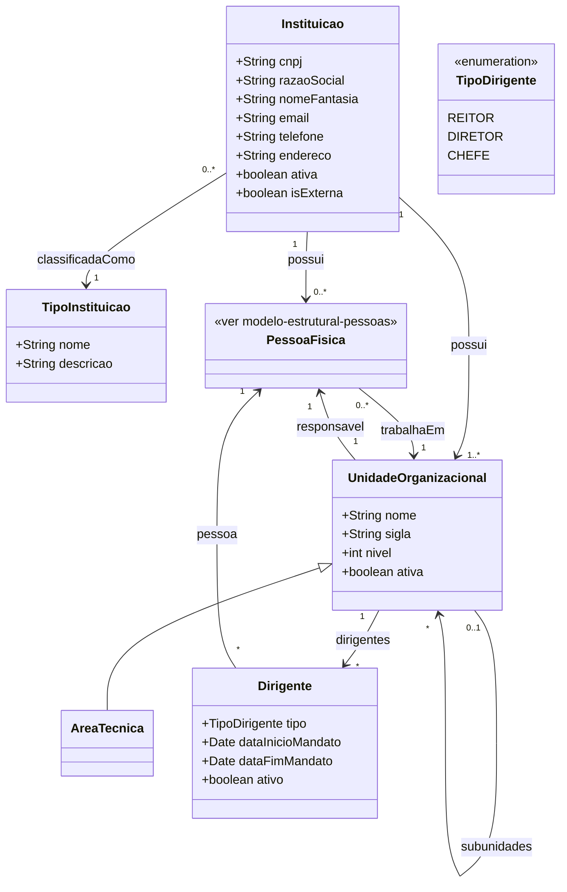

# Modelo Estrutural — Instituicoes e Unidades

Sub-modelo do M008. Modelo consolidado: [modelo-estrutural.md](modelo-estrutural.md) | Dominio: [README.md](README.md)

---

### Diagrama de Classes

### Dicionario de Dados

| Classe | Atributo | Definicao | Obrig. | Tipo | Dominio | Tamanho | Unico |
|--------|----------|-----------|--------|------|---------|---------|-------|
| **Instituicao** | cnpj | CNPJ da instituicao (somente digitos) | Sim | String | Ex: 12345678000199 | 14 | Sim |
| | razaoSocial | Razao social da instituicao | Sim | String | | 300 | Sim |
| | nomeFantasia | Nome fantasia da instituicao | Nao | String | | 300 | |
| | email | Email institucional | Sim | String | | 200 | |
| | telefone | Telefone institucional | Nao | String | | 20 | |
| | endereco | Endereco completo | Sim | String | | 500 | |
| | ativa | Indica se a instituicao esta ativa | Sim | Boolean | true/false | | |
| | isExterna | Indica se e instituicao externa a agencia de fomento | Sim | Boolean | true/false | | |
| **TipoInstituicao** | nome | Nome do tipo de instituicao | Sim | String | Ex: Ensino, Empresa, Agencia de Fomento | 200 | Sim |
| | descricao | Descricao do tipo | Nao | String | | 500 | |
| **UnidadeOrganizacional** | nome | Nome da unidade | Sim | String | Ex: Departamento de Informatica | 300 | |
| | sigla | Sigla da unidade | Sim | String | Ex: DI | 20 | |
| | nivel | Nivel hierarquico dentro da instituicao | Gerado | Int | Ex: 1, 2, 3 | | |
| | ativa | Indica se a unidade esta ativa | Sim | Boolean | true/false | | |
| **Dirigente** | tipo | Tipo do cargo de dirigente | Sim | TipoDirigente | Reitor, Diretor, Chefe | | |
| | dataInicioMandato | Data de inicio do mandato | Sim | Date | | | |
| | dataFimMandato | Data de termino do mandato | Sim | Date | | | |
| | ativo | Indica se o mandato esta vigente | Gerado | Boolean | true/false | | |

### Regras Relacionadas

- RN02: Instituicao identificada unicamente pelo CNPJ
- RN03: Unidades com hierarquia pai-filho, pertencentes a exatamente uma instituicao
- RN04: Dirigente vinculado a unidade com mandato definido
- RN08: AreaTecnica e especializacao de UnidadeOrganizacional da agencia
- RI1: Um dirigente so pode ter um mandato ativo por unidade ao mesmo tempo

### Consumidores

| Modulo | Entidade consumida | Uso |
|--------|-------------------|-----|
| M010 | Instituicao | Origem de AporteFinanceiro em Parcerias |
| M010 | UnidadeOrganizacional | Responsavel pela Parceria |
| M010 | PessoaFisica | Coordenacao temporal de Parcerias |
| M003 | AreaTecnica | Area tecnica responsavel pelo edital operacional |
| M004 | AreaTecnica | Liberacao de editais por area para pagamento |
| M001 | Instituicao | Referencia de Moeda (cadastro corporativo) |
