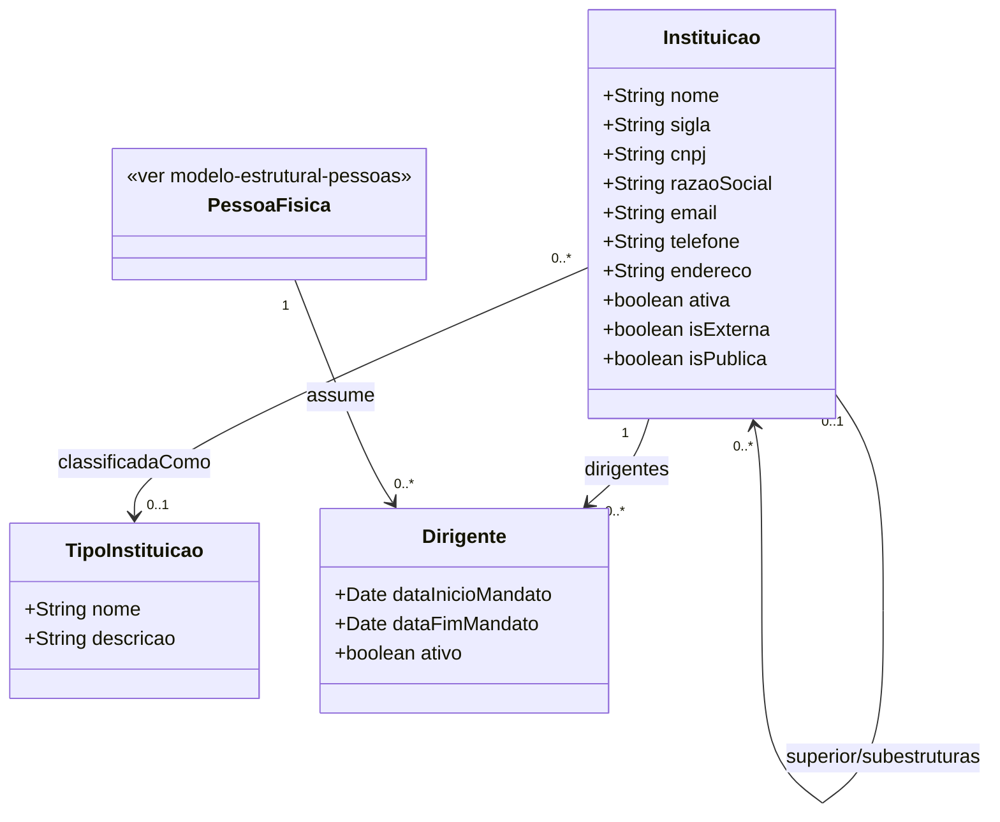

# Modelo Estrutural — Instituicoes

Sub-modelo do M008. Modelo consolidado: [modelo-estrutural.md](modelo-estrutural.md) | Dominio: [README.md](README.md)

---

### Diagrama de Classes

### Criterio de Modelagem

- **Instituicao** representa qualquer organizacao cadastravel no M008: instituicao, empresa, matriz, filial, campus, centro, departamento, coordenacao, laboratorio ou setor.
- O modelo nao possui uma classe separada para setores internos, pois a especializacao nao adicionaria atributos nem comportamento proprio. A classificacao e feita por regra de negocio.
- A distincao entre instituicao juridica e setor interno nao e feita por especializacao vazia. Ela e uma regra de negocio baseada no CNPJ:
  - instituicao com CNPJ proprio atua como instituicao juridica, campus, filial ou unidade juridicamente identificavel;
  - instituicao sem CNPJ proprio atua como setor interno e deve estar vinculada a uma instituicao superior;
  - instituicao raiz, sem superior, sempre deve possuir CNPJ proprio.
- Ex.: IFES matriz e IFES Campus Serra com CNPJ proprio sao duas `Instituicao`, ligadas por `superior/subestruturas`. UFES, Centro Tecnologico e Departamento de Informatica tambem sao `Instituicao`; apenas a UFES possui CNPJ, enquanto centro e departamento ficam como setores internos sem CNPJ.
- Instituicoes sem filiais, campi ou setores simplesmente nao possuem registros relacionados em `subestruturas`.
- `Dirigente` e o vinculo temporal entre uma `PessoaFisica` e uma `Instituicao`, com periodo de mandato.
- Quando uma `Instituicao` possui CNPJ proprio, ela pode ser classificada por `TipoInstituicao`. Para setores internos sem CNPJ, essa classificacao e opcional e normalmente nao se aplica.

### Dicionario de Dados

| Classe | Atributo | Definicao | Obrig. | Tipo | Dominio | Tamanho | Unico |
|--------|----------|-----------|--------|------|---------|---------|-------|
| **Instituicao** | nome | Nome comum de exibicao da instituicao, filial, campus, unidade ou setor | Sim | String | Ex: UFES, IFES Campus Serra, Centro Tecnologico | 300 | |
| | sigla | Sigla comum da instituicao ou setor | Nao | String | Ex: UFES, CT | 20 | |
| | cnpj | CNPJ proprio da instituicao, quando ela for juridicamente identificavel (somente digitos) | Cond. | String | Ex: 12345678000199 | 14 | Sim quando informado |
| | razaoSocial | Razao social da instituicao com CNPJ proprio | Cond. | String | Obrigatoria quando houver CNPJ | 300 | |
| | email | Email institucional ou de contato | Cond. | String | Obrigatorio quando a instituicao atuar como entidade juridicamente identificavel | 200 | |
| | telefone | Telefone institucional ou de contato | Nao | String | | 20 | |
| | endereco | Endereco completo | Cond. | String | Obrigatorio quando a instituicao atuar como entidade juridicamente identificavel | 500 | |
| | ativa | Indica se a instituicao esta ativa | Sim | Boolean | true/false | | |
| | isExterna | Indica se a instituicao e externa a agencia de fomento | Sim | Boolean | true/false | | |
| | isPublica | Indica se a instituicao e publica (`true`) ou privada (`false`) | Cond. | Boolean | Obrigatorio quando houver CNPJ | | |
| | superior (relacao) | Instituicao superior, quando houver; representa matriz, instituicao proprietaria, setor pai ou hierarquia equivalente | Nao | FK → Instituicao | Via `superior/subestruturas` | | |
| | dirigentes (relacao) | Vinculos de dirigente associados a esta instituicao | Nao | FK → Dirigente | Via `dirigentes` | | |
| | tipoInstituicao (relacao) | Classificacao institucional, aplicavel principalmente quando houver CNPJ proprio | Cond. | FK → TipoInstituicao | Via `classificadaComo` | | |
| **TipoInstituicao** | nome | Nome do tipo de instituicao | Sim | String | Ex: Ensino, Empresa, Agencia de Fomento | 200 | Sim |
| | descricao | Descricao do tipo | Nao | String | | 500 | |
| **Dirigente** | dataInicioMandato | Data de inicio do mandato | Sim | Date | | | |
| | dataFimMandato | Data de termino do mandato | Sim | Date | | | |
| | ativo | Indica se o mandato esta vigente | Gerado | Boolean | true/false | | |
| | pessoa (relacao) | Pessoa fisica que assume o papel de dirigente | Sim | FK → PessoaFisica | Via `assume` | | |
| | instituicao (relacao) | Instituicao onde a pessoa assume o papel de dirigente | Sim | FK → Instituicao | Via `dirigentes` | | |

### Regras Relacionadas

- RN02: Instituicao com CNPJ proprio e identificada unicamente pelo CNPJ
- RN03: Instituicoes podem possuir hierarquia superior-subestrutura
- RN04: Dirigente e o vinculo temporal entre uma PessoaFisica e uma Instituicao, com mandato definido
- RN11: Instituicao com CNPJ proprio deve possuir exatamente um Dirigente ativo
- RN12: Toda organizacao, campus, filial ou unidade com CNPJ proprio deve ser cadastrada como Instituicao com CNPJ
- RN13: Setor interno sem CNPJ proprio deve ser cadastrado como Instituicao sem CNPJ e com superior informado
- RN14: Instituicao sem superior deve possuir CNPJ proprio
- RN15: Instituicao sem CNPJ proprio e tratada como setor interno para fins de cadastro, consulta e hierarquia
- RI1: Uma Instituicao so pode ter um dirigente ativo ao mesmo tempo

### Consumidores

| Modulo | Entidade consumida | Uso |
|--------|-------------------|-----|
| M010 | Instituicao | Origem de AporteFinanceiro em Parcerias, quando possuir CNPJ proprio |
| M010 | Instituicao | Responsavel pela Parceria, quando a area responsavel for um setor interno |
| M010 | PessoaFisica | Coordenacao temporal de Parcerias |
| M001 | Instituicao | Referencia de Moeda (cadastro corporativo), quando aplicavel |
