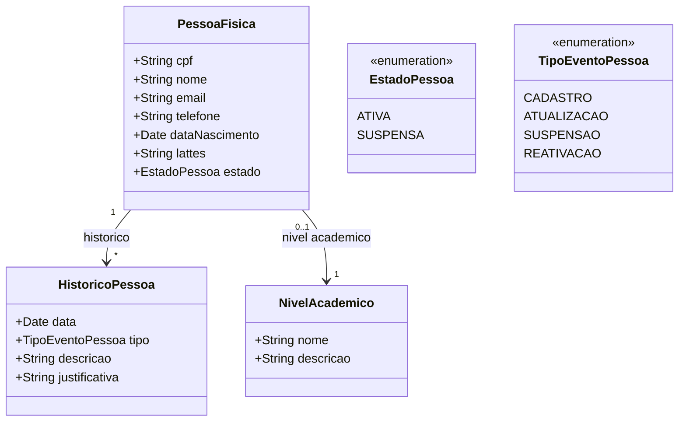

# Modelo Estrutural — Pessoas

Sub-modelo do M008. Modelo consolidado: [modelo-estrutural.md](modelo-estrutural.md) | Dominio: [README.md](README.md)

---

### Diagrama de Classes

### Dicionario de Dados

| Classe | Atributo | Definicao | Obrig. | Tipo | Dominio | Tamanho | Unico |
|--------|----------|-----------|--------|------|---------|---------|-------|
| **PessoaFisica** | cpf | CPF da pessoa (somente digitos) | Sim | String | Ex: 12345678901 | 11 | Sim |
| | nome | Nome completo da pessoa | Sim | String | | 300 | |
| | email | Email de contato | Sim | String | | 200 | |
| | telefone | Telefone de contato | Nao | String | | 20 | |
| | dataNascimento | Data de nascimento | Sim | Date | | | |
| | lattes | URL do curriculo Lattes | Nao | String | | 500 | |
| | estado | Estado atual da pessoa | Gerado | EstadoPessoa | Ativa, Suspensa | | |
| | nivelAcademico (relacao) | Maior nivel academico informado para a pessoa | Nao | FK → NivelAcademico | Ex: Graduacao, Especializacao, Mestrado, Doutorado, Pos-Doutorado | | |
| **NivelAcademico** | nome | Nome do nivel academico | Sim | String | Ex: Doutorado | 100 | Sim |
| | descricao | Descricao do nivel academico | Nao | String | | 300 | |
| **HistoricoPessoa** | data | Data do evento | Gerado | Date | | | |
| | tipo | Tipo do evento registrado | Sim | TipoEventoPessoa | Cadastro, Atualizacao, Suspensao, Reativacao | | |
| | descricao | Descricao textual do evento | Sim | String | | 500 | |
| | justificativa | Justificativa (obrigatoria para suspensao e reativacao) | Cond. | String | | 500 | |

### Regras Relacionadas

- RN01: PessoaFisica identificada unicamente pelo CPF
- RN05: Suspensao bloqueia todas as operacoes vinculadas
- RN10: Cadastro automatico via Acesso Cidadao vincula pelo CPF
- RN11: NivelAcademico e uma tabela de referencia usada para requisitos de elegibilidade em captacoes e outras operacoes.
- RI2: Reativacao requer justificativa
