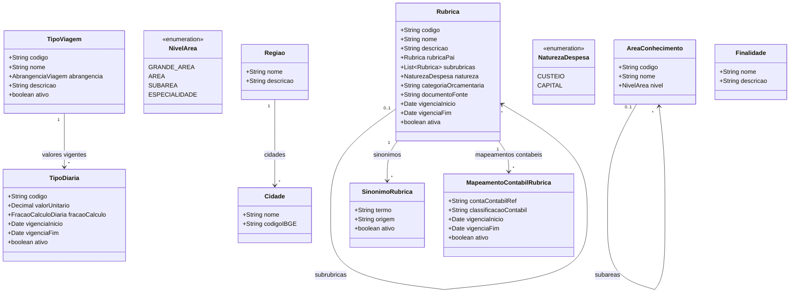

# Modelo Estrutural — Cadastros de Referencia

Sub-modelo do M008. Modelo consolidado: [modelo-estrutural.md](modelo-estrutural.md) | Dominio: [README.md](README.md)

---

Este documento funciona como indice consolidado das referencias corporativas. Os detalhes ficam nos contextos de negocio; este arquivo deve orientar consulta transversal, nao substituir os modelos contextuais.

### Contextos de Referencia

| Contexto | Modelo | Backlog |
|----------|--------|---------|
| Classificacoes | [modelo](classificacoes/modelo-estrutural.md) | [backlog](classificacoes/backlog.md) |
| Geografia | [modelo](geografia/modelo-estrutural.md) | [backlog](geografia/backlog.md) |
| Diarias | [modelo](diarias/modelo-estrutural.md) | [backlog](diarias/backlog.md) |
| Rubricas | [modelo](rubricas/modelo-estrutural.md) | [backlog](rubricas/backlog.md) |

---

### Diagrama de Classes

### Dicionario de Dados

| Classe | Atributo | Definicao | Obrig. | Tipo | Dominio | Tamanho | Unico |
|--------|----------|-----------|--------|------|---------|---------|-------|
| **AreaConhecimento** | codigo | Codigo da area conforme CNPq | Sim | String | Ex: 1.03.04 | 20 | Sim |
| | nome | Nome da area de conhecimento | Sim | String | Ex: Ciencia da Computacao | 200 | |
| | nivel | Nivel hierarquico da area | Sim | NivelArea | Grande Area, Area, Subarea, Especialidade | | |
| **TipoViagem** | codigo | Codigo canonico do tipo de viagem | Sim | String | Ex: TVI-001 | 40 | Sim |
| | nome | Nome de exibicao do tipo de viagem | Sim | String | Ex: Dentro do Estado, Nacional, Internacional | 150 | |
| | abrangencia | Abrangencia administrativa do deslocamento | Sim | AbrangenciaViagem | DENTRO_ESTADO, NACIONAL, INTERNACIONAL | | |
| | descricao | Descricao administrativa do tipo | Nao | String | | 500 | |
| | ativo | Indica se o tipo esta disponivel para novas solicitacoes | Sim | Boolean | true/false | | |
| **TipoDiaria** | codigo | Codigo canonico do tipo de diaria | Sim | String | Ex: DIA-2026-001 | 40 | Sim |
| | tipoViagem (relacao) | Tipo de viagem ao qual o valor se aplica | Sim | FK -> TipoViagem | Via `valores vigentes` | | |
| | valorUnitario | Valor unitario vigente da diaria | Sim | Decimal | Maior que zero | | |
| | fracaoCalculo | Fracao usada no calculo | Sim | FracaoCalculoDiaria | 12H, 24H | | |
| | vigenciaInicio | Inicio da vigencia | Sim | Date | | | |
| | vigenciaFim | Fim da vigencia | Nao | Date | | | |
| | ativo | Indica se o cadastro esta ativo | Sim | Boolean | true/false | | |
| **Rubrica** | codigo | Codigo canonico da rubrica | Sim | String | Ex: RUB-DIARIAS | 40 | Sim |
| | nome | Nome de exibicao da rubrica | Sim | String | Ex: Diarias | 150 | |
| | descricao | Descricao da rubrica | Sim | String | | 500 | |
| | rubricaPai (relacao) | Rubrica superior quando esta rubrica representar detalhamento/subrubrica | Nao | FK -> Rubrica | Via `subrubricas` | | |
| | subrubricas (relacao) | Rubricas filhas que detalham esta rubrica | Nao | Lista FK -> Rubrica | Via `rubricaPai` | | |
| | natureza | Natureza da despesa | Sim | NaturezaDespesa | CUSTEIO, CAPITAL | | |
| | categoriaOrcamentaria | Categoria orcamentaria vinculada, quando aplicavel | Nao | String | | 200 | |
| | documentoFonte | Norma, edital ou resolucao que fundamenta a rubrica | Nao | String | Ex: Resolucao CCAF no 309/2022 | 300 | |
| | vigenciaInicio | Data de inicio da vigencia cadastral | Nao | Date | | | |
| | vigenciaFim | Data de fim da vigencia cadastral | Nao | Date | | | |
| | ativa | Indica se a rubrica esta ativa | Sim | Boolean | true/false | | |
| **SinonimoRubrica** | termo | Nome alternativo usado em edital, planilha, SIGFAPES ou legado | Sim | String | Ex: Passagens e Diarias | 200 | |
| | origem | Origem do termo alternativo | Nao | String | Ex: Edital 08/2025, SIGFAPES | 200 | |
| | ativo | Indica se o sinonimo continua valido para novas normalizacoes | Sim | Boolean | true/false | | |
| | rubrica (relacao) | Rubrica canonica a que o termo alternativo pertence | Sim | FK -> Rubrica | Via `sinonimos` | | |
| **MapeamentoContabilRubrica** | contaContabilRef | Referencia da conta contabil no M016 | Sim | String | Ex: CONTA-339014 | 80 | |
| | classificacaoContabil | Descricao ou codigo auxiliar de classificacao contabil | Nao | String | | 200 | |
| | vigenciaInicio | Inicio da validade do mapeamento contabil | Sim | Date | | | |
| | vigenciaFim | Fim da validade do mapeamento contabil | Nao | Date | | | |
| | ativo | Indica se o mapeamento esta vigente para novas classificacoes | Sim | Boolean | true/false | | |
| | rubrica (relacao) | Rubrica canonica vinculada ao mapeamento contabil | Sim | FK -> Rubrica | Via `mapeamentos contabeis` | | |
| **Cidade** | nome | Nome da cidade | Sim | String | Ex: Vitoria | 200 | |
| | codigoIBGE | Codigo IBGE da cidade | Sim | String | Ex: 3205309 | 10 | Sim |
| **Regiao** | nome | Nome da regiao | Sim | String | Ex: Grande Vitoria | 200 | Sim |
| | descricao | Descricao da regiao | Nao | String | | 500 | |
| **Finalidade** | nome | Nome da finalidade | Sim | String | Ex: Pesquisa, Inovacao, Extensao | 200 | Sim |
| | descricao | Descricao do proposito | Nao | String | | 500 | |

### Regras Relacionadas

- RN06: Areas de conhecimento seguem classificacao hierarquica CNPq (grande area → area → subarea → especialidade)
- RN22: TipoViagem classifica deslocamentos de diaria e nao armazena valor unitario
- RN23: TipoDiaria define valor vigente, fracao de calculo e vigencia por tipo de viagem
- RN07: Rubricas vinculadas a categorias orcamentarias validas quando aplicavel
- RN09: Cidades pertencem a uma regiao; regioes agrupam cidades do estado
- RN16: Toda Rubrica deve possuir codigo canonico unico, nome, descricao, natureza e situacao ativa/inativa
- RN17: Subrubricas sao representadas por relacao opcional com `rubricaPai`; nao ha campo adicional para classificar a hierarquia
- RN18: Rubrica inativa nao deve aparecer em novas configuracoes, mas deve permanecer consultavel para historico
- RN19: Sinonimos de rubrica devem apontar para uma rubrica canonica e nao substituem o nome oficial da rubrica
- RN20: Mapeamento contabil e opcional, versionado por vigencia e referencia contas do M016 sem transformar rubrica em conta contabil

### Consumidores

| Modulo | Entidade consumida | Uso |
|--------|-------------------|-----|
| M010 | Finalidade | Classificacao de Parcerias (Pesquisa, Inovacao, Extensao) |
| M013 | Rubrica | Classificacao de despesas de projeto |
| M011 | AreaConhecimento | Cotas por area em editais |
| M003 | TipoViagem | Selecao do deslocamento na solicitacao de diaria |
| M003 | TipoDiaria | Calculo e snapshot do valor vigente da solicitacao de diaria |
