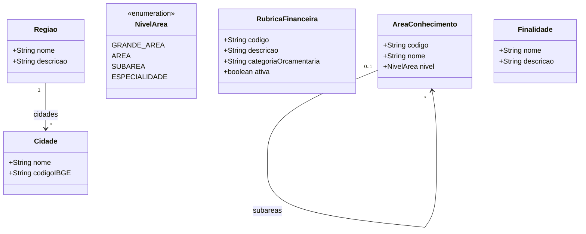

# Modelo Estrutural — Cadastros de Referencia

Sub-modelo do M008. Modelo consolidado: [modelo-estrutural.md](modelo-estrutural.md) | Dominio: [README.md](README.md)

---

### Diagrama de Classes

### Dicionario de Dados

| Classe | Atributo | Definicao | Obrig. | Tipo | Dominio | Tamanho | Unico |
|--------|----------|-----------|--------|------|---------|---------|-------|
| **AreaConhecimento** | codigo | Codigo da area conforme CNPq | Sim | String | Ex: 1.03.04 | 20 | Sim |
| | nome | Nome da area de conhecimento | Sim | String | Ex: Ciencia da Computacao | 200 | |
| | nivel | Nivel hierarquico da area | Sim | NivelArea | Grande Area, Area, Subarea, Especialidade | | |
| **RubricaFinanceira** | codigo | Codigo da rubrica | Sim | String | Ex: 339018 | 20 | Sim |
| | descricao | Descricao da rubrica | Sim | String | | 300 | |
| | categoriaOrcamentaria | Categoria orcamentaria vinculada | Sim | String | | 200 | |
| | ativa | Indica se a rubrica esta ativa | Sim | Boolean | true/false | | |
| **Cidade** | nome | Nome da cidade | Sim | String | Ex: Vitoria | 200 | |
| | codigoIBGE | Codigo IBGE da cidade | Sim | String | Ex: 3205309 | 10 | Sim |
| **Regiao** | nome | Nome da regiao | Sim | String | Ex: Grande Vitoria | 200 | Sim |
| | descricao | Descricao da regiao | Nao | String | | 500 | |
| **Finalidade** | nome | Nome da finalidade | Sim | String | Ex: Pesquisa, Inovacao, Extensao | 200 | Sim |
| | descricao | Descricao do proposito | Nao | String | | 500 | |

### Regras Relacionadas

- RN06: Areas de conhecimento seguem classificacao hierarquica CNPq (grande area → area → subarea → especialidade)
- RN07: Rubricas financeiras vinculadas a categorias orcamentarias validas
- RN09: Cidades pertencem a uma regiao; regioes agrupam cidades do estado

### Consumidores

| Modulo | Entidade consumida | Uso |
|--------|-------------------|-----|
| M010 | Finalidade | Classificacao de Parcerias (Pesquisa, Inovacao, Extensao) |
| M013 | RubricaFinanceira | Classificacao de despesas de projeto |
| M011 | AreaConhecimento | Cotas por area em editais |
