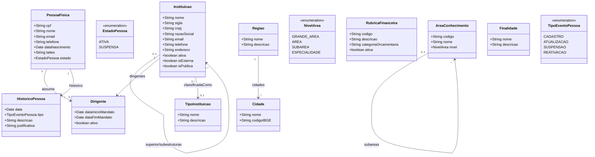

# Modelo Estrutural

Dominio e regras de negocio: ver [README.md](README.md)

## Sub-modelos

Para facilitar a leitura, o modelo esta dividido em tres sub-modelos por area tematica:

| Sub-modelo | Entidades | Descricao |
|------------|-----------|-----------|
| [Pessoas](modelo-estrutural-pessoas.md) | PessoaFisica, HistoricoPessoa | Cadastro de individuos e auditoria |
| [Instituicoes](modelo-estrutural-instituicoes.md) | Instituicao, TipoInstituicao, Dirigente | Organizacoes, instituicoes, campi, filiais e setores internos |
| [Cadastros de Referencia](modelo-estrutural-referencia.md) | AreaConhecimento, RubricaFinanceira, Cidade, Regiao, Finalidade | Tabelas de classificacao transversais |

---

### Diagrama Consolidado

## Dicionario de Dados

| Classe | Atributo | Definicao | Obrig. | Tipo | Dominio | Tamanho | Unico |
|--------|----------|-----------|--------|------|---------|---------|-------|
| **PessoaFisica** | cpf | CPF da pessoa (somente digitos) | Sim | String | Ex: 12345678901 | 11 | Sim |
| | nome | Nome completo da pessoa | Sim | String | | 300 | |
| | email | Email de contato | Sim | String | | 200 | |
| | telefone | Telefone de contato | Nao | String | | 20 | |
| | dataNascimento | Data de nascimento | Sim | Date | | | |
| | lattes | URL do curriculo Lattes | Nao | String | | 500 | |
| | estado | Estado atual da pessoa | Gerado | EstadoPessoa | Ativa, Suspensa | | |
| **Instituicao** | nome | Nome comum de exibicao da instituicao, filial, campus, unidade ou setor | Sim | String | Ex: UFES, IFES Campus Serra, Centro Tecnologico | 300 | |
| | sigla | Sigla comum da instituicao ou setor | Nao | String | Ex: UFES, CT | 20 | |
| | cnpj | CNPJ proprio da instituicao, quando ela for juridicamente identificavel (somente digitos) | Cond. | String | Ex: 12345678000199 | 14 | Sim quando informado |
| | razaoSocial | Razao social da instituicao com CNPJ proprio | Cond. | String | Obrigatoria quando houver CNPJ | 300 | |
| | email | Email institucional ou de contato | Cond. | String | Obrigatorio quando a instituicao atuar como entidade juridicamente identificavel | 200 | |
| | telefone | Telefone institucional ou de contato | Nao | String | | 20 | |
| | endereco | Endereco completo | Cond. | String | Obrigatorio quando a instituicao atuar como entidade juridicamente identificavel | 500 | |
| | ativa | Indica se a instituicao esta ativa | Sim | Boolean | true/false | | |
| | isExterna | Indica se a instituicao e externa a agencia de fomento | Sim | Boolean | true/false | | |
| | isPublica | Indica se a instituicao e publica (`true`) ou privada (`false`) | Cond. | Boolean | Obrigatorio quando houver CNPJ | | |
| | superior (relacao) | Instituicao superior, quando houver | Nao | FK → Instituicao | Via `superior/subestruturas` | | |
| | dirigentes (relacao) | Vinculos de dirigente associados a esta instituicao | Nao | FK → Dirigente | Via `dirigentes` | | |
| | tipoInstituicao (relacao) | Classificacao institucional, aplicavel principalmente quando houver CNPJ proprio | Cond. | FK → TipoInstituicao | Via `classificadaComo` | | |
| **TipoInstituicao** | nome | Nome do tipo de instituicao | Sim | String | Ex: Ensino, Empresa, Agencia de Fomento | 200 | Sim |
| | descricao | Descricao do tipo | Nao | String | | 500 | |
| **Dirigente** | dataInicioMandato | Data de inicio do mandato | Sim | Date | | | |
| | dataFimMandato | Data de termino do mandato | Sim | Date | | | |
| | ativo | Indica se o mandato esta vigente | Gerado | Boolean | true/false | | |
| | pessoa (relacao) | Pessoa fisica que assume o papel de dirigente | Sim | FK → PessoaFisica | Via `assume` | | |
| | instituicao (relacao) | Instituicao onde a pessoa assume o papel de dirigente | Sim | FK → Instituicao | Via `dirigentes` | | |
| **AreaConhecimento** | codigo | Codigo da area conforme CNPq | Sim | String | Ex: 1.03.04 | 20 | Sim |
| | nome | Nome da area de conhecimento | Sim | String | Ex: Ciencia da Computacao | 200 | |
| | nivel | Nivel hierarquico da area | Sim | NivelArea | Grande Area, Area, Subarea, Especialidade | | |
| **RubricaFinanceira** | codigo | Codigo da rubrica | Sim | String | Ex: 339018 | 20 | Sim |
| | descricao | Descricao da rubrica | Sim | String | | 300 | |
| | categoriaOrcamentaria | Categoria orcamentaria vinculada | Sim | String | | 200 | |
| | ativa | Indica se a rubrica esta ativa | Sim | Boolean | true/false | | |
| **Cidade** | nome | Nome da cidade | Sim | String | Ex: Vitoria | 200 | |
| | codigoIBGE | Codigo IBGE da cidade | Sim | String | Ex: 3205309 | 10 | Sim |
| **Regiao** | nome | Nome da regiao | Sim | String | Ex: Grande Vitoria | 200 | Sim |
| | descricao | Descricao da regiao | Nao | String | | 500 | |
| **Finalidade** | nome | Nome da finalidade | Sim | String | Ex: Pesquisa, Inovacao, Extensao | 200 | Sim |
| | descricao | Descricao do proposito | Nao | String | | 500 | |
| **HistoricoPessoa** | data | Data do evento | Gerado | Date | | | |
| | tipo | Tipo do evento registrado | Sim | TipoEventoPessoa | Cadastro, Atualizacao, Suspensao, Reativacao | | |
| | descricao | Descricao textual do evento | Sim | String | | 500 | |
| | justificativa | Justificativa (obrigatoria para suspensao e reativacao) | Cond. | String | | 500 | |

## Notas de Implementacao

**Hierarquia organizacional:**
- `Instituicao` e a entidade unica para organizacoes, instituicoes, matrizes, filiais, campi e setores internos.
- A relacao `superior/subestruturas` representa tanto vinculos juridicos entre instituicoes com CNPJ proprio quanto a hierarquia interna de setores sem CNPJ.
- A diferenca entre instituicao/campus/filial e setor interno e definida por regra de negocio: com CNPJ proprio, a instituicao atua como entidade juridicamente identificavel; sem CNPJ proprio, atua como setor interno e deve ter uma superior.

**Entidades externas:**
- Acesso Cidadao (SSO): gerenciado por M005 (Autenticacao). A identidade autenticada e usada para vincular ao cadastro da pessoa.

**Navegabilidade:**
- Cardinalidade 1: atributo do tipo da classe destino (ex: Dirigente.pessoa: PessoaFisica)
- Cardinalidade N: atributo lista do tipo da classe destino (ex: Instituicao.subestruturas: List<Instituicao>)
