# Modelo Estrutural

Dominio e regras de negocio: ver [README.md](README.md)

## Organizacao por Contexto

Para facilitar a leitura, o modelo esta dividido em contextos de negocio. Cada contexto mantem seu proprio `README.md`, `modelo-estrutural.md`, `backlog.md` e EPICs quando aplicavel.

| Contexto | Entidades | Descricao |
|------------|-----------|-----------|
| [Pessoas](pessoas/modelo-estrutural.md) | PessoaFisica, NivelAcademico, HistoricoPessoa | Cadastro de individuos, titulacao e auditoria |
| [Instituicoes](instituicoes/modelo-estrutural.md) | Instituicao, TipoInstituicao, Dirigente | Organizacoes, instituicoes, campi, filiais, setores internos e seus dirigentes |
| [Diarias](diarias/modelo-estrutural.md) | TipoViagem, TipoDiaria | Cadastros corporativos para calculo de diarias |
| [Rubricas](rubricas/modelo-estrutural.md) | Rubrica, SinonimoRubrica, MapeamentoContabilRubrica | Catalogo de rubricas e referencias contabeis |
| [Geografia](geografia/modelo-estrutural.md) | Cidade, Regiao | Tabelas territoriais |
| [Classificacoes](classificacoes/modelo-estrutural.md) | AreaConhecimento, Finalidade | Classificacoes transversais |
| [Cadastros de Referencia](modelo-estrutural-referencia.md) | Diarias, Rubricas, Geografia e Classificacoes | Indice consolidado das referencias por contexto |

## Indice dos Contextos

| Contexto | Entidades |
|----------|-----------|
| [Pessoas](pessoas/README.md) | [PessoaFisica](pessoas/pessoa-fisica/README.md), [NivelAcademico](pessoas/nivel-academico/README.md), [HistoricoPessoa](pessoas/historico-pessoa/README.md) |
| [Instituicoes](instituicoes/README.md) | Instituicao, TipoInstituicao, Dirigente |
| [Diarias](diarias/README.md) | TipoViagem, TipoDiaria |
| [Rubricas](rubricas/README.md) | [Rubrica](rubricas/rubrica/README.md), [SinonimoRubrica](rubricas/sinonimo-rubrica/README.md), [MapeamentoContabilRubrica](rubricas/mapeamento-contabil-rubrica/README.md) |
| [Geografia](geografia/README.md) | [Cidade](geografia/cidade/README.md), [Regiao](geografia/regiao/README.md) |
| [Classificacoes](classificacoes/README.md) | [AreaConhecimento](classificacoes/area-conhecimento/README.md), [Finalidade](classificacoes/finalidade/README.md) |

---

### Diagrama Consolidado

```mermaid
classDiagram
    direction TB

    class PessoaFisica {
        +String cpf
        +String nome
        +String email
        +String telefone
        +Date dataNascimento
        +String lattes
        +EstadoPessoa estado
    }

    class EstadoPessoa {
        <<enumeration>>
        ATIVA
        SUSPENSA
    }

    class NivelAcademico {
        +String nome
        +String descricao
    }

    class Instituicao {
        +String nome
        +String sigla
        +String cnpj
        +String razaoSocial
        +String email
        +String telefone
        +String endereco
        +boolean ativa
        +boolean isExterna
        +boolean isPublica
    }

    class TipoInstituicao {
        +String nome
        +String descricao
    }

    class Dirigente {
        +Date dataInicioMandato
        +Date dataFimMandato
        +boolean ativo
    }

    class AreaConhecimento {
        +String codigo
        +String nome
        +NivelArea nivel
    }

    class NivelArea {
        <<enumeration>>
        GRANDE_AREA
        AREA
        SUBAREA
        ESPECIALIDADE
    }

    class Rubrica {
        +String codigo
        +String nome
        +String descricao
        +Rubrica rubricaPai
        +List~Rubrica~ subrubricas
        +NaturezaDespesa natureza
        +String categoriaOrcamentaria
        +String documentoFonte
        +Date vigenciaInicio
        +Date vigenciaFim
        +boolean ativa
    }

    class TipoViagem {
        +String codigo
        +String nome
        +AbrangenciaViagem abrangencia
        +String descricao
        +boolean ativo
    }

    class TipoDiaria {
        +String codigo
        +Decimal valorUnitario
        +FracaoCalculoDiaria fracaoCalculo
        +Date vigenciaInicio
        +Date vigenciaFim
        +boolean ativo
    }

    class AbrangenciaViagem {
        <<enumeration>>
        DENTRO_ESTADO
        NACIONAL
        INTERNACIONAL
    }

    class FracaoCalculoDiaria {
        <<enumeration>>
        12H
        24H
    }

    class SinonimoRubrica {
        +String termo
        +String origem
        +boolean ativo
    }

    class MapeamentoContabilRubrica {
        +String contaContabilRef
        +String classificacaoContabil
        +Date vigenciaInicio
        +Date vigenciaFim
        +boolean ativo
    }

    class NaturezaDespesa {
        <<enumeration>>
        CUSTEIO
        CAPITAL
    }

    class Cidade {
        +String nome
        +String codigoIBGE
    }

    class Regiao {
        +String nome
        +String descricao
    }

    class Finalidade {
        +String nome
        +String descricao
    }

    class HistoricoPessoa {
        +Date data
        +TipoEventoPessoa tipo
        +String descricao
        +String justificativa
    }

    class TipoEventoPessoa {
        <<enumeration>>
        CADASTRO
        ATUALIZACAO
        SUSPENSAO
        REATIVACAO
    }

    Instituicao "0..1" --> "0..*" Instituicao : superior/subestruturas
    Instituicao "1" --> "0..*" Dirigente : dirigentes
    Instituicao "0..*" --> "0..1" TipoInstituicao : classificadaComo
    PessoaFisica "1" --> "0..*" Dirigente : assume
    PessoaFisica "1" --> "*" HistoricoPessoa : historico
    PessoaFisica "0..1" --> "1" NivelAcademico : nivel academico
    AreaConhecimento "0..1" --> "*" AreaConhecimento : subareas
    TipoViagem "1" --> "*" TipoDiaria : valores vigentes
    Rubrica "0..1" --> "*" Rubrica : subrubricas
    Rubrica "1" --> "*" SinonimoRubrica : sinonimos
    Rubrica "1" --> "*" MapeamentoContabilRubrica : mapeamentos contabeis

    Regiao "1" --> "*" Cidade : cidades
```

## Dicionario de Dados

| Classe | Atributo | Definicao | Obrig. | Tipo | Dominio | Tamanho | Unico |
|--------|----------|-----------|--------|------|---------|---------|-------|
| **PessoaFisica** | cpf | CPF da pessoa (somente digitos) | Sim | String | Ex: 12345678901 | 11 | Sim |
| | nome | Nome completo da pessoa | Sim | String | | 300 | |
| | email | Email de contato | Sim | String | | 200 | |
| | telefone | Telefone de contato | Nao | String | | 20 | |
| | dataNascimento | Data de nascimento | Sim | Date | | | |
| | lattes | URL do curriculo Lattes | Nao | String | | 500 | |
| | estado | Estado atual da pessoa | Gerado | EstadoPessoa | Ativa, Suspensa | | |
| | nivelAcademico (relacao) | Maior nivel academico informado para a pessoa | Nao | FK -> NivelAcademico | Ex: Graduacao, Especializacao, Mestrado, Doutorado, Pos-Doutorado | | |
| **NivelAcademico** | nome | Nome do nivel academico | Sim | String | Ex: Doutorado | 100 | Sim |
| | descricao | Descricao do nivel academico | Nao | String | | 300 | |
| **Instituicao** | nome | Nome comum de exibicao da instituicao, filial, campus, unidade ou setor | Sim | String | Ex: UFES, IFES Campus Serra, Centro Tecnologico | 300 | |
| | sigla | Sigla comum da instituicao ou setor | Nao | String | Ex: UFES, CT | 20 | |
| | cnpj | CNPJ proprio da instituicao, quando ela for juridicamente identificavel (somente digitos) | Cond. | String | Ex: 12345678000199 | 14 | Sim quando informado |
| | razaoSocial | Razao social da instituicao com CNPJ proprio | Cond. | String | Obrigatoria quando houver CNPJ | 300 | |
| | email | Email institucional ou de contato | Cond. | String | Obrigatorio quando a instituicao atuar como entidade juridicamente identificavel | 200 | |
| | telefone | Telefone institucional ou de contato | Nao | String | | 20 | |
| | endereco | Endereco completo | Cond. | String | Obrigatorio quando a instituicao atuar como entidade juridicamente identificavel | 500 | |
| | ativa | Indica se a instituicao esta ativa | Sim | Boolean | true/false | | |
| | isExterna | Indica se a instituicao e externa a agencia de fomento | Sim | Boolean | true/false | | |
| | isPublica | Indica se a instituicao e publica (`true`) ou privada (`false`) | Cond. | Boolean | Obrigatorio quando houver CNPJ | | |
| | superior (relacao) | Instituicao superior, quando houver | Nao | FK → Instituicao | Via `superior/subestruturas` | | |
| | dirigentes (relacao) | Vinculos de dirigente associados a esta instituicao | Nao | FK → Dirigente | Via `dirigentes` | | |
| | tipoInstituicao (relacao) | Classificacao institucional, aplicavel principalmente quando houver CNPJ proprio | Cond. | FK → TipoInstituicao | Via `classificadaComo` | | |
| **TipoInstituicao** | nome | Nome do tipo de instituicao | Sim | String | Ex: Ensino, Empresa, Agencia de Fomento | 200 | Sim |
| | descricao | Descricao do tipo | Nao | String | | 500 | |
| **Dirigente** | dataInicioMandato | Data de inicio do mandato | Sim | Date | | | |
| | dataFimMandato | Data de termino do mandato | Sim | Date | | | |
| | ativo | Indica se o mandato esta vigente | Gerado | Boolean | true/false | | |
| | pessoa (relacao) | Pessoa fisica que assume o papel de dirigente | Sim | FK → PessoaFisica | Via `assume` | | |
| | instituicao (relacao) | Instituicao onde a pessoa assume o papel de dirigente | Sim | FK → Instituicao | Via `dirigentes` | | |
| **AreaConhecimento** | codigo | Codigo da area conforme CNPq | Sim | String | Ex: 1.03.04 | 20 | Sim |
| | nome | Nome da area de conhecimento | Sim | String | Ex: Ciencia da Computacao | 200 | |
| | nivel | Nivel hierarquico da area | Sim | NivelArea | Grande Area, Area, Subarea, Especialidade | | |
| **TipoViagem** | codigo | Codigo canonico do tipo de viagem | Sim | String | Ex: TVI-001 | 40 | Sim |
| | nome | Nome de exibicao do tipo de viagem | Sim | String | Ex: Dentro do Estado, Nacional, Internacional | 150 | |
| | abrangencia | Abrangencia administrativa do deslocamento | Sim | AbrangenciaViagem | DENTRO_ESTADO, NACIONAL, INTERNACIONAL | | |
| | descricao | Descricao administrativa do tipo | Nao | String | | 500 | |
| | ativo | Indica se o tipo esta disponivel para novas solicitacoes | Sim | Boolean | true/false | | |
| **TipoDiaria** | codigo | Codigo canonico do tipo de diaria | Sim | String | Ex: DIA-2026-001 | 40 | Sim |
| | tipoViagem (relacao) | Tipo de viagem ao qual o valor se aplica | Sim | FK -> TipoViagem | Via `valores vigentes` | | |
| | valorUnitario | Valor unitario vigente da diaria | Sim | Decimal | Maior que zero | | |
| | fracaoCalculo | Fracao usada no calculo | Sim | FracaoCalculoDiaria | 12H, 24H | | |
| | vigenciaInicio | Inicio da vigencia | Sim | Date | | | |
| | vigenciaFim | Fim da vigencia | Nao | Date | | | |
| | ativo | Indica se o cadastro esta ativo | Sim | Boolean | true/false | | |
| **Rubrica** | codigo | Codigo canonico da rubrica | Sim | String | Ex: RUB-DIARIAS | 40 | Sim |
| | nome | Nome de exibicao da rubrica | Sim | String | Ex: Diarias | 150 | |
| | descricao | Descricao da rubrica | Sim | String | | 500 | |
| | rubricaPai (relacao) | Rubrica superior quando esta rubrica representar detalhamento/subrubrica | Nao | FK -> Rubrica | Via `subrubricas` | | |
| | subrubricas (relacao) | Rubricas filhas que detalham esta rubrica | Nao | Lista FK -> Rubrica | Via `rubricaPai` | | |
| | natureza | Natureza da despesa | Sim | NaturezaDespesa | CUSTEIO, CAPITAL | | |
| | categoriaOrcamentaria | Categoria orcamentaria vinculada, quando aplicavel | Nao | String | | 200 | |
| | documentoFonte | Norma, edital ou resolucao que fundamenta a rubrica | Nao | String | Ex: Resolucao CCAF no 309/2022 | 300 | |
| | vigenciaInicio | Data de inicio da vigencia cadastral | Nao | Date | | | |
| | vigenciaFim | Data de fim da vigencia cadastral | Nao | Date | | | |
| | ativa | Indica se a rubrica esta ativa | Sim | Boolean | true/false | | |
| **SinonimoRubrica** | termo | Nome alternativo usado em edital, planilha, SIGFAPES ou legado | Sim | String | Ex: Passagens e Diarias | 200 | |
| | origem | Origem do termo alternativo | Nao | String | Ex: Edital 08/2025, SIGFAPES | 200 | |
| | ativo | Indica se o sinonimo continua valido para novas normalizacoes | Sim | Boolean | true/false | | |
| | rubrica (relacao) | Rubrica canonica a que o termo alternativo pertence | Sim | FK -> Rubrica | Via `sinonimos` | | |
| **MapeamentoContabilRubrica** | contaContabilRef | Referencia da conta contabil no M016 | Sim | String | Ex: CONTA-339014 | 80 | |
| | classificacaoContabil | Descricao ou codigo auxiliar de classificacao contabil | Nao | String | | 200 | |
| | vigenciaInicio | Inicio da validade do mapeamento contabil | Sim | Date | | | |
| | vigenciaFim | Fim da validade do mapeamento contabil | Nao | Date | | | |
| | ativo | Indica se o mapeamento esta vigente para novas classificacoes | Sim | Boolean | true/false | | |
| | rubrica (relacao) | Rubrica canonica vinculada ao mapeamento contabil | Sim | FK -> Rubrica | Via `mapeamentos contabeis` | | |
| **Cidade** | nome | Nome da cidade | Sim | String | Ex: Vitoria | 200 | |
| | codigoIBGE | Codigo IBGE da cidade | Sim | String | Ex: 3205309 | 10 | Sim |
| **Regiao** | nome | Nome da regiao | Sim | String | Ex: Grande Vitoria | 200 | Sim |
| | descricao | Descricao da regiao | Nao | String | | 500 | |
| **Finalidade** | nome | Nome da finalidade | Sim | String | Ex: Pesquisa, Inovacao, Extensao | 200 | Sim |
| | descricao | Descricao do proposito | Nao | String | | 500 | |
| **HistoricoPessoa** | data | Data do evento | Gerado | Date | | | |
| | tipo | Tipo do evento registrado | Sim | TipoEventoPessoa | Cadastro, Atualizacao, Suspensao, Reativacao | | |
| | descricao | Descricao textual do evento | Sim | String | | 500 | |
| | justificativa | Justificativa (obrigatoria para suspensao e reativacao) | Cond. | String | | 500 | |

## Notas de Implementacao

**Hierarquia organizacional:**
- `Instituicao` e a entidade unica para organizacoes, instituicoes, matrizes, filiais, campi e setores internos.
- A relacao `superior/subestruturas` representa tanto vinculos juridicos entre instituicoes com CNPJ proprio quanto a hierarquia interna de setores sem CNPJ.
- A diferenca entre instituicao/campus/filial e setor interno e definida por regra de negocio: com CNPJ proprio, a instituicao atua como entidade juridicamente identificavel; sem CNPJ proprio, atua como setor interno e deve ter uma superior.

**Entidades externas:**
- Acesso Cidadao (SSO): gerenciado por M005 (Autenticacao). A identidade autenticada e usada para vincular ao cadastro da pessoa.

**Rubrica x transacao:**
- `Rubrica` e dado mestre de classificacao normativa/orcamentaria, com `codigo`, `nome`, `descricao` e hierarquia por `rubricaPai`/`subrubricas`.
- Subrubrica nao e entidade separada; e uma Rubrica filha de outra Rubrica.
- `MapeamentoContabilRubrica` apenas aponta para conta contabil sugerida no M016; nao transforma rubrica em conta.
- Movimentos de saldo da rubrica nao pertencem ao catalogo de Rubricas; pertencem ao M013 como `Transacao`. Pagamentos e movimentos bancarios pertencem a M014/M016 como `TransacaoFinanceira`/`MovimentacaoFinanceira` e apenas referenciam a rubrica quando aplicavel.

**Navegabilidade:**
- Cardinalidade 1: atributo do tipo da classe destino (ex: Dirigente.pessoa: PessoaFisica)
- Cardinalidade N: atributo lista do tipo da classe destino (ex: Instituicao.subestruturas: List<Instituicao>)
