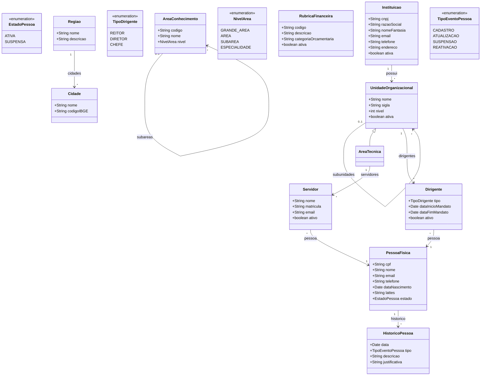

# Modelo Estrutural

Dominio e regras de negocio: ver [README.md](README.md)

### Diagrama de Classes

## Dicionario de Dados

| Classe | Atributo | Definicao | Obrig. | Tipo | Dominio | Tamanho | Unico |
|--------|----------|-----------|--------|------|---------|---------|-------|
| **PessoaFisica** | cpf | CPF da pessoa (somente digitos) | Sim | String | Ex: 12345678901 | 11 | Sim |
| | nome | Nome completo da pessoa | Sim | String | | 300 | |
| | email | Email de contato | Sim | String | | 200 | |
| | telefone | Telefone de contato | Nao | String | | 20 | |
| | dataNascimento | Data de nascimento | Sim | Date | | | |
| | lattes | URL do curriculo Lattes | Nao | String | | 500 | |
| | estado | Estado atual da pessoa | Gerado | EstadoPessoa | Ativa, Suspensa | | |
| **Instituicao** | cnpj | CNPJ da instituicao (somente digitos) | Sim | String | Ex: 12345678000199 | 14 | Sim |
| | razaoSocial | Razao social da instituicao | Sim | String | | 300 | Sim |
| | nomeFantasia | Nome fantasia da instituicao | Nao | String | | 300 | |
| | email | Email institucional | Sim | String | | 200 | |
| | telefone | Telefone institucional | Nao | String | | 20 | |
| | endereco | Endereco completo | Sim | String | | 500 | |
| | ativa | Indica se a instituicao esta ativa | Sim | Boolean | true/false | | |
| **UnidadeOrganizacional** | nome | Nome da unidade | Sim | String | Ex: Departamento de Informatica | 300 | |
| | sigla | Sigla da unidade | Sim | String | Ex: DI | 20 | |
| | nivel | Nivel hierarquico da unidade dentro da instituicao | Gerado | Int | Ex: 1, 2, 3 | | |
| | ativa | Indica se a unidade esta ativa | Sim | Boolean | true/false | | |
| **Dirigente** | tipo | Tipo do cargo de dirigente | Sim | TipoDirigente | Reitor, Diretor, Chefe | | |
| | dataInicioMandato | Data de inicio do mandato | Sim | Date | | | |
| | dataFimMandato | Data de termino do mandato | Sim | Date | | | |
| | ativo | Indica se o mandato esta vigente | Gerado | Boolean | true/false | | |
| **AreaConhecimento** | codigo | Codigo da area conforme CNPq | Sim | String | Ex: 1.03.04 | 20 | Sim |
| | nome | Nome da area de conhecimento | Sim | String | Ex: Ciencia da Computacao | 200 | |
| | nivel | Nivel hierarquico da area | Sim | NivelArea | Grande Area, Area, Subarea, Especialidade | | |
| **RubricaFinanceira** | codigo | Codigo da rubrica | Sim | String | Ex: 339018 | 20 | Sim |
| | descricao | Descricao da rubrica | Sim | String | | 300 | |
| | categoriaOrcamentaria | Categoria orcamentaria vinculada | Sim | String | | 200 | |
| | ativa | Indica se a rubrica esta ativa | Sim | Boolean | true/false | | |
| **Cidade** | nome | Nome da cidade | Sim | String | Ex: Vitoria | 200 | |
| | codigoIBGE | Codigo IBGE da cidade | Sim | String | Ex: 3205309 | 10 | Sim |
| **Regiao** | nome | Nome da regiao | Sim | String | Ex: Grande Vitoria | 200 | Sim |
| | descricao | Descricao da regiao | Nao | String | | 500 | |
| **Servidor** | nome | Nome do servidor | Sim | String | | 300 | |
| | matricula | Matricula funcional do servidor | Sim | String | | 20 | Sim |
| | email | Email institucional do servidor | Sim | String | | 200 | |
| | ativo | Indica se o servidor esta ativo | Sim | Boolean | true/false | | |
| **HistoricoPessoa** | data | Data do evento | Gerado | Date | | | |
| | tipo | Tipo do evento registrado | Sim | TipoEventoPessoa | Cadastro, Atualizacao, Suspensao, Reativacao | | |
| | descricao | Descricao textual do evento | Sim | String | | 500 | |
| | justificativa | Justificativa (obrigatoria para suspensao e reativacao) | Cond. | String | | 500 | |

## Notas de Implementacao

**Especializacao estrutural:**
- `AreaTecnica` e uma especializacao de `UnidadeOrganizacional` usada para representar as unidades internas da instituicao agencia responsaveis pela gestao operacional dos modulos de negocio.

**Entidades externas:**
- Acesso Cidadao (SSO): gerenciado por M005 (Autenticacao). A identidade autenticada e usada para vincular ao cadastro da pessoa.

**Navegabilidade:**
- Cardinalidade 1: atributo do tipo da classe destino (ex: Dirigente.pessoa: PessoaFisica)
- Cardinalidade N: atributo lista do tipo da classe destino (ex: Instituicao.unidades: List<UnidadeOrganizacional>)
