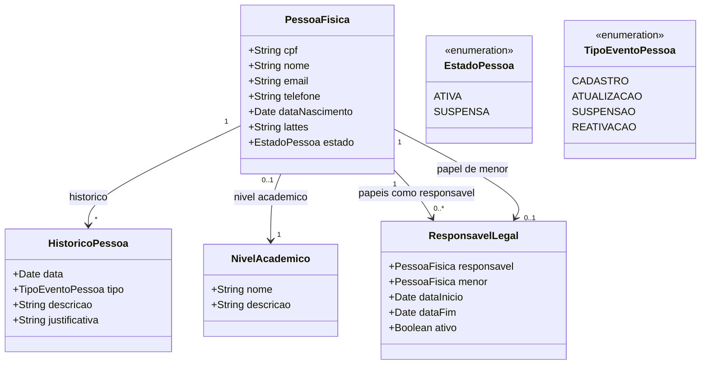

# Modelo Estrutural — Pessoas

Submodulo do M008. Modelo consolidado: [../modelo-estrutural.md](../modelo-estrutural.md) | Contexto: [README.md](README.md)

---

### Entidades do Contexto

| Entidade | Documento |
|----------|-----------|
| PessoaFisica | — |
| NivelAcademico | — |
| HistoricoPessoa | — |
| ResponsavelLegal | — |

---

### Diagrama de Classes

### Dicionario de Dados

| Classe | Atributo | Definicao | Obrig. | Tipo | Dominio | Tamanho | Unico |
|--------|----------|-----------|--------|------|---------|---------|-------|
| **PessoaFisica** | cpf | CPF da pessoa (somente digitos) | Sim | String | Ex: 12345678901 | 11 | Sim |
| | nome | Nome completo da pessoa | Sim | String | | 300 | |
| | email | Email de contato | Sim | String | | 200 | |
| | telefone | Telefone de contato | Nao | String | | 20 | |
| | dataNascimento | Data de nascimento | Sim | Date | | | |
| | lattes | URL do curriculo Lattes | Nao | String | | 500 | |
| | estado | Estado atual da pessoa | Gerado | EstadoPessoa | Ativa, Suspensa | | |
| | nivelAcademico (relacao) | Maior nivel academico informado para a pessoa | Nao | FK → NivelAcademico | Ex: Graduacao, Especializacao, Mestrado, Doutorado, Pos-Doutorado | | |
| | papeis como responsavel (relacao) | Papeis `ResponsavelLegal` nos quais esta pessoa atua como responsavel legal de menores | Nao | Lista FK → ResponsavelLegal | | | |
| | papel de menor (relacao) | Papel `ResponsavelLegal` ativo no qual esta pessoa e o menor representado | Cond. | FK → ResponsavelLegal | Obrigatorio quando idade < 18 (AX-PESSOAS-001) | | |
| **ResponsavelLegal** | responsavel | Pessoa que assume a responsabilidade legal | Sim | FK → PessoaFisica | Deve ser ativa e maior de idade; nao pode ser o proprio menor (RI7) | | |
| | menor | Pessoa menor de idade representada | Sim | FK → PessoaFisica | Deve ter idade < 18 na data de inicio do papel | | |
| | dataInicio | Data de inicio da responsabilidade legal | Sim | Date | | | |
| | dataFim | Data de encerramento da responsabilidade legal | Nao | Date | Nulo = vigente; deve ser posterior a dataInicio | | |
| | ativo | Indica se o papel esta vigente | Gerado | Boolean | Calculado: dataFim nula ou dataFim > hoje | | |
| **NivelAcademico** | nome | Nome do nivel academico | Sim | String | Ex: Doutorado | 100 | Sim |
| | descricao | Descricao do nivel academico | Nao | String | | 300 | |
| **HistoricoPessoa** | data | Data do evento | Gerado | Date | | | |
| | tipo | Tipo do evento registrado | Sim | TipoEventoPessoa | Cadastro, Atualizacao, Suspensao, Reativacao | | |
| | descricao | Descricao textual do evento | Sim | String | | 500 | |
| | justificativa | Justificativa (obrigatoria para suspensao e reativacao) | Cond. | String | | 500 | |

### Regras Relacionadas

- RN01: PessoaFisica identificada unicamente pelo CPF
- RN05: Suspensao bloqueia todas as operacoes vinculadas
- RN10: Cadastro automatico via Acesso Cidadao vincula pelo CPF
- RN11: NivelAcademico e uma tabela de referencia usada para requisitos de elegibilidade em captacoes e outras operacoes.
- RN19: Pessoa menor de idade (idade < 18) exige `ResponsavelLegal` vigente apontando para outra `PessoaFisica` cadastrada, ativa e maior de idade
- RI2: Reativacao requer justificativa
- RI7: Em `ResponsavelLegal`, `responsavel` deve ser diferente de `menor` — uma pessoa nao pode ser responsavel legal de si mesma; alem disso, `responsavel` deve ser cadastrada, ativa e maior de idade
- AX-PESSOAS-001: toda operacao que exija assinatura verifica se o signatario e menor e redireciona para o responsavel legal vigente
