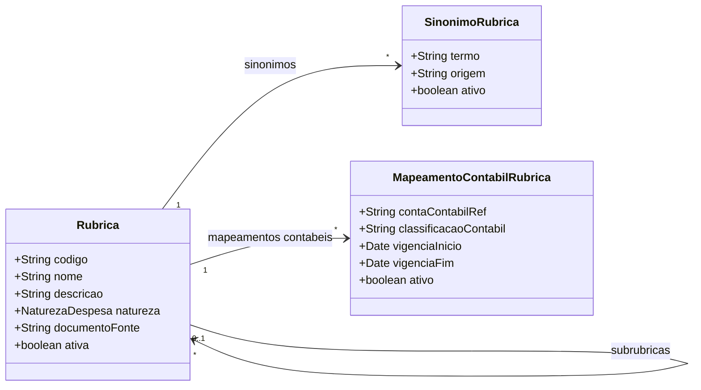

# Modelo Estrutural - Rubricas

[M008](../README.md) | [Backlog](backlog.md) | [Discovery FAPES](../../../../discovery/rubricas-subrubricas-fapes.md)

## Entidades

| Entidade | Documento | Responsabilidade |
|----------|-----------|------------------|
| Rubrica | [rubrica](rubrica/README.md) | Categoria normativa/orcamentaria para classificacao de despesas |
| SinonimoRubrica | [sinonimo-rubrica](sinonimo-rubrica/README.md) | Termos alternativos vinculados a rubrica canonica |
| MapeamentoContabilRubrica | [mapeamento-contabil-rubrica](mapeamento-contabil-rubrica/README.md) | Ponte opcional entre rubrica e conta contabil do M016 |

## Diagrama

## Regras

- Rubrica e categoria, nao transacao.
- Subrubrica e uma `Rubrica` filha por `rubricaPai`.
- Movimentacao de saldo pertence ao M013 como `Transacao`.
