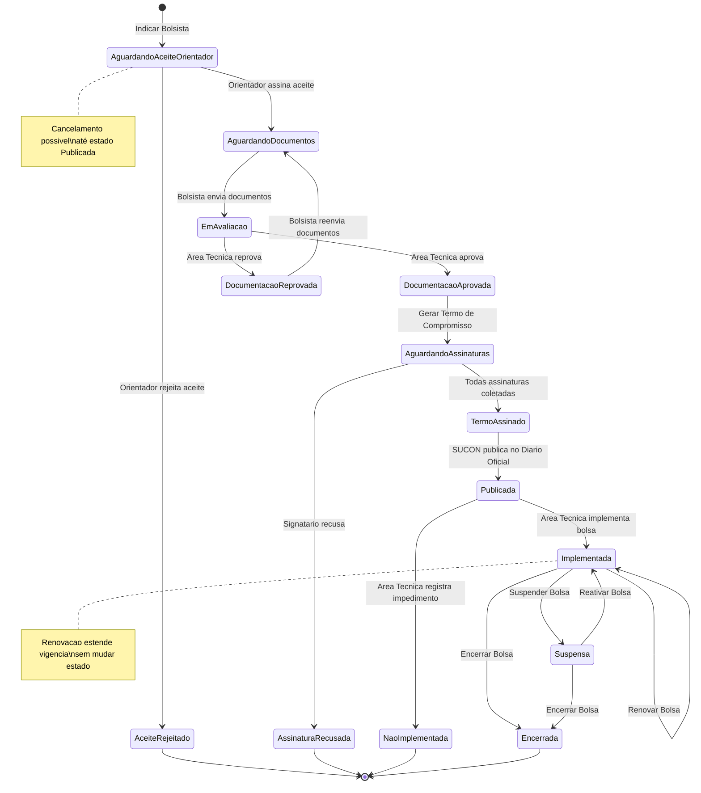
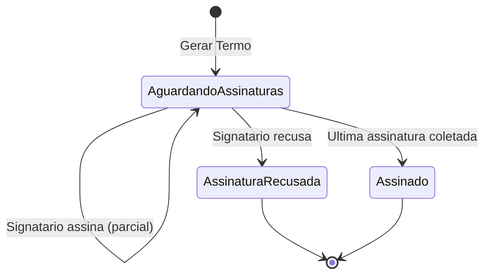

# Modelo Comportamental

Dominio e regras de negocio: ver [README.md](README.md)

### Ciclo de Vida: BolsaPesquisa

```mermaid
stateDiagram-v2
    [*] --> AguardandoAceiteOrientador : Indicar Bolsista

    AguardandoAceiteOrientador --> AceiteRejeitado : Orientador rejeita aceite
    AguardandoAceiteOrientador --> AguardandoDocumentos : Orientador assina aceite

    AceiteRejeitado --> [*]

    AguardandoDocumentos --> EmAvaliacao : Bolsista envia documentos

    EmAvaliacao --> DocumentacaoAprovada : Area Tecnica aprova
    EmAvaliacao --> DocumentacaoReprovada : Area Tecnica reprova

    DocumentacaoReprovada --> AguardandoDocumentos : Bolsista reenvia documentos

    DocumentacaoAprovada --> AguardandoAssinaturas : Gerar Termo de Compromisso

    AguardandoAssinaturas --> AssinaturaRecusada : Signatario recusa
    AguardandoAssinaturas --> TermoAssinado : Todas assinaturas coletadas

    AssinaturaRecusada --> [*]

    TermoAssinado --> Publicada : SUCON publica no Diario Oficial

    Publicada --> Implementada : Area Tecnica implementa bolsa
    Publicada --> NaoImplementada : Area Tecnica registra impedimento

    NaoImplementada --> [*]

    Implementada --> Suspensa : Suspender Bolsa
    Implementada --> Encerrada : Encerrar Bolsa
    Implementada --> Implementada : Renovar Bolsa

    Suspensa --> Implementada : Reativar Bolsa
    Suspensa --> Encerrada : Encerrar Bolsa

    Encerrada --> [*]

    state AguardandoAceiteOrientador : Indicacao registrada
    state AguardandoDocumentos : Aguardando envio pelo Bolsista
    state EmAvaliacao : Area Tecnica avaliando
    state DocumentacaoAprovada : Pronta para formalizacao
    state AguardandoAssinaturas : Termo gerado, coletando assinaturas
    state TermoAssinado : Pronto para publicacao
    state Publicada : Publicada no Diario Oficial
    state Implementada : Bolsa ativa, pagamentos habilitados
    state Suspensa : Pagamentos interrompidos
    state Encerrada : Bolsa finalizada, cota liberada

    note right of Implementada : Renovacao estende vigencia\nsem mudar estado
    note right of AguardandoAceiteOrientador : Cancelamento possivel\naté estado Publicada
```

### Ciclo de Vida: TermoCompromisso

```mermaid
stateDiagram-v2
    [*] --> AguardandoAssinaturas : Gerar Termo

    AguardandoAssinaturas --> AguardandoAssinaturas : Signatario assina (parcial)
    AguardandoAssinaturas --> AssinaturaRecusada : Signatario recusa
    AguardandoAssinaturas --> Assinado : Ultima assinatura coletada

    AssinaturaRecusada --> [*]
    Assinado --> [*]

    state AguardandoAssinaturas : Coordenador, Orientador, Bolsista, DIRAF, DIPRE
    state Assinado : Todas 5 assinaturas coletadas
```
