# Modelo Estrutural

Dominio e regras de negocio: ver [README.md](README.md)

### Diagrama de Classes

```mermaid
classDiagram
    direction TB

    class BolsaPesquisa {
        +String codigo
        +String temaPesquisa
        +String descricaoTema
        +Date dataInicioBolsa
        +Date dataFimBolsa
        +Date dataInicioCurso
        +Date dataFimCurso
        +int quantidadeCotas
        +EstadoBolsa estado
    }

    class EstadoBolsa {
        <<enumeration>>
        AGUARDANDO_ACEITE_ORIENTADOR
        ACEITE_REJEITADO
        AGUARDANDO_DOCUMENTOS
        EM_AVALIACAO
        DOCUMENTACAO_APROVADA
        DOCUMENTACAO_REPROVADA
        AGUARDANDO_ASSINATURAS
        ASSINATURA_RECUSADA
        TERMO_ASSINADO
        PUBLICADA
        IMPLEMENTADA
        NAO_IMPLEMENTADA
        SUSPENSA
        ENCERRADA
        CANCELADA
    }

    class MotivoEncerramento {
        <<enumeration>>
        CONCLUSAO
        DESISTENCIA
        CORTE_RECURSOS
        DESCUMPRIMENTO
    }

    class TermoAceite {
        +Date dataAssinatura
        +boolean aceito
        +String justificativa
    }

    class DocumentoBolsa {
        +String nome
        +String tipo
        +URL url
        +Date dataEnvio
        +StatusDocumento status
    }

    class StatusDocumento {
        <<enumeration>>
        ENVIADO
        APROVADO
        REPROVADO
        REENVIO_SOLICITADO
    }

    class ParecerAvaliacao {
        +Date dataAvaliacao
        +boolean aprovado
        +String justificativa
    }

    class TermoCompromisso {
        +String codigo
        +Date dataGeracao
        +EstadoTermo estado
    }

    class EstadoTermo {
        <<enumeration>>
        AGUARDANDO_ASSINATURAS
        ASSINATURA_RECUSADA
        ASSINADO
    }

    class AssinaturaTermo {
        +String signatario
        +String perfil
        +Date dataAssinatura
        +boolean assinado
        +String justificativa
    }

    class PublicacaoDiarioOficial {
        +String numeroDiario
        +Date dataPublicacao
    }

    class HistoricoBolsa {
        +Date data
        +TipoEvento tipo
        +String descricao
    }

    class TipoEvento {
        <<enumeration>>
        INDICACAO
        ACEITE
        ENVIO_DOCUMENTOS
        AVALIACAO
        GERACAO_TERMO
        ASSINATURA
        PUBLICACAO
        IMPLEMENTACAO
        RENOVACAO
        SUSPENSAO
        REATIVACAO
        ENCERRAMENTO
        CANCELAMENTO
    }

    class Coordenador {
        <<fora do escopo - M003>>
    }

    class Orientador {
        <<fora do escopo - M003>>
    }

    class Bolsista {
        <<fora do escopo - M003>>
    }

    class Iniciativa {
        <<fora do escopo - M003>>
    }

    class CotaBolsa {
        +int quantidadeDisponivel
    }

    class VersaoNivel {
        <<fora do escopo - M001>>
    }

    BolsaPesquisa "*" --> "1" Iniciativa : vinculada a
    BolsaPesquisa "*" --> "1" CotaBolsa : consome
    BolsaPesquisa "*" --> "1" Coordenador : indicada por
    BolsaPesquisa "*" --> "1" Orientador : orientada por
    BolsaPesquisa "*" --> "1" Bolsista : concedida a
    BolsaPesquisa "*" --> "1" VersaoNivel : nivel da bolsa
    BolsaPesquisa "1" --> "1" TermoAceite : aceite do orientador
    BolsaPesquisa "1" --> "*" DocumentoBolsa : documentos
    BolsaPesquisa "1" --> "*" ParecerAvaliacao : pareceres
    BolsaPesquisa "1" --> "0..1" TermoCompromisso : termo
    BolsaPesquisa "1" --> "0..1" PublicacaoDiarioOficial : publicacao
    BolsaPesquisa "1" --> "*" HistoricoBolsa : historico
    TermoCompromisso "1" --> "*" AssinaturaTermo : assinaturas
```

## Dicionario de Dados

| Classe | Atributo | Definicao | Obrig. | Tipo | Dominio | Tamanho | Unico |
|--------|----------|-----------|--------|------|---------|---------|-------|
| **BolsaPesquisa** | codigo | Codigo de identificacao unica da bolsa | Gerado | String | Ex: BP-2025-001 | | Sim |
| | temaPesquisa | Titulo do tema de pesquisa do bolsista | Sim | String | | 300 | |
| | descricaoTema | Descricao detalhada do tema, incluindo palavras-chave | Sim | String | | 2000 | |
| | dataInicioBolsa | Data de inicio da vigencia da bolsa | Sim | Date | | | |
| | dataFimBolsa | Data de fim da vigencia da bolsa | Sim | Date | | | |
| | dataInicioCurso | Data de inicio do curso (mestrado/doutorado) | Sim | Date | | | |
| | dataFimCurso | Data prevista de conclusao do curso | Sim | Date | | | |
| | quantidadeCotas | Quantidade de cotas utilizadas pela bolsa | Sim | Int | Ex: 24 de 30 disponiveis | | |
| | estado | Estado atual da bolsa no ciclo de vida | Gerado | EstadoBolsa | Ver enumeracao | | |
| **TermoAceite** | dataAssinatura | Data em que o orientador assinou ou rejeitou | Sim | Date | | | |
| | aceito | Indica se o orientador aceitou a indicacao | Sim | Boolean | true/false | | |
| | justificativa | Justificativa em caso de rejeicao | Cond. | String | Obrigatorio se aceito=false | 500 | |
| **DocumentoBolsa** | nome | Nome do documento enviado | Sim | String | Ex: Comprovante de matricula | 200 | |
| | tipo | Tipo/categoria do documento | Sim | String | Ex: Matricula, RG, CPF, Historico | 100 | |
| | url | URL de acesso ao documento armazenado | Sim | URL | | | |
| | dataEnvio | Data do envio ou reenvio do documento | Sim | Date | | | |
| | status | Status do documento na avaliacao | Gerado | StatusDocumento | Ver enumeracao | | |
| **ParecerAvaliacao** | dataAvaliacao | Data em que o parecer foi emitido | Sim | Date | | | |
| | aprovado | Indica se a documentacao foi aprovada | Sim | Boolean | true/false | | |
| | justificativa | Justificativa do parecer | Sim | String | | 1000 | |
| **TermoCompromisso** | codigo | Codigo de identificacao do termo | Gerado | String | Ex: TC-2025-001 | | Sim |
| | dataGeracao | Data em que o termo foi gerado | Gerado | Date | | | |
| | estado | Estado do termo no fluxo de assinaturas | Gerado | EstadoTermo | Ver enumeracao | | |
| **AssinaturaTermo** | signatario | Nome do signatario | Sim | String | | 200 | |
| | perfil | Perfil do signatario no processo | Sim | String | Coordenador, Orientador, Bolsista, DIRAF, DIPRE | 50 | |
| | dataAssinatura | Data da assinatura ou recusa | Cond. | Date | Preenchida ao assinar/recusar | | |
| | assinado | Indica se o signatario assinou | Sim | Boolean | true/false | | |
| | justificativa | Justificativa em caso de recusa | Cond. | String | Obrigatorio se assinado=false | 500 | |
| **PublicacaoDiarioOficial** | numeroDiario | Numero da edicao do Diario Oficial | Sim | String | | 50 | |
| | dataPublicacao | Data da publicacao | Sim | Date | | | |
| **HistoricoBolsa** | data | Data do evento | Gerado | Date | | | |
| | tipo | Tipo do evento registrado | Sim | TipoEvento | Ver enumeracao | | |
| | descricao | Descricao textual do evento | Sim | String | | 500 | |

## Notas de Implementacao

**Entidades externas:**
- Iniciativa: gerenciada por M003 (Gestao de Iniciativas Captadas).
- Edital/chamada: gerenciado por M011 (Configuracao da Captacao), quando aplicavel.
- Coordenador, Orientador e Bolsista: papeis operacionais do fluxo de bolsas no M009, referenciando PessoaFisica quando necessario.
- VersaoNivel: gerenciado por M001 (Modalidade de Bolsa).

**Navegabilidade:**
- Cardinalidade 1: atributo do tipo da classe destino (ex: BolsaPesquisa.projeto: Projeto)
- Cardinalidade N: atributo lista do tipo da classe destino (ex: BolsaPesquisa.documentos: List&lt;DocumentoBolsa&gt;)

**Regras de saldo aplicaveis:**
Ver [discovery/regras-saldo-alocado-disponivel.md](../../../discovery/regras-saldo-alocado-disponivel.md). RN-SLD01 a RN-SLD05 + RI-SLD1/2 governam saldo de bolsas no orcamento do projeto. M013 e fonte canonica via `RubricaProjeto` (terminologia: `valorAprovado`/`valorComprometido`/`valorExecutado`/`saldoDisponivel` ↔ `valorTotal`/`valorAlocado`/`valorConsumido`/`valorDisponivel`). Eventos M009 que afetam saldo:
- `BolsaConcedida` → +Alocado (mensalidades futuras reservadas)
- `MensalidadePaga` (via M004 Folha) → −Alocado, +Consumido
- `BolsaCancelada` antes do pagamento → −Alocado, +Disponivel
- `MensalidadeEstornada` → −Consumido, +Disponivel

Nova concessao bloqueada por RN-SLD02 quando `valorBolsaSolicitada > valorDisponivel`.

`CotaBolsa.quantidadeDisponivel` e contador independente em quantidade de cotas; nao substitui o saldo monetario governado por RN-SLD01.
