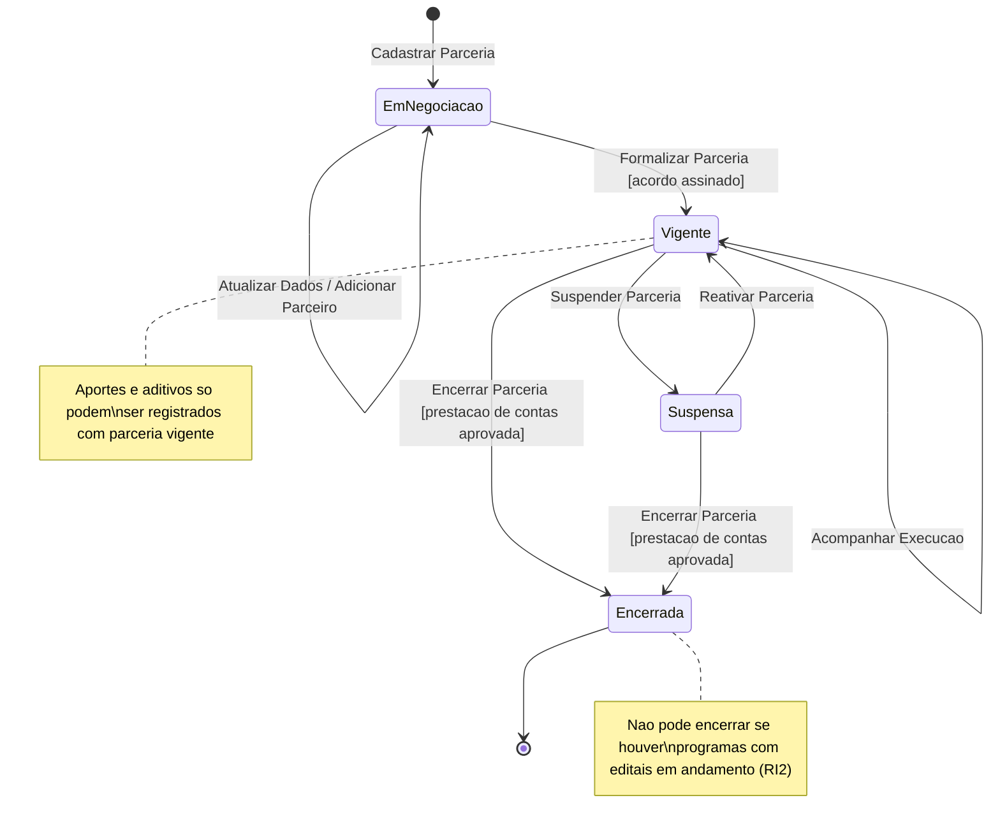
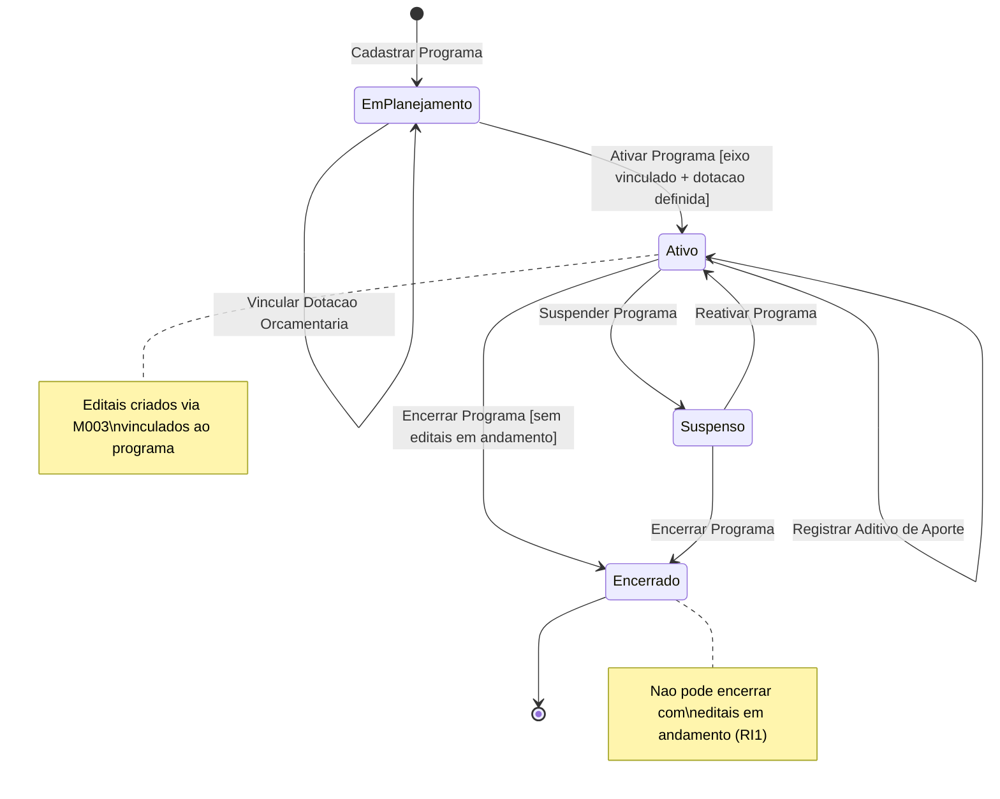

# Modelo Comportamental

Dominio e regras de negocio: ver [README.md](README.md)

### Ciclo de Vida: Parceria

```mermaid
stateDiagram-v2
    [*] --> EmNegociacao : Cadastrar Parceria

    EmNegociacao --> EmNegociacao : Atualizar Dados / Adicionar Parceiro
    EmNegociacao --> Vigente : Formalizar Parceria [acordo assinado]

    Vigente --> Vigente : Registrar Aporte Financeiro
    Vigente --> Vigente : Registrar Aditivo de Tempo
    Vigente --> Vigente : Registrar Aditivo de Aporte
    Vigente --> Vigente : Acompanhar Execucao
    Vigente --> Suspensa : Suspender Parceria
    Vigente --> Encerrada : Encerrar Parceria [prestacao de contas aprovada]

    Suspensa --> Vigente : Reativar Parceria
    Suspensa --> Encerrada : Encerrar Parceria [prestacao de contas aprovada]

    Encerrada --> [*]

    state EmNegociacao : Termos sendo definidos, sem aportes
    state Vigente : Acordo assinado, aportes e aditivos permitidos
    state Suspensa : Operacoes interrompidas temporariamente
    state Encerrada : Prestacao de contas final aprovada

    note right of Vigente : Aportes e aditivos so podem\nser registrados com parceria vigente
    note right of Encerrada : Nao pode encerrar se houver\nprogramas com editais em andamento (RI2)
```

### Ciclo de Vida: Programa

```mermaid
stateDiagram-v2
    [*] --> EmPlanejamento : Cadastrar Programa

    EmPlanejamento --> EmPlanejamento : Atualizar Dados
    EmPlanejamento --> EmPlanejamento : Cadastrar Comite Gestor
    EmPlanejamento --> EmPlanejamento : Vincular Dotacao Orcamentaria
    EmPlanejamento --> Ativo : Ativar Programa [eixo vinculado + dotacao definida]

    Ativo --> Ativo : Vincular Dotacao Adicional
    Ativo --> Ativo : Atualizar Comite Gestor
    Ativo --> Ativo : Registrar Aditivo de Tempo
    Ativo --> Ativo : Registrar Aditivo de Aporte
    Ativo --> Suspenso : Suspender Programa
    Ativo --> Encerrado : Encerrar Programa [sem editais em andamento]

    Suspenso --> Ativo : Reativar Programa
    Suspenso --> Encerrado : Encerrar Programa

    Encerrado --> [*]

    state EmPlanejamento : Configuracao inicial, sem editais
    state Ativo : Programa habilitado para criacao de editais
    state Suspenso : Novos editais bloqueados
    state Encerrado : Programa finalizado, historico mantido

    note right of Ativo : Editais criados via M003\nvinculados ao programa
    note right of Encerrado : Nao pode encerrar com\neditais em andamento (RI1)
```
