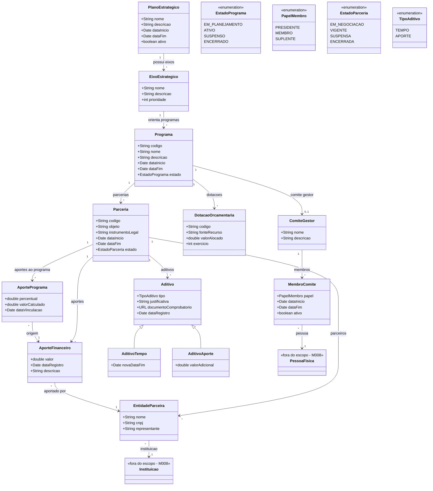

# Modelo Estrutural

Dominio e regras de negocio: ver [README.md](README.md)

### Diagrama de Classes

## Dicionario de Dados

| Classe | Atributo | Definicao | Obrig. | Tipo | Dominio | Tamanho | Unico |
|--------|----------|-----------|--------|------|---------|---------|-------|
| **PlanoEstrategico** | nome | Nome do plano estrategico | Sim | String | Ex: Plano Estrategico 2024-2027 | 300 | Sim |
| | descricao | Descricao dos objetivos do plano | Sim | String | | 2000 | |
| | dataInicio | Data de inicio da vigencia do plano | Sim | Date | | | |
| | dataFim | Data de fim da vigencia do plano | Sim | Date | | | |
| | ativo | Indica se o plano esta ativo | Sim | Boolean | true/false | | |
| **EixoEstrategico** | nome | Nome do eixo estrategico | Sim | String | Ex: Formacao de Recursos Humanos | 300 | |
| | descricao | Descricao do escopo e objetivos do eixo | Sim | String | | 2000 | |
| | prioridade | Ordem de prioridade do eixo no plano | Sim | Int | Ex: 1, 2, 3 | | |
| **Programa** | codigo | Codigo de identificacao do programa | Gerado | String | Ex: PRG-2025-001 | | Sim |
| | nome | Nome do programa de fomento | Sim | String | Ex: Programa de Bolsas de Pesquisa | 300 | |
| | descricao | Descricao detalhada do programa, acoes apoiadas e modalidade de financiamento | Sim | String | | 2000 | |
| | dataInicio | Data de inicio do programa | Sim | Date | | | |
| | dataFim | Data de fim do programa | Sim | Date | | | |
| | estado | Estado atual do programa | Gerado | EstadoPrograma | Ver enumeracao | | |
| **ComiteGestor** | nome | Nome do comite | Sim | String | Ex: Comite Gestor do PRG-2025-001 | 300 | |
| | descricao | Descricao das atribuicoes do comite | Nao | String | | 1000 | |
| **MembroComite** | papel | Papel do membro no comite | Sim | PapelMembro | Presidente, Membro, Suplente | | |
| | dataInicio | Data de inicio da participacao | Sim | Date | | | |
| | dataFim | Data de fim da participacao | Nao | Date | | | |
| | ativo | Indica se o membro esta ativo no comite | Gerado | Boolean | true/false | | |
| **DotacaoOrcamentaria** | codigo | Codigo da dotacao orcamentaria | Sim | String | Ex: LOA-2025-1234 | 50 | Sim |
| | fonteRecurso | Fonte de recurso (LOA, LDO, PPA, parceria) | Sim | String | | 200 | |
| | valorAlocado | Valor alocado ao programa | Sim | Double | | | |
| | exercicio | Exercicio financeiro da dotacao | Sim | Int | Ex: 2025 | | |
| **Parceria** | codigo | Codigo de identificacao da parceria | Gerado | String | Ex: PRC-2025-001 | | Sim |
| | objeto | Descricao do objeto da parceria | Sim | String | | 2000 | |
| | instrumentoLegal | Tipo do instrumento legal (convenio, acordo, termo) | Sim | String | | 200 | |
| | dataInicio | Data de inicio da vigencia | Sim | Date | | | |
| | dataFim | Data de fim da vigencia | Sim | Date | | | |
| | estado | Estado atual da parceria | Gerado | EstadoParceria | Ver enumeracao | | |
| **EntidadeParceira** | nome | Nome da entidade parceira | Sim | String | | 300 | |
| | cnpj | CNPJ da entidade | Sim | String | | 14 | |
| | representante | Nome do representante legal | Sim | String | | 300 | |
| **AporteFinanceiro** | valor | Valor do aporte financeiro | Sim | Double | | | |
| | dataRegistro | Data do registro do aporte | Gerado | Date | | | |
| | descricao | Descricao do aporte | Nao | String | | 500 | |
| **Aditivo** | tipo | Tipo do aditivo | Sim | TipoAditivo | Tempo, Aporte | | |
| | justificativa | Justificativa para o aditivo | Sim | String | | 2000 | |
| | documentoComprobatorio | URL do documento comprobatorio anexado | Sim | URL | | | |
| | dataRegistro | Data do registro do aditivo | Gerado | Date | | | |
| **AditivoTempo** | novaDataFim | Nova data de fim da vigencia | Sim | Date | | | |
| **AditivoAporte** | valorAdicional | Valor financeiro adicional | Sim | Double | | | |
| **AportePrograma** | percentual | Percentual do aporte alocado ao programa | Sim | Double | Ex: 50.0 (50%) | | |
| | valorCalculado | Valor calculado com base no percentual | Gerado | Double | | | |
| | dataVinculacao | Data da vinculacao do aporte ao programa | Gerado | Date | | | |

## Notas de Implementacao

**Entidades externas:**
- PessoaFisica: gerenciado por M008 (Cadastros Corporativos). Membros do comite gestor sao pessoas fisicas.
- Instituicao: gerenciado por M008 (Cadastros Corporativos). Entidades parceiras referenciam instituicoes cadastradas.

**Heranca:**
- Aditivo e uma classe abstrata com duas especializacoes: AditivoTempo e AditivoAporte. O tipo do aditivo define qual especializacao e utilizada.

**Navegabilidade:**
- Cardinalidade 1: atributo do tipo da classe destino (ex: Programa.comiteGestor: ComiteGestor)
- Cardinalidade N: atributo lista do tipo da classe destino (ex: Parceria.aportes: List&lt;AporteFinanceiro&gt;)
