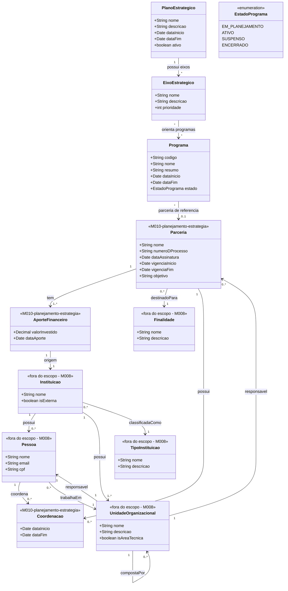

# Modelo Estrutural

Dominio e regras de negocio: ver [README.md](README.md)

### Diagrama de Classes

## Dicionario de Dados

| Classe | Atributo | Definicao | Obrig. | Tipo | Dominio | Tamanho | Unico |
|--------|----------|-----------|--------|------|---------|---------|-------|
| **PlanoEstrategico** | nome | Nome do plano estrategico | Sim | String | Ex: Plano Estrategico 2024-2027 | 300 | Sim |
| | descricao | Descricao dos objetivos do plano | Sim | String | | 2000 | |
| | dataInicio | Data de inicio da vigencia do plano | Sim | Date | | | |
| | dataFim | Data de fim da vigencia do plano | Sim | Date | | | |
| | ativo | Indica se o plano esta ativo | Sim | Boolean | true/false | | |
| **EixoEstrategico** | nome | Nome do eixo estrategico | Sim | String | Ex: Formacao de Recursos Humanos | 300 | |
| | descricao | Descricao do escopo e objetivos do eixo | Sim | String | | 2000 | |
| | prioridade | Ordem de prioridade do eixo no plano | Sim | Int | Ex: 1, 2, 3 | | |
| **Programa** | codigo | Codigo de identificacao do programa | Gerado | String | Ex: PRG-2025-001 | | Sim |
| | nome | Nome do programa de fomento | Sim | String | Ex: Programa de Bolsas de Pesquisa | 300 | |
| | resumo | Resumo do programa, sua justificativa e objetivo geral | Sim | String | | 2000 | |
| | dataInicio | Data de inicio do programa | Sim | Date | | | |
| | dataFim | Data de fim do programa | Sim | Date | | | |
| | estado | Estado atual do programa | Gerado | EstadoPrograma | Ver enumeracao | | |
| **Parceria** | nome | Nome da parceria | Sim | String | Ex: Parceria Pesquisa em Saude 2026 | 300 | |
| | numeroDProcesso | Numero do processo administrativo | Sim | String | Ex: PRC-2026-001 | 100 | Sim |
| | dataAssinatura | Data da assinatura do instrumento | Sim | Date | | | |
| | vigenciaInicio | Data de inicio da vigencia | Sim | Date | | | |
| | vigenciaFim | Data de fim da vigencia | Sim | Date | | | |
| | objetivo | Objetivo geral da parceria | Sim | String | | 2000 | |
| **AporteFinanceiro** | valorInvestido | Valor do aporte financeiro | Sim | Decimal | Ex: 500000.00 | | |
| | dataAporte | Data de realizacao do aporte | Sim | Date | | | |
| **Coordenacao** | dataInicio | Data de inicio da coordenacao | Sim | Date | | | |
| | dataFim | Data de fim da coordenacao | Nao | Date | | | |

## Entidades Externas (M008 - Cadastros Corporativos)

| Classe | Descricao | Relacao com M010 |
|--------|-----------|------------------|
| **Pessoa** | Individuo cadastrado no sistema | Coordena parcerias via Coordenacao; responsavel por UnidadeOrganizacional |
| **Instituicao** | Organizacao cadastrada (IFES, empresa, agencia) | Origem de AporteFinanceiro; possui Pessoas e UnidadeOrganizacionais |
| **TipoInstituicao** | Classificacao da instituicao | Classifica Instituicao (ensino, empresa, agencia de fomento) |
| **UnidadeOrganizacional** | Setor, diretoria ou area da instituicao | Responsavel pela Parceria; estrutura hierarquica interna |
| **Finalidade** | Classificacao do proposito do investimento | Classificacao da Parceria (Pesquisa, Inovacao, Extensao) |

## Notas de Implementacao

**Simplificacao do modelo de Parcerias:**
- Parceria e um instrumento direto com nome, processo, vigencia e objetivo. Nao possui mais EntidadeParceira, Aditivos nem DocumentoParceria.
- AporteFinanceiro referencia diretamente a Instituicao de origem (M008), sem intermediacao de EntidadeParceira.
- Coordenacao e uma relacao temporal entre Pessoa (M008) e Parceria, substituindo os atributos coordenadorNome/Email/Celular.
- UnidadeOrganizacional (M008) e responsavel pela Parceria, substituindo o atributo gerenciaResponsavel.

**Navegabilidade:**
- Cardinalidade 1: atributo do tipo da classe destino (ex: Parceria.finalidade: Finalidade)
- Cardinalidade N: atributo lista do tipo da classe destino (ex: Parceria.aportes: List&lt;AporteFinanceiro&gt;)
