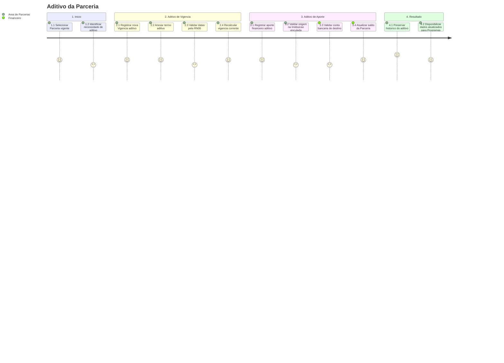

# Jornada — Aditivo da Parceria

[← Voltar ao Processo](processo.md) | [Estrutural](modelo-estrutural.md) | [Comportamental](modelo-comportamental.md)

---

## Jornada do Usuario

## Etapas

| # | Etapa | Ator principal | Resultado |
|---|-------|----------------|-----------|
| 1 | Selecionar Parceria | Area de Parcerias | Parceria vigente selecionada para alteracao. |
| 2 | Aditivo de vigencia | Area de Parcerias | Nova `Vigencia` com `isAditivo = true` registrada. |
| 3 | Aditivo de aporte | Area de Parcerias / Financeiro | Novo `AporteFinanceiro` com `isAditivo = true` registrado. |
| 4 | Recalculo | Area de Parcerias / Financeiro | Vigencia corrente ou saldo atualizados. |
| 5 | Historico | Area de Parcerias | Alteracao preservada como aditivo, sem sobrescrever o instrumento original. |

## Referencia de Regras

Regras aplicaveis: `RN04`, `RN06`, `RN10`, `RN14`, `RN17`. As definicoes oficiais ficam em [M010 — Regras de Negocio](../README.md#regras-de-negocio-consolidadas).
