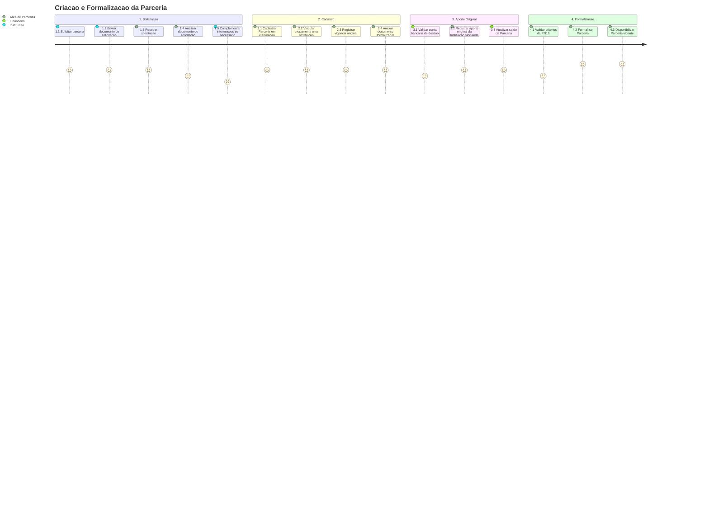

# Jornada — Criacao da Parceria

[← Voltar ao Processo](processo.md) | [Estrutural](modelo-estrutural.md) | [Comportamental](modelo-comportamental.md)

---

## Jornada do Usuario

## Etapas

| # | Etapa | Ator principal | Resultado |
|---|-------|----------------|-----------|
| 1 | Solicitacao | Instituicao | Pedido de parceria e documento de solicitacao enviados. |
| 2 | Analise inicial | Area de Parcerias | Solicitacao aceita para cadastro ou devolvida para complementacao. |
| 3 | Cadastro | Area de Parcerias | Parceria criada em `EmElaboracao` com Instituicao unica, vigencia original e documentos. |
| 4 | Aporte original | Area de Parcerias / Financeiro | `AporteFinanceiro` original registrado com origem na Instituicao vinculada. |
| 5 | Formalizacao | Area de Parcerias | Parceria transita para `Vigente` quando RN19 e atendida. |

## Referencia de Regras

Regras aplicaveis: `RN04`, `RN10`, `RN15`, `RN19`. As definicoes oficiais ficam em [M010 — Regras de Negocio](../README.md#regras-de-negocio-consolidadas).
