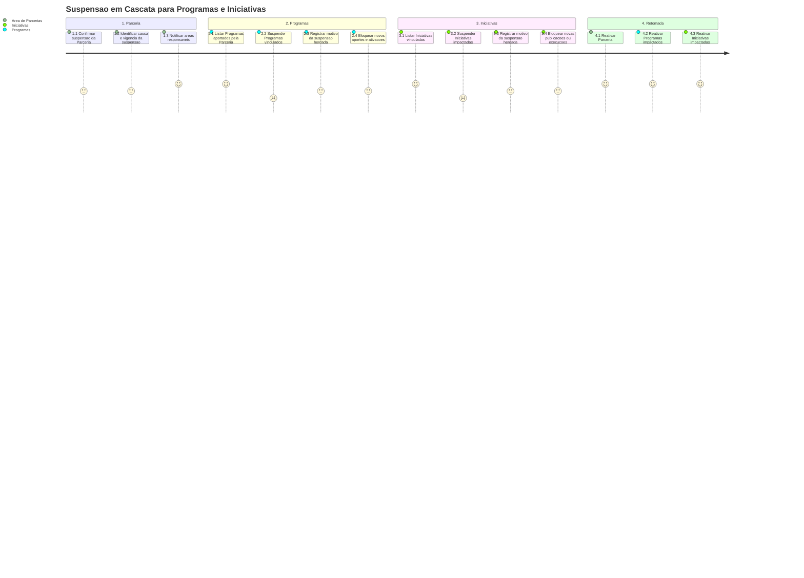

# Jornada — Suspensao em Cascata

[← Voltar ao Processo](processo.md) | [Estrutural](modelo-estrutural.md) | [Comportamental](modelo-comportamental.md)

---

## Jornada do Usuario

## Etapas

| # | Etapa | Ator principal | Resultado |
|---|-------|----------------|-----------|
| 1 | Confirmar suspensao | Area de Parcerias | Parceria permanece em `Suspensa` com motivo registrado. |
| 2 | Suspender Programas | Programas / M010 | Todos os Programas aportados pela Parceria ficam `Suspenso`. |
| 3 | Suspender Iniciativas | Iniciativas / M003 | Iniciativas vinculadas diretamente ou por Programa ficam suspensas. |
| 4 | Bloquear execucao | Programas / Iniciativas | Novas ativacoes, publicacoes ou execucoes ficam bloqueadas. |
| 5 | Retomada | Area de Parcerias / Programas / Iniciativas | Reativacao ocorre em ordem inversa: Parceria, Programas e Iniciativas. |

## Referencia de Regras

Regra aplicavel: `RI4`. A definicao oficial fica em [M010 — Regras de Negocio](../README.md#regras-de-negocio-consolidadas).
