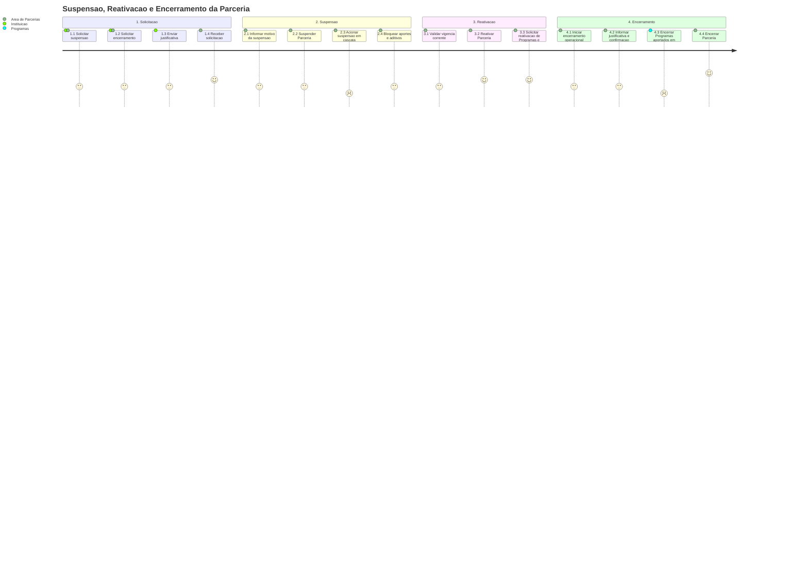

# Jornada — Suspensao, Reativacao e Encerramento da Parceria

[← Voltar ao Processo](processo.md) | [Estrutural](modelo-estrutural.md) | [Comportamental](modelo-comportamental.md)

---

## Jornada do Usuario

## Etapas

| # | Etapa | Ator principal | Resultado |
|---|-------|----------------|-----------|
| 1 | Solicitacao | Instituicao ou Area de Parcerias | Pedido de suspensao ou encerramento recebido. |
| 2 | Suspensao | Area de Parcerias | Parceria transita para `Suspensa` e bloqueia novas operacoes. |
| 3 | Reativacao | Area de Parcerias | Parceria volta para `Vigente` se a vigencia corrente estiver valida. |
| 4 | Encerramento | Area de Parcerias / Programas | Programas aportados sao encerrados em cascata e a Parceria transita para `Encerrada`. |

## Referencia de Regras

Regras aplicaveis: `RN14`, `RI2`, `RI4`. As definicoes oficiais ficam em [M010 — Regras de Negocio](../README.md#regras-de-negocio-consolidadas).
