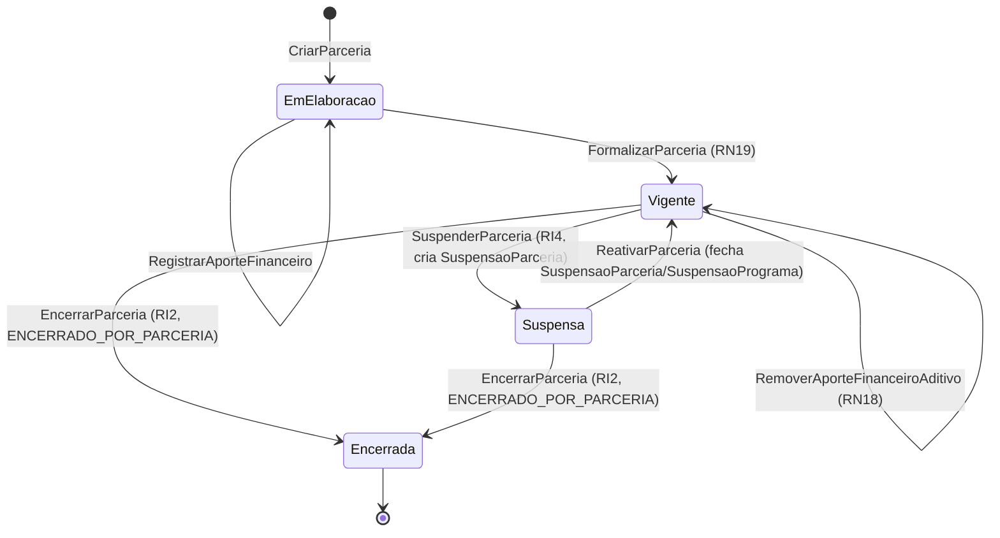

# Modelo Comportamental — Parcerias

[← Voltar ao M010](../README.md) | [Estrutural](modelo-estrutural.md)

---

## Ciclo de Vida: Parceria

### Descricao dos estados

| Estado | Descricao |
|--------|-----------|
| **EmElaboracao** | Parceria cadastrada com Vigencia original. Permanece aqui ate atender RN19. |
| **Vigente** | Acordo assinado; aportes e aditivos permitidos. `hoje` em `[vigenciaInicioCorrente, vigenciaFimCorrente]`. |
| **Suspensa** | Operacoes interrompidas temporariamente. Nesta entrega, a suspensao cria `SuspensaoParceria` e suspende Programas `VIGENTE` associados via `AporteFinanceiroPrograma` com status `SUSPENSO_POR_PARCERIA`; bloqueios finos e Iniciativas ficam para integracoes futuras. |
| **Encerrada** | Parceria encerrada formalmente com `DataFim` e `JustificativaEncerramento`; Programas associados recebem `ENCERRADO_POR_PARCERIA`; imutavel. |

### Guards e regras por transicao

| Transicao | Operacao | Pre-condicoes |
|-----------|----------|---------------|
| `[*] → EmElaboracao` | `CriarParceria` | Instituicao informada (RN10); Vigencia original valida (RN15) |
| `EmElaboracao → Vigente` | `FormalizarParceria` | Ver `RN19` |
| `Vigente → Suspensa` | `SuspenderParceria` | motivo informado; origem derivada do token; cria `SuspensaoParceria`; Programas `VIGENTE` associados passam para `SUSPENSO_POR_PARCERIA` (RI4) |
| `Suspensa → Vigente` | `ReativarParceria` | existe `SuspensaoParceria` ativa; fecha historicos ativos; Programas `SUSPENSO_POR_PARCERIA` voltam para `VIGENTE`; nao ressuscita encerrados |
| `Vigente → Encerrada` / `Suspensa → Encerrada` | `EncerrarParceria` | justificativa obrigatoria; registra `DataFim` e `JustificativaEncerramento`; Programas associados passam para `ENCERRADO_POR_PARCERIA` (RI2) |

### Gatilhos de encerramento

1. **Manual**: usuario solicita `EncerrarParceria` com justificativa obrigatoria.
2. **Automatico por expiracao**: job diario `VerificarVigenciaExpirada` detecta `vigenciaFimCorrente` < `hoje`, **notifica** o responsavel e abre pendencia operacional. O encerramento efetivo continua exigindo chamada explicita ao endpoint de encerramento com justificativa.

### Referencia de Regras

Regras aplicaveis ao ciclo de vida de Parcerias: `RN13`, `RN14`, `RN19`, `RI2`, `RI4`. As definicoes oficiais ficam em [M010 — Regras de Negocio](../README.md#regras-de-negocio-consolidadas).

- Prestacao de contas final: parte do processo de encerramento; criterios detalhados a serem definidos com o cliente.

---

## Regras Financeiras por Operacao

### RegistrarAporteFinanceiro (original ou aditivo)

1. Valida pre-condicoes: `dataAssinatura` da Parceria preenchida (RN03), origem = Instituicao vinculada (RN04), documento classificado como "Termo de Descentralizacao" (RN12).
2. Se `isAditivo = true`: verifica existencia de original e `dataAporte` posterior (RN17).
3. Calcula `TaxaGestaoParcerias` com snapshot da `PoliticaTaxaGestaoParcerias` vigente no M016 (RN20, RN23).
4. Recalcula derivados: `valorBrutoRecebido`, `valorTaxaGestao`, `saldoAlocavelEmProgramas`.
5. Emite evento `AporteFinanceiroRegistrado`.
6. Quando o aporte gera `TaxaGestaoParcerias`, emite `TaxaGestaoParceriasCalculada` com o snapshot (`aporteFinanceiroId`, `versaoFaixaId`, `valorBase`, `percentualAplicado`, `valorTaxaGestao`) — consumido pelo M016/taxa-gestao (estado CALCULADA). A Parceria e a versao da politica derivam, respectivamente, do aporte e da `versaoFaixaId`.

### EditarAporteFinanceiroAditivo / RemoverAporteFinanceiroAditivo (RN18)

1. Operacao permitida apenas para `AporteFinanceiro.isAditivo = true`.
2. Recalcula `valorBrutoRecebido`, `valorTaxaGestao` e `saldoAlocavelEmProgramas` com o novo estado.
3. Rejeita se `saldoAlocavelEmProgramas_resultante < 0` (INV-M010-PAR-01).

### RegistrarAporteFinanceiroPrograma (alocacao em Programa)

1. Verifica `saldoAlocavelEmProgramas >= valor_alocado` (RN22).
2. Verifica Parceria `Vigente` (RN11).
3. Verifica que datas do Programa cabem na vigencia da Parceria (RN13).
4. Debita do `saldoAlocavelEmProgramas`; emite evento de alocacao.

### RetirarAporteFinanceiroPrograma

1. Remove o `AporteFinanceiroPrograma`.
2. Devolve valor ao `saldoAlocavelEmProgramas` da Parceria (RN14).

### Impacto no Saldo por Operacao

| Operacao | valorBrutoRecebido | valorTaxaGestao | saldoAlocavelEmProgramas |
|----------|-------------------|-----------------|--------------------------|
| Registrar AporteFinanceiro | +valorInvestido | +taxa calculada | recalculado |
| Editar AporteFinanceiro aditivo | ajustado | ajustado | recalculado |
| Remover AporteFinanceiro aditivo | -valorInvestido | -taxa do aditivo | recalculado |
| Alocar em Programa | — | — | -valor alocado |
| Retirar de Programa | — | — | +valor retirado |
