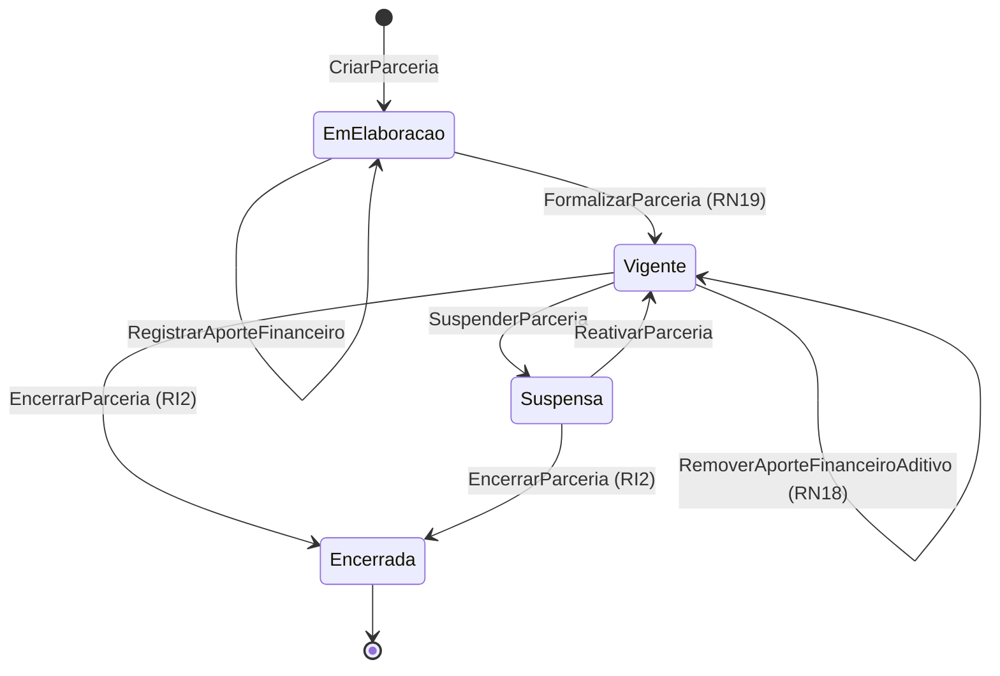

# Modelo Comportamental — Parcerias

[← Voltar ao M010](../README.md) | [Estrutural](modelo-estrutural.md)

---

## Ciclo de Vida: Parceria

### Descricao dos estados

| Estado | Descricao |
|--------|-----------|
| **EmElaboracao** | Parceria cadastrada com Vigencia original. Permanece aqui ate atender RN19. |
| **Vigente** | Acordo assinado; aportes e aditivos permitidos. `hoje` em `[vigenciaInicioCorrente, vigenciaFimCorrente]`. |
| **Suspensa** | Operacoes interrompidas temporariamente. Aportes bloqueados. |
| **Encerrada** | Parceria encerrada formalmente apos cascata de encerramento dos Programas; imutavel. |

### Guards e regras por transicao

| Transicao | Operacao | Pre-condicoes |
|-----------|----------|---------------|
| `[*] → EmElaboracao` | `CriarParceria` | Instituicao informada (RN10); Vigencia original valida (RN15) |
| `EmElaboracao → Vigente` | `FormalizarParceria` | **RN19**: `dataAssinatura` + ao menos 1 `AporteFinanceiro` original + ao menos 1 `Documento` anexado + `hoje` no intervalo `[vigenciaInicioCorrente, vigenciaFimCorrente]` |
| `Vigente → Suspensa` | `SuspenderParceria` | motivo informado |
| `Suspensa → Vigente` | `ReativarParceria` | `hoje` no intervalo `[vigenciaInicioCorrente, vigenciaFimCorrente]` |
| `Vigente → Encerrada` / `Suspensa → Encerrada` | `EncerrarParceria` | **RI2**: confirmacao explicita + justificativa + cascata de encerramento dos Programas aportados |

### Gatilhos de encerramento

1. **Manual**: usuario solicita `EncerrarParceria` com `origemGatilho = USUARIO`.
2. **Automatico por expiracao**: job diario `VerificarVigenciaExpirada` detecta `vigenciaFimCorrente` < `hoje`, **notifica** o responsavel e abre pendencia de confirmacao. O sistema nao encerra sem confirmacao explicita.

### Regras invariantes relevantes

- **RN13** (temporal): o periodo dos Programas aportados deve estar contido em `[vigenciaInicioCorrente, vigenciaFimCorrente]` sempre.
- **RN14** (saldo): `saldo` derivado da Parceria nunca pode ficar negativo.
- **RI2** (encerramento em cascata): ao encerrar a Parceria, todos os Programas aportados transitam para `ENCERRADO` apos confirmacao.
- Prestacao de contas final: parte do processo de encerramento; criterios detalhados a serem definidos com o cliente.
