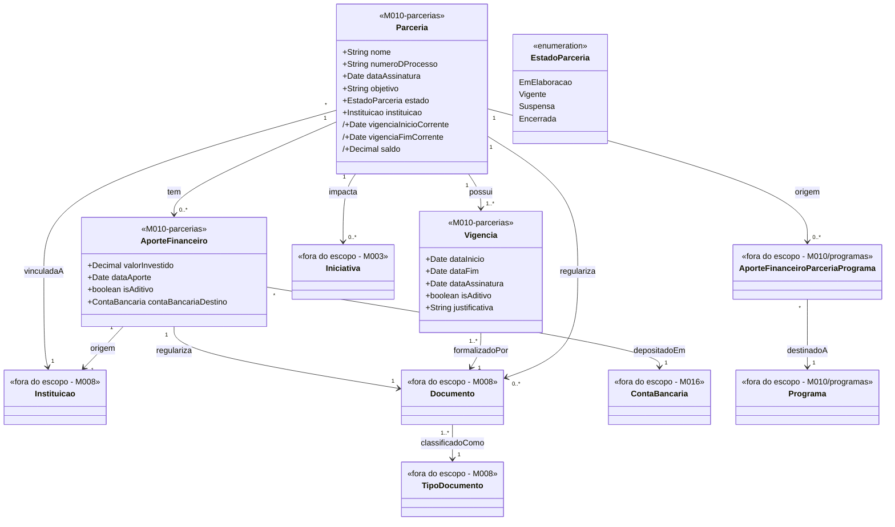

# Modelo Estrutural — Parcerias

[← Voltar ao M010](../README.md) | [Contrato M010](../contrato.md) | [Contrato API M010](../contrato-api.md)

**Escopo**: Parceria, sua vigencia (original e aditivos), Instituicao vinculada, aportes recebidos e documentos regularizadores. Aportes de Parceria para Programa vivem em [programas/](../programas/modelo-estrutural.md) — esta visao apresenta apenas a relacao saindo da Parceria.

---

## Diagrama de Classes

## Conceitos Financeiros Normalizados

| Conceito | Definicao | Fonte principal |
|----------|-----------|-----------------|
| Valor investido | Valor recebido pela Parceria a partir da Instituicao vinculada. | `AporteFinanceiro.valorInvestido` |
| Valor alocado | Parcela do valor investido reservada para um Programa. | `AporteFinanceiroParceriaPrograma.valor` |
| Valor aportado | Parcela da alocacao efetivamente disponibilizada para Programas, Rubricas ou Iniciativas. | Consolidacao M010/M003 |
| Valor consumido | Parcela da alocacao ja comprometida ou utilizada pelas Iniciativas, incluindo pagamentos e compromissos reconhecidos. | M003 alimentado por M014 |
| Saldo disponivel | No nivel da Parceria: `valorInvestido - valorAlocado`. No nivel de Programa/Rubrica: `valorAlocado - valorConsumido`. | Derivado |

> Esses termos devem ser usados de forma consistente nos dashboards, epicos, contratos e telas. Evitar os termos "pago", "executado", "saldo nao alocado" e "saldo nao executado" nas telas de Parcerias quando o objetivo for acompanhamento gerencial do recurso.

## Dicionario de Dados

| Classe | Atributo | Definicao | Obrig. | Tipo | Dominio | Tamanho | Unico |
|--------|----------|-----------|--------|------|---------|---------|-------|
| **Parceria** | nome | Nome da parceria | Sim | String | | 300 | |
| | numeroDProcesso | Numero do processo administrativo | Sim | String | Ex: PRC-2026-001 | 100 | Sim |
| | dataAssinatura | Data da assinatura do instrumento | Sim | Date | | | |
| | objetivo | Objetivo geral | Sim | String | | 2000 | |
| | estado | Estado corrente | Gerado | EstadoParceria | `EmElaboracao`/`Vigente`/`Suspensa`/`Encerrada` | | |
| | instituicao (relacao) | Instituicao unica vinculada a Parceria (RN10) | Sim | FK → Instituicao (M008) | Via `vinculadaA` | | |
| | vigenciaInicioCorrente (derivado) | `MIN(Vigencia.dataInicio)` | Calculado | Date | | | |
| | vigenciaFimCorrente (derivado) | `MAX(Vigencia.dataFim)` | Calculado | Date | | | |
| | saldo (derivado) | `SUM(AporteFinanceiro.valorInvestido) − SUM(AporteFinanceiroParceriaPrograma.valor)` — sempre `>= 0` | Calculado | Decimal | ≥ 0 | | |
| **Vigencia** | dataInicio | Inicio da janela | Sim | Date | | | |
| | dataFim | Fim da janela; aditivo exige posterior a vigenciaFimCorrente anterior | Sim | Date | | | |
| | dataAssinatura | Assinatura desta Vigencia; aditivo exige posterior a da Vigencia original | Sim | Date | | | |
| | isAditivo | Original (`false`) ou aditivo (`true`) | Sim | Boolean | Padrao primeira: `false` | | |
| | justificativa | Justificativa (obrigatoria para aditivo) | Condicional | String | | 2000 | |
| | documento (relacao) | Documento (M008) formalizador — Termo de Cooperacao na original, Termo Aditivo nas demais | Sim | FK → Documento | Via `formalizadoPor` | | |
| **AporteFinanceiro** | valorInvestido | Valor recebido | Sim | Decimal | > 0 | | |
| | dataAporte | Data do aporte | Sim | Date | | | |
| | isAditivo | Original (`false`) ou aditivo (`true`); aditivo exige `dataAporte` posterior ao original (RN17) | Sim | Boolean | Padrao: `false` | | |
| | documento (relacao) | Documento (M008) classificado como "Termo de Descentralizacao" (RN12) | Sim | FK → Documento | Via `regulariza` | | |
| | instituicao (relacao) | Instituicao (M008) de origem; deve ser a mesma Instituicao vinculada a Parceria (RN04/RN10) | Sim | FK → Instituicao | Via `origem` | | |
| | contaBancariaDestino (relacao) | Conta bancaria (M016) da agencia de fomento que recebe o deposito do aporte | Sim | FK → ContaBancaria (M016) | Via `depositadoEm` | | |

## Referencia de Regras

Regras aplicaveis ao modelo de Parcerias: `RN03`, `RN04`, `RN06`, `RN10`, `RN12`, `RN14`, `RN15`, `RN17`, `RN18`, `RN19`, `RI2`, `RI3`, `RI4`. As definicoes oficiais ficam em [M010 — Regras de Negocio](../README.md#regras-de-negocio-consolidadas).

## Relacoes com outros subdominios

| Destino | Relacao | Observacao |
|---------|---------|------------|
| `programas/AporteFinanceiroParceriaPrograma` | Parceria → AporteFinanceiroParceriaPrograma → Programa | Entidade associativa vive em **programas/**; Parceria e a fonte |
| `M008/Instituicao` | `vinculadaA` (N:1 via Parceria) e `origem` (N:1 via AporteFinanceiro) | A Parceria possui exatamente uma Instituicao vinculada; aportes devem ter origem nessa mesma Instituicao |
| `M003/Iniciativa` | Parceria → Iniciativa | Relacao externa para suspensao em cascata; ownership da Iniciativa permanece em M003 |
| `M008/Documento` | `regulariza`, `formalizadoPor` | Termo de Cooperacao, Termo Aditivo, Termo de Descentralizacao, anexos |
| `M008/TipoDocumento` | Classifica Documento | |
| `M016/ContaBancaria` | `depositadoEm` (N:1 via AporteFinanceiro) | Conta bancaria da agencia que recebe o deposito; a conta pertence a um `FundoFinanceiro` gerido em M016 |

## Atributos derivados (prefixo `/`)

| Atributo | Formula | Quando muda |
|----------|---------|-------------|
| `/vigenciaInicioCorrente` | `MIN(Vigencia.dataInicio)` | Ao criar/remover Vigencia |
| `/vigenciaFimCorrente` | `MAX(Vigencia.dataFim)` | Ao registrar nova Vigencia aditivo (RN06, RN15) |
| `/saldo` | `SUM(AporteFinanceiro.valorInvestido) − SUM(AporteFinanceiroParceriaPrograma.valor)` | Ao registrar AporteFinanceiro (+) ou AporteFinanceiroParceriaPrograma (−) — RN14 |
