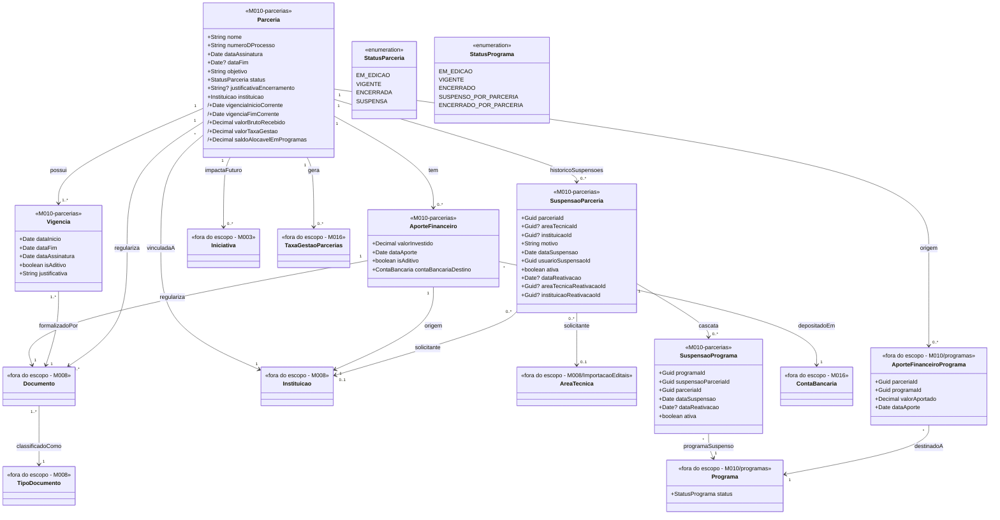

# Modelo Estrutural — Parcerias

[← Voltar ao M010](../README.md) | [Contrato M010](../contrato.md) | [Contrato API M010](../contrato-api.md)

**Escopo**: Parceria, sua vigencia (original e aditivos), Instituicao vinculada, aportes recebidos, documentos regularizadores e ciclo operacional de suspensao/reativacao/encerramento. A associacao Parceria → Programa vive em [programas/](../programas/modelo-estrutural.md), por meio de `AporteFinanceiroPrograma`; esta visao mostra a relacao porque ela e a base da cascata.

---

## Diagrama de Classes

## Conceitos Financeiros Normalizados

| Conceito | Definicao | Fonte principal |
|----------|-----------|-----------------|
| Valor investido | Valor recebido pela Parceria a partir da Instituicao vinculada. | `AporteFinanceiro.valorInvestido` |
| Valor alocado | Parcela do valor investido reservada para um Programa. | `AporteFinanceiroPrograma.valorAportado` |
| Valor aportado | Parcela da alocacao efetivamente disponibilizada para Programas, Rubricas ou Iniciativas. | Consolidacao M010/M003 |
| Valor consumido | Consolidacao dos valores efetivamente executados nas Iniciativas (projetos) vinculadas aos Programas aportados por esta Parceria — inclui projetos de demanda induzida e projetos ligados a Programas. Calculado por M003 a partir de pagamentos e compromissos registrados em M014. Parceria nao armazena diretamente; acessa via consolidacao. | M003 + M014 |
| Valor da Taxa de Gestao de Parcerias | Percentual calculado uma unica vez por AporteFinanceiro, conforme PoliticaTaxaGestaoParcerias parametrizada no M016 (Resolucao CCAF 334/2023). Nao compoe saldo alocavel em Programas. | M010/M016 |
| Saldo alocavel em Programas | No nivel da Parceria: `valorBrutoRecebido - valorTaxaGestao - valorAlocadoEmProgramas`. No nivel de Programa/Rubrica: `valorAlocado - valorConsumido`. | Derivado |

> Esses termos devem ser usados de forma consistente nos dashboards, epicos, contratos e telas. Evitar os termos "pago", "executado", "saldo nao alocado" e "saldo nao executado" nas telas de Parcerias quando o objetivo for acompanhamento gerencial do recurso.

## Dicionario de Dados

| Classe | Atributo | Definicao | Obrig. | Tipo | Dominio | Tamanho | Unico |
|--------|----------|-----------|--------|------|---------|---------|-------|
| **Parceria** | nome | Nome da parceria | Sim | String | | 300 | |
| | numeroDProcesso | Numero do processo administrativo | Sim | String | Ex: PRC-2026-001 | 100 | Sim |
| | dataAssinatura | Data da assinatura do instrumento | Sim | Date | | | |
| | dataFim | Data efetiva de encerramento quando a parceria e encerrada | Condicional | DateTimeOffset? | Preenchida em `EncerrarParceria` | | |
| | objetivo | Objetivo geral | Sim | String | | 2000 | |
| | status | Estado corrente | Gerado | StatusParceria | `EM_EDICAO`/`VIGENTE`/`SUSPENSA`/`ENCERRADA` | | |
| | justificativaEncerramento | Justificativa obrigatoria no ato de encerramento; coluna pode ser nula antes disso | Condicional | String? | Obrigatoria em `EncerrarParceria` | 2000 | |
| | instituicao (relacao) | Instituicao unica vinculada a Parceria (RN10) | Sim | FK → Instituicao (M008) | Via `vinculadaA` | | |
| | vigenciaInicioCorrente (derivado) | `MIN(Vigencia.dataInicio)` | Calculado | Date | | | |
| | vigenciaFimCorrente (derivado) | `MAX(Vigencia.dataFim)` | Calculado | Date | | | |
| | valorBrutoRecebido (derivado) | `SUM(AporteFinanceiro.valorInvestido)` | Calculado | Decimal | >= 0 | | |
| | valorTaxaGestao (derivado) | Soma das TaxaGestaoParcerias geradas por cada AporteFinanceiro desta Parceria; nao compoe saldo alocavel em Programas | Calculado | Decimal | >= 0 | | |
| | saldoAlocavelEmProgramas (derivado) | `valorBrutoRecebido - valorTaxaGestao - SUM(AporteFinanceiroPrograma.valorAportado)` — sempre `>= 0` | Calculado | Decimal | >= 0 | | |
| **Vigencia** | dataInicio | Inicio da janela | Sim | Date | | | |
| | dataFim | Fim da janela; aditivo exige posterior a vigenciaFimCorrente anterior | Sim | Date | | | |
| | dataAssinatura | Assinatura desta Vigencia; aditivo exige posterior a da Vigencia original | Sim | Date | | | |
| | isAditivo | Original (`false`) ou aditivo (`true`) | Sim | Boolean | Padrao primeira: `false` | | |
| | justificativa | Justificativa (obrigatoria para aditivo) | Condicional | String | | 2000 | |
| | documento (relacao) | Documento (M008) formalizador — Termo de Cooperacao na original, Termo Aditivo nas demais | Sim | FK → Documento | Via `formalizadoPor` | | |
| **AporteFinanceiro** | valorInvestido | Valor recebido | Sim | Decimal | > 0 | | |
| | dataAporte | Data do aporte | Sim | Date | | | |
| | isAditivo | Original (`false`) ou aditivo (`true`); aditivo exige `dataAporte` posterior ao original (RN17) | Sim | Boolean | Padrao: `false` | | |
| | documento (relacao) | Documento (M008) classificado como "Termo de Descentralizacao" (RN12) | Sim | FK → Documento | Via `regulariza` | | |
| | instituicao (relacao) | Instituicao (M008) de origem; deve ser a mesma Instituicao vinculada a Parceria (RN04/RN10) | Sim | FK → Instituicao | Via `origem` | | |
| | contaBancariaDestino (relacao) | Conta bancaria (M016) da agencia de fomento que recebe o deposito do aporte | Sim | FK → ContaBancaria (M016) | Via `depositadoEm` | | |
| **SuspensaoParceria** | parceriaId | Parceria suspensa | Sim | FK → Parceria | | | |
| | areaTecnicaId | Area Tecnica solicitante, resolvida do token quando `isAreaTecnica = true` | Condicional | FK? → AreaTecnica | Nullable | | |
| | instituicaoId | Instituicao solicitante, resolvida do usuario autenticado em entrega futura | Nao nesta entrega | FK? → Instituicao | Nullable | | |
| | motivo | Justificativa da suspensao | Sim | String | Nao vazio | 2000 | |
| | dataSuspensao | Data/hora da suspensao | Sim | DateTimeOffset | | | |
| | usuarioSuspensaoId | Usuario autenticado que solicitou a suspensao | Sim | Guid | Via JWT | | |
| | ativa | Indica suspensao vigente | Sim | Boolean | `true` na suspensao; `false` na reativacao | | |
| | dataReativacao | Data/hora da reativacao | Condicional | DateTimeOffset? | Preenchida na reativacao | | |
| | areaTecnicaReativacaoId | Area Tecnica que reativou, resolvida do token | Condicional | FK? → AreaTecnica | Nullable | | |
| | instituicaoReativacaoId | Instituicao que reativou, resolvida em entrega futura | Nao nesta entrega | FK? → Instituicao | Nullable | | |
| **SuspensaoPrograma** | programaId | Programa afetado pela cascata | Sim | FK → Programa | | | |
| | suspensaoParceriaId | Suspensao de Parceria que originou a cascata | Sim | FK → SuspensaoParceria | | | |
| | parceriaId | Parceria de origem | Sim | FK → Parceria | | | |
| | dataSuspensao | Data/hora da suspensao do Programa | Sim | DateTimeOffset | | | |
| | dataReativacao | Data/hora da reativacao do Programa | Condicional | DateTimeOffset? | Preenchida na reativacao | | |
| | ativa | Indica cascata ainda ativa para o Programa | Sim | Boolean | `true` na suspensao; `false` na reativacao | | |

## Referencia de Regras

Regras aplicaveis ao modelo de Parcerias: `RN03`, `RN04`, `RN06`, `RN10`, `RN12`, `RN14`, `RN15`, `RN17`, `RN18`, `RN19`, `RN20`, `RN21`, `RN22`, `RN23`, `RN24`, `RI2`, `RI3`, `RI4`. As definicoes oficiais ficam em [M010 — Regras de Negocio](../README.md#regras-de-negocio-consolidadas).

## Relacoes com outros subdominios

| Destino | Relacao | Observacao |
|---------|---------|------------|
| `programas/AporteFinanceiroPrograma` | Parceria → AporteFinanceiroPrograma → Programa | Entidade associativa vive em **programas/**; e a fonte da cascata de suspensao, reativacao e encerramento. |
| `M010/programas/Programa` | `StatusPrograma` | Recebe `SUSPENSO_POR_PARCERIA` na suspensao por cascata e `ENCERRADO_POR_PARCERIA` no encerramento da Parceria; `ENCERRADO` continua sendo encerramento proprio do Programa. |
| `M008/Instituicao` | `vinculadaA`, `origem`, `solicitante` | A Parceria possui exatamente uma Instituicao vinculada; aportes devem ter origem nessa Instituicao. A rastreabilidade de solicitacao por Instituicao e nullable nesta entrega. |
| `M008/AreaTecnica` | `solicitante` / `reativacao` | Origem da suspensao/reativacao quando `isAreaTecnica = true`, resolvida do token JWT. |
| `M003/Iniciativa` | Parceria → Iniciativa | Relacao externa para suspensao em cascata; ownership da Iniciativa permanece em M003 e a integracao fica fora do recorte imediato #2147/#2149. |
| `M008/Documento` | `regulariza`, `formalizadoPor` | Termo de Cooperacao, Termo Aditivo, Termo de Descentralizacao, anexos. |
| `M008/TipoDocumento` | Classifica Documento | |
| `M016/ContaBancaria` | `depositadoEm` (N:1 via AporteFinanceiro) | Conta bancaria da agencia que recebe o deposito; a conta pertence a um `FundoFinanceiro` gerido em M016. |
| `M016/TaxaGestaoParcerias` | Parceria → TaxaGestaoParcerias | M010 calcula e bloqueia a taxa por AporteFinanceiro; M016 custodia, classifica contabilmente e alimenta as AcoesTransversais que gastam os recursos. |

## Atributos derivados (prefixo `/`)

| Atributo | Formula | Quando muda |
|----------|---------|-------------|
| `/vigenciaInicioCorrente` | `MIN(Vigencia.dataInicio)` | Ao criar/remover Vigencia |
| `/vigenciaFimCorrente` | `MAX(Vigencia.dataFim)` | Ao registrar nova Vigencia aditivo (RN06, RN15) |
| `/valorBrutoRecebido` | `SUM(AporteFinanceiro.valorInvestido)` | Ao registrar AporteFinanceiro original ou aditivo |
| `/valorTaxaGestao` | `SUM(TaxaGestaoParcerias.valorTaxaGestao WHERE parceria = this)` — snapshot por aporte conforme PoliticaTaxaGestaoParcerias vigente no M016 | Ao registrar AporteFinanceiro original ou aditivo |
| `/saldoAlocavelEmProgramas` | `valorBrutoRecebido - valorTaxaGestao - SUM(AporteFinanceiroPrograma.valorAportado)` | Ao registrar AporteFinanceiro, ajustar taxa ou registrar AporteFinanceiroPrograma — RN22 |
