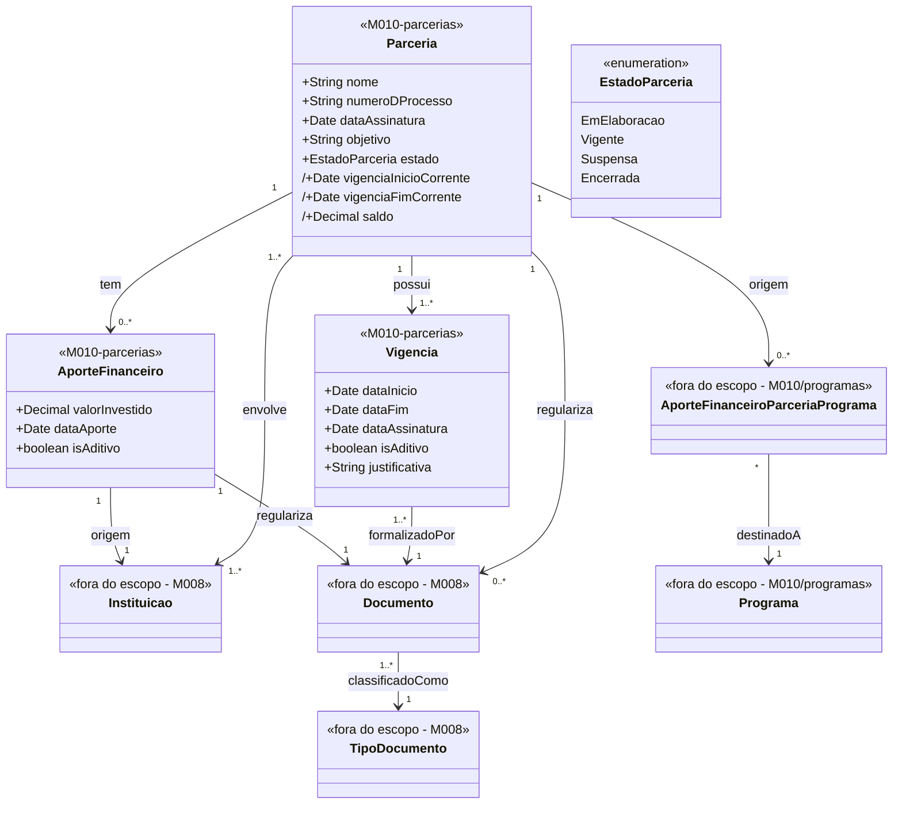

# Modelo Estrutural — Parcerias

[← Voltar ao M010](../README.md) | [Contrato M010](../contrato.md) | [Contrato API M010](../contrato-api.md)

**Escopo**: Parceria, sua vigencia (original e aditivos), aportes recebidos de Instituicoes e documentos regularizadores. Aportes de Parceria para Programa vivem em [programas/](../programas/modelo-estrutural.md) — esta visao apresenta apenas a relacao saindo da Parceria.

---

## Diagrama de Classes

## Dicionario de Dados

| Classe | Atributo | Definicao | Obrig. | Tipo | Dominio | Tamanho | Unico |
|--------|----------|-----------|--------|------|---------|---------|-------|
| **Parceria** | nome | Nome da parceria | Sim | String | | 300 | |
| | numeroDProcesso | Numero do processo administrativo | Sim | String | Ex: PRC-2026-001 | 100 | Sim |
| | dataAssinatura | Data da assinatura do instrumento | Sim | Date | | | |
| | objetivo | Objetivo geral | Sim | String | | 2000 | |
| | estado | Estado corrente | Gerado | EstadoParceria | `EmElaboracao`/`Vigente`/`Suspensa`/`Encerrada` | | |
| | vigenciaInicioCorrente (derivado) | `MIN(Vigencia.dataInicio)` | Calculado | Date | | | |
| | vigenciaFimCorrente (derivado) | `MAX(Vigencia.dataFim)` | Calculado | Date | | | |
| | saldo (derivado) | `SUM(AporteFinanceiro.valorInvestido) − SUM(AporteFinanceiroParceriaPrograma.valor)` — sempre `>= 0` | Calculado | Decimal | ≥ 0 | | |
| **Vigencia** | dataInicio | Inicio da janela | Sim | Date | | | |
| | dataFim | Fim da janela; aditivo exige posterior a vigenciaFimCorrente anterior | Sim | Date | | | |
| | dataAssinatura | Assinatura desta Vigencia; aditivo exige posterior a da Vigencia original | Sim | Date | | | |
| | isAditivo | Original (`false`) ou aditivo (`true`) | Sim | Boolean | Padrao primeira: `false` | | |
| | justificativa | Justificativa (obrigatoria para aditivo) | Condicional | String | | 2000 | |
| | documento (relacao) | Documento (M008) formalizador — Termo de Cooperacao na original, Termo Aditivo nas demais | Sim | FK → Documento | Via `formalizadoPor` | | |
| **AporteFinanceiro** | valorInvestido | Valor recebido | Sim | Decimal | > 0 | | |
| | dataAporte | Data do aporte | Sim | Date | | | |
| | isAditivo | Original (`false`) ou aditivo (`true`); aditivo exige `dataAporte` posterior ao original (RN17) | Sim | Boolean | Padrao: `false` | | |
| | documento (relacao) | Documento (M008) classificado como "Termo de Descentralizacao" (RN12) | Sim | FK → Documento | Via `regulariza` | | |
| | instituicao (relacao) | Instituicao (M008) de origem | Sim | FK → Instituicao | Via `origem` | | |

## Regras de Negocio Aplicaveis

- **RN03** — Aporte requer `dataAssinatura` da Parceria preenchida
- **RN04** — Aporte tem origem em Instituicao (M008)
- **RN06** — Nova Vigencia (aditivo): `dataAssinatura > original.dataAssinatura`; `dataFim > vigenciaFimCorrente anterior`
- **RN10** — Parceria ≥1 Instituicao envolvida
- **RN12** — AporteFinanceiro formalizado por Documento Termo de Descentralizacao
- **RN14** — `saldo` sempre `>= 0`
- **RN15** — Exatamente uma Vigencia com `isAditivo = false` (a original)
- **RN17** — Primeiro AporteFinanceiro e original; aditivos exigem posteridade
- **RN18** — Aditivos podem ser editados/removidos com recalculo de saldo
- **RN19** — Transicao para `Vigente` exige: dataAssinatura + >=1 AporteFinanceiro original + >=1 Documento anexado + hoje em `[vigenciaInicioCorrente, vigenciaFimCorrente]`
- **RI2** — Encerramento em cascata com confirmacao
- **RI3** — Remocao bloqueada se houver `AporteFinanceiroParceriaPrograma` vinculado

## Relacoes com outros subdominios

| Destino | Relacao | Observacao |
|---------|---------|------------|
| `programas/AporteFinanceiroParceriaPrograma` | Parceria → AporteFinanceiroParceriaPrograma → Programa | Entidade associativa vive em **programas/**; Parceria e a fonte |
| `M008/Instituicao` | `origem` (N:1 via AporteFinanceiro) e `envolve` (N:N Parceria-Instituicao) | |
| `M008/Documento` | `regulariza`, `formalizadoPor` | Termo de Cooperacao, Termo Aditivo, Termo de Descentralizacao, anexos |
| `M008/TipoDocumento` | Classifica Documento | |

## Atributos derivados (prefixo `/`)

| Atributo | Formula | Quando muda |
|----------|---------|-------------|
| `/vigenciaInicioCorrente` | `MIN(Vigencia.dataInicio)` | Ao criar/remover Vigencia |
| `/vigenciaFimCorrente` | `MAX(Vigencia.dataFim)` | Ao registrar nova Vigencia aditivo (RN06, RN15) |
| `/saldo` | `SUM(AporteFinanceiro.valorInvestido) − SUM(AporteFinanceiroParceriaPrograma.valor)` | Ao registrar AporteFinanceiro (+) ou AporteFinanceiroParceriaPrograma (−) — RN14 |
