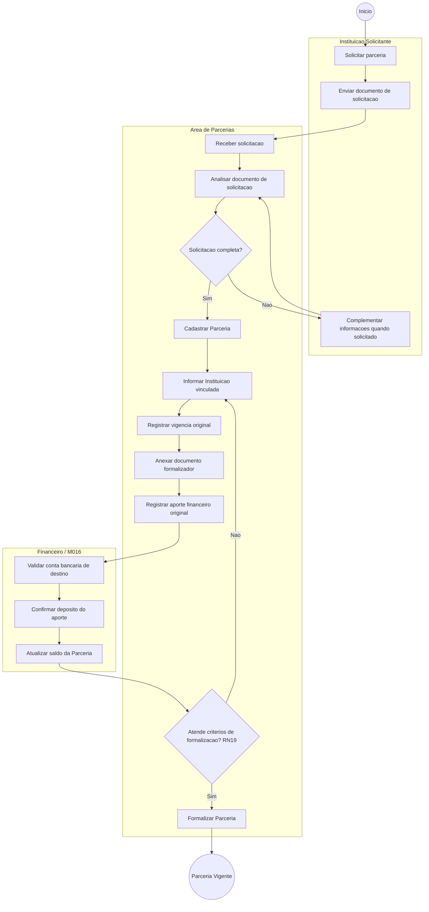
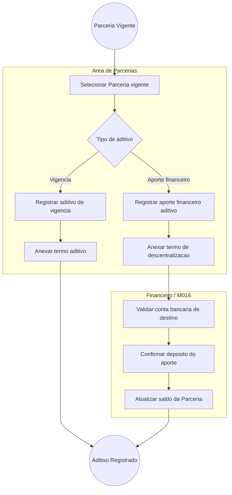
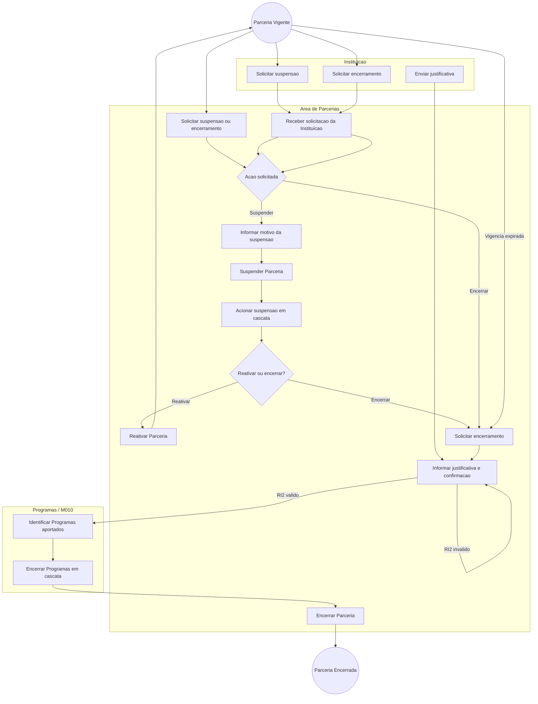
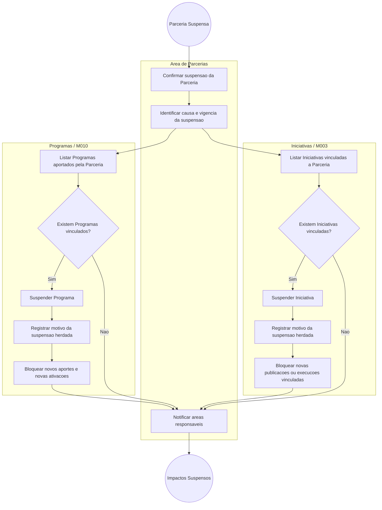

# Processo — Parcerias

[← Voltar ao M010](../README.md) | [Estrutural](modelo-estrutural.md) | [Comportamental](modelo-comportamental.md)

---

## Visao Geral

O processo de Parcerias foi dividido em quatro fluxos principais:

1. **[Criacao da Parceria](#fluxo-1-criacao-da-parceria)** — solicitacao pela Instituicao, envio do documento de solicitacao, cadastro, formalizacao documental, registro do aporte original e transicao para `Vigente`.
2. **[Aditivo da Parceria](#fluxo-2-aditivo-da-parceria)** — inclusao de nova vigencia ou novo aporte financeiro apos a parceria estar vigente.
3. **[Suspensao ou Encerramento da Parceria](#fluxo-3-suspensao-ou-encerramento-da-parceria)** — interrupcao temporaria, reativacao ou encerramento definitivo com cascata para Programas aportados.
4. **[Suspensao em Cascata](#fluxo-4-suspensao-em-cascata-para-programas-e-iniciativas)** — suspensao dos Programas e Iniciativas vinculados quando a Parceria e suspensa.

---

## Fluxo 1 — Criacao da Parceria

Este fluxo inicia quando uma Instituicao solicita a parceria e envia o documento de solicitacao. A Area de Parcerias analisa a demanda, cadastra a Parceria em `EmElaboracao` e formaliza sua entrada em `Vigente` quando os criterios da RN19 sao atendidos.

### Atividades da criacao

| Atividade | Responsavel | Resultado |
|-----------|-------------|-----------|
| Solicitar parceria | Instituicao Solicitante | Pedido de parceria iniciado pela Instituicao interessada. |
| Enviar documento de solicitacao | Instituicao Solicitante | Documento de solicitacao recebido para abertura da analise. |
| Analisar documento de solicitacao | Area de Parcerias | Verificacao inicial da completude da solicitacao; pode exigir complementacao. |
| Cadastrar Parceria | Area de Parcerias | Parceria criada em `EmElaboracao` com nome, processo e objetivo. |
| Informar Instituicao vinculada | Area de Parcerias | Parceria vinculada a exatamente uma Instituicao, conforme RN10. |
| Registrar vigencia original | Area de Parcerias | Primeira `Vigencia` criada com `isAditivo = false`, conforme RN15. |
| Anexar documento formalizador | Area de Parcerias | Documento formalizador vinculado a Parceria ou Vigencia. |
| Registrar aporte financeiro original | Area de Parcerias / Financeiro | `AporteFinanceiro` original criado com origem, documento regularizador e conta bancaria de destino. |
| Formalizar Parceria | Area de Parcerias | Estado alterado para `Vigente` quando data de assinatura, documento, aporte original e vigencia valida atendem RN19. |

---

## Fluxo 2 — Aditivo da Parceria

Este fluxo trata alteracoes apos a Parceria estar `Vigente`: aditivo de vigencia e aporte financeiro adicional. Aditivos nao recriam a parceria; eles preservam o historico e recalculam vigencia corrente ou saldo.

### Atividades do aditivo

| Atividade | Responsavel | Resultado |
|-----------|-------------|-----------|
| Selecionar Parceria vigente | Area de Parcerias | Parceria em estado `Vigente` apta a receber aditivo; parcerias encerradas ou suspensas bloqueadas. |
| Registrar aditivo de vigencia | Area de Parcerias | Nova `Vigencia` com `isAditivo = true`; `dataAssinatura` posterior a original e `dataFim` posterior a `vigenciaFimCorrente` anterior (RN06). Recalcula `vigenciaInicioCorrente` e `vigenciaFimCorrente`. |
| Anexar termo aditivo | Area de Parcerias | Documento de formalizacao da nova vigencia; obrigatorio para `Vigencia` com `isAditivo = true`. |
| Registrar aporte financeiro aditivo | Area de Parcerias / Financeiro | Novo `AporteFinanceiro` com `isAditivo = true`; exige existencia de original e `dataAporte` posterior (RN17). Origem deve ser mesma Instituicao vinculada (RN04). Documento classificado como "Termo de Descentralizacao" (RN12). |
| Calcular Taxa de Gestao de Parcerias | Sistema / M016 | `TaxaGestaoParcerias` gerada com snapshot imutavel da `PoliticaTaxaGestaoParcerias` vigente no M016; valor deduzido antes de aumentar saldo alocavel (RN20, RN21, RN23). |
| Recalcular derivados da Parceria | Sistema | Atualiza `valorBrutoRecebido`, `valorTaxaGestao` e `saldoAlocavelEmProgramas`; garante saldo nao negativo (RN14, RN22, INV-M010-PAR-01). |
| Validar conta bancaria | Financeiro / M016 | Conta bancaria (M008/ContaBancaria) valida para recepcao do deposito. |
| Confirmar deposito | Financeiro / M016 | Deposito confirmado; aporte registrado no sistema. |

### Edicao e remocao de aporte aditivo

Um `AporteFinanceiro` com `isAditivo = true` pode ser editado ou removido apos criacao (RN18). O sistema recalcula `valorBrutoRecebido`, `valorTaxaGestao` e `saldoAlocavelEmProgramas` e rejeita a operacao se o saldo resultante ficar negativo.

---

## Fluxo 3 — Suspensao ou Encerramento da Parceria

Este fluxo cobre a interrupcao temporaria da Parceria, sua reativacao e o encerramento definitivo. A solicitacao de suspensao ou encerramento pode partir da Instituicao ou da Area de Parcerias. O encerramento exige confirmacao explicita, justificativa e encerramento em cascata dos Programas aportados.

### Atividades de suspensao e encerramento

| Atividade | Responsavel | Resultado |
|-----------|-------------|-----------|
| Solicitar suspensao | Instituicao ou Area de Parcerias | Pedido de suspensao recebido com motivo inicial. |
| Solicitar encerramento | Instituicao ou Area de Parcerias | Pedido de encerramento recebido para analise. |
| Suspender Parceria | Area de Parcerias | Estado alterado para `Suspensa`; novos aportes e aditivos ficam bloqueados. Aciona a suspensao em cascata de Programas e Iniciativas (RI4). |
| Reativar Parceria | Area de Parcerias | Estado retorna para `Vigente` quando a vigencia corrente ainda e valida. |
| Verificar vigencia expirada | Area de Parcerias | Identifica vigencia vencida e notifica o responsavel; nao encerra automaticamente. |
| Iniciar encerramento operacional | Area de Parcerias | Abertura da etapa de encerramento apos solicitacao ou notificacao de expiracao. |
| Validar RI2 | Area de Parcerias | Exige confirmacao explicita e justificativa antes do encerramento definitivo. |
| Encerrar Programas em cascata | Programas / M010 | Programas aportados pela Parceria sao encerrados conforme RI2. |
| Encerrar Parceria | Area de Parcerias | Estado alterado para `Encerrada`; a Parceria torna-se imutavel. |

---

## Fluxo 4 — Suspensao em Cascata para Programas e Iniciativas

Uma Parceria pode aportar em mais de um Programa e tambem estar relacionada a Iniciativas. Quando a Parceria e suspensa, todos os Programas e Iniciativas dependentes dessa Parceria devem ser suspensos para impedir novas execucoes, novos editais ou novas operacoes vinculadas enquanto a causa da suspensao estiver em analise.

### Atividades da suspensao em cascata

| Atividade | Responsavel | Resultado |
|-----------|-------------|-----------|
| Confirmar suspensao da Parceria | Area de Parcerias | Parceria permanece em `Suspensa` e a causa da suspensao e registrada. |
| Listar Programas aportados | Programas / M010 | Identifica todos os Programas que recebem aporte da Parceria por `AporteFinanceiroParceriaPrograma`. |
| Suspender Programa | Programas / M010 | Cada Programa vinculado passa para `Suspenso` e recebe motivo de suspensao herdada da Parceria. |
| Listar Iniciativas vinculadas | Iniciativas / M003 | Identifica Iniciativas relacionadas diretamente a Parceria ou a Programas suspensos. |
| Suspender Iniciativa | Iniciativas / M003 | Cada Iniciativa impactada passa para estado suspenso ou equivalente, preservando rastreabilidade do motivo. |
| Notificar areas responsaveis | Area de Parcerias | Areas de Programas e Iniciativas sao notificadas sobre os impactos da suspensao. |

### Referencia da cascata

A suspensao em cascata e regida pela `RI4`. A definicao oficial fica em [M010 — Regras de Negocio](../README.md#regras-de-negocio-consolidadas).

---

## Referencia de Regras

Regras aplicaveis aos fluxos de Parcerias: `RN04`, `RN06`, `RN10`, `RN14`, `RN15`, `RN17`, `RN19`, `RI2`, `RI4`. As definicoes oficiais ficam em [M010 — Regras de Negocio](../README.md#regras-de-negocio-consolidadas).

## Observacoes

- A criacao da Parceria nao distribui recurso para Programa; isso ocorre via `AporteFinanceiroParceriaPrograma`, no subdominio de Programas.
- O job de expiracao apenas notifica e abre pendencia operacional; a Parceria nao e encerrada sem confirmacao.
- Contas bancarias pertencem conceitualmente ao M016, sendo usadas aqui como destino do deposito do aporte.
