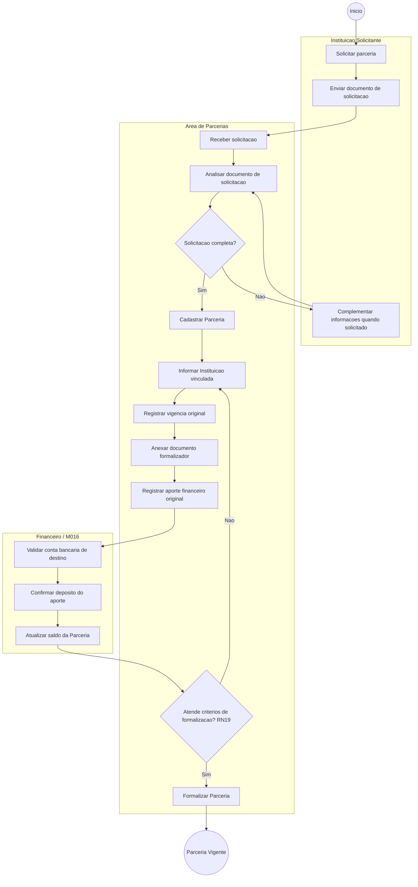
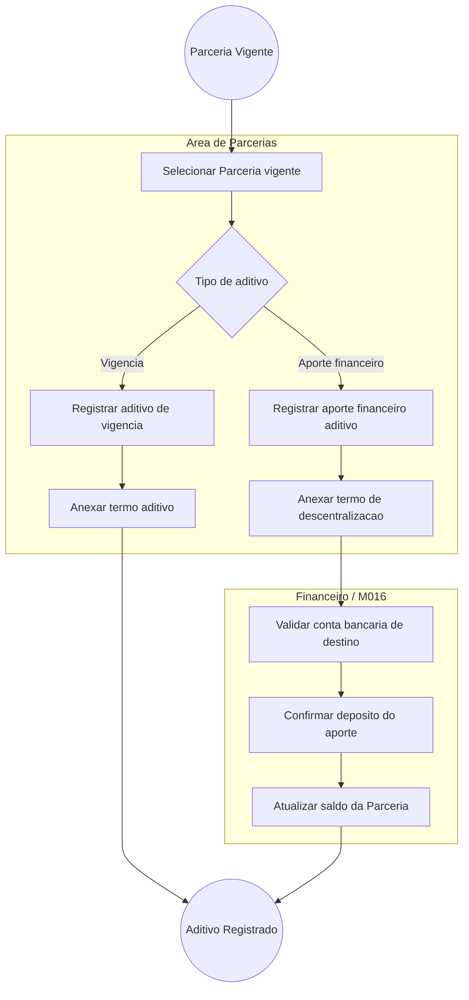
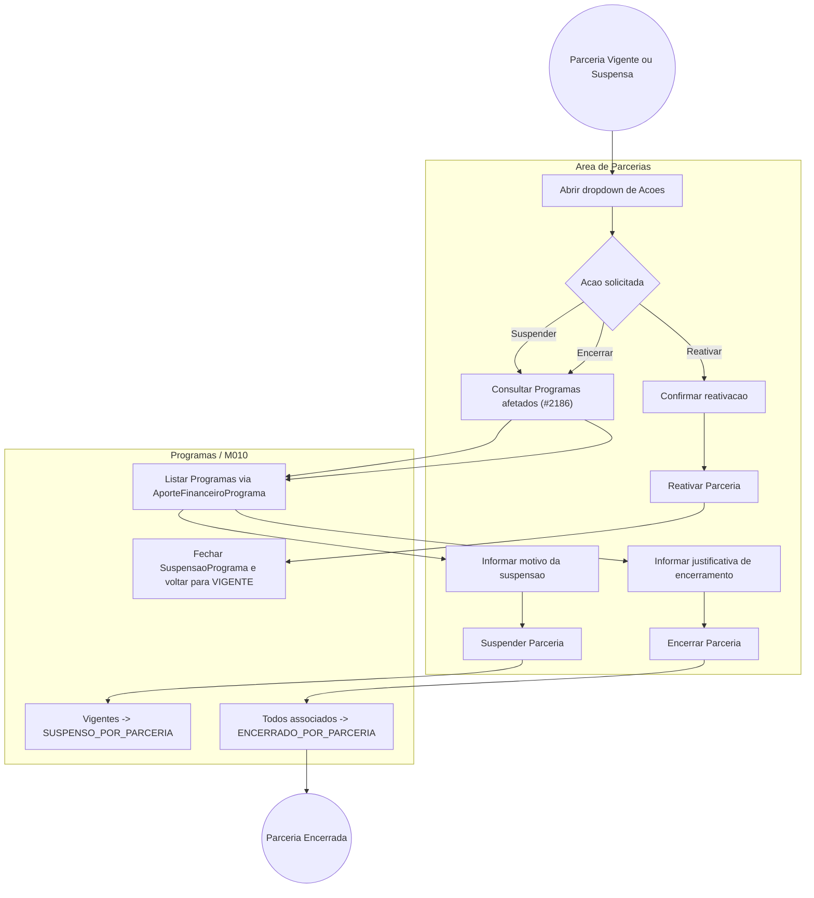
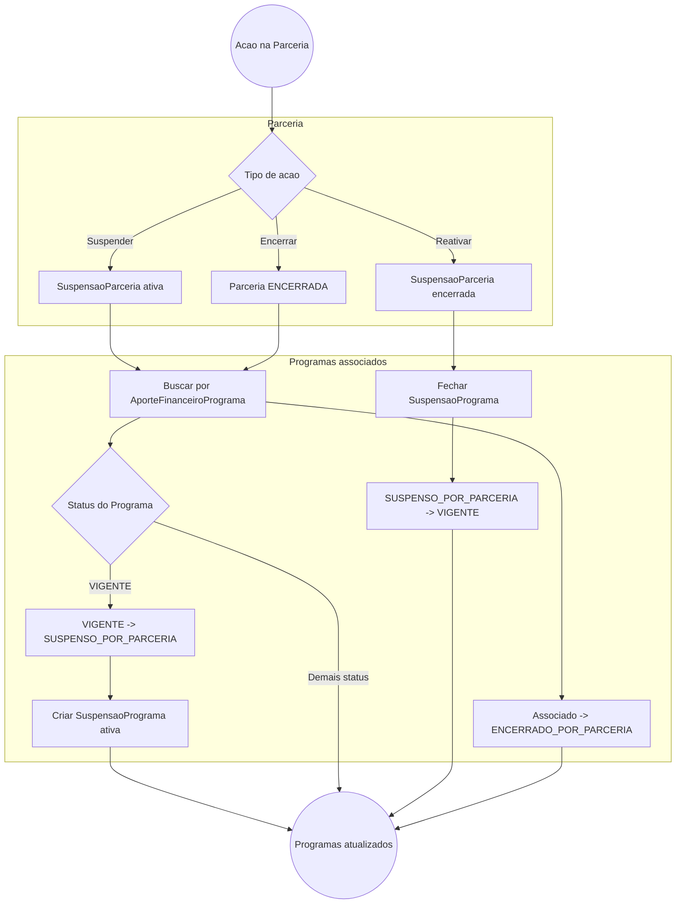

# Processo — Parcerias

[← Voltar ao M010](../README.md) | [Estrutural](modelo-estrutural.md) | [Comportamental](modelo-comportamental.md)

---

## Visao Geral

O processo de Parcerias foi dividido em quatro fluxos principais:

1. **[Criacao da Parceria](#fluxo-1-criacao-da-parceria)** — solicitacao pela Instituicao, envio do documento de solicitacao, cadastro, formalizacao documental, registro do aporte original e transicao para `Vigente`.
2. **[Aditivo da Parceria](#fluxo-2-aditivo-da-parceria)** — inclusao de nova vigencia ou novo aporte financeiro apos a parceria estar vigente.
3. **[Suspensao, Reativacao e Encerramento da Parceria](#fluxo-3-suspensao-reativacao-e-encerramento-da-parceria)** — interrupcao temporaria, retorno a vigencia ou encerramento definitivo com cascata para Programas aportados.
4. **[Cascata em Programas](#fluxo-4-cascata-em-programas)** — impacto da suspensao, reativacao e encerramento da Parceria sobre os Programas associados por `AporteFinanceiroPrograma`.

---

## Fluxo 1 — Criacao da Parceria

Este fluxo inicia quando uma Instituicao solicita a parceria e envia o documento de solicitacao. A Area de Parcerias analisa a demanda, cadastra a Parceria em `EmElaboracao` e formaliza sua entrada em `Vigente` quando os criterios da RN19 sao atendidos.

### Atividades da criacao

| Atividade | Responsavel | Resultado |
|-----------|-------------|-----------|
| Solicitar parceria | Instituicao Solicitante | Pedido de parceria iniciado pela Instituicao interessada. |
| Enviar documento de solicitacao | Instituicao Solicitante | Documento de solicitacao recebido para abertura da analise. |
| Analisar documento de solicitacao | Area de Parcerias | Verificacao inicial da completude da solicitacao; pode exigir complementacao. |
| Cadastrar Parceria | Area de Parcerias | Parceria criada em `EmElaboracao` com nome, processo e objetivo. |
| Informar Instituicao vinculada | Area de Parcerias | Parceria vinculada a exatamente uma Instituicao, conforme RN10. |
| Registrar vigencia original | Area de Parcerias | Primeira `Vigencia` criada com `isAditivo = false`, conforme RN15. |
| Anexar documento formalizador | Area de Parcerias | Documento formalizador vinculado a Parceria ou Vigencia. |
| Registrar aporte financeiro original | Area de Parcerias / Financeiro | `AporteFinanceiro` original criado com origem, documento regularizador e conta bancaria de destino. |
| Formalizar Parceria | Area de Parcerias | Estado alterado para `Vigente` quando data de assinatura, documento, aporte original e vigencia valida atendem RN19. |

---

## Fluxo 2 — Aditivo da Parceria

Este fluxo trata alteracoes apos a Parceria estar `Vigente`: aditivo de vigencia e aporte financeiro adicional. Aditivos nao recriam a parceria; eles preservam o historico e recalculam vigencia corrente ou saldo.

### Atividades do aditivo

| Atividade | Responsavel | Resultado |
|-----------|-------------|-----------|
| Selecionar Parceria vigente | Area de Parcerias | Parceria em estado `Vigente` apta a receber aditivo; parcerias encerradas ou suspensas bloqueadas. |
| Registrar aditivo de vigencia | Area de Parcerias | Nova `Vigencia` com `isAditivo = true`; `dataAssinatura` posterior a original e `dataFim` posterior a `vigenciaFimCorrente` anterior (RN06). Recalcula `vigenciaInicioCorrente` e `vigenciaFimCorrente`. |
| Anexar termo aditivo | Area de Parcerias | Documento de formalizacao da nova vigencia; obrigatorio para `Vigencia` com `isAditivo = true`. |
| Registrar aporte financeiro aditivo | Area de Parcerias / Financeiro | Novo `AporteFinanceiro` com `isAditivo = true`; exige existencia de original e `dataAporte` posterior (RN17). Origem deve ser mesma Instituicao vinculada (RN04). Documento classificado como "Termo de Descentralizacao" (RN12). |
| Calcular Taxa de Gestao de Parcerias | Sistema / M016 | `TaxaGestaoParcerias` gerada com snapshot imutavel da `PoliticaTaxaGestaoParcerias` vigente no M016; valor deduzido antes de aumentar saldo alocavel (RN20, RN21, RN23). |
| Recalcular derivados da Parceria | Sistema | Atualiza `valorBrutoRecebido`, `valorTaxaGestao` e `saldoAlocavelEmProgramas`; garante saldo nao negativo (RN14, RN22, INV-M010-PAR-01). |
| Validar conta bancaria | Financeiro / M016 | Conta bancaria (M008/ContaBancaria) valida para recepcao do deposito. |
| Confirmar deposito | Financeiro / M016 | Deposito confirmado; aporte registrado no sistema. |

### Edicao e remocao de aporte aditivo

Um `AporteFinanceiro` com `isAditivo = true` pode ser editado ou removido apos criacao (RN18). O sistema recalcula `valorBrutoRecebido`, `valorTaxaGestao` e `saldoAlocavelEmProgramas` e rejeita a operacao se o saldo resultante ficar negativo.

---

## Fluxo 3 — Suspensao, Reativacao e Encerramento da Parceria

Este fluxo cobre a interrupcao temporaria da Parceria, sua reativacao e o encerramento definitivo. O recorte atual segue as issues #2147, #2149 e #2153: a origem por Area Tecnica e rastreada a partir do usuario autenticado, a resolucao por Instituicao fica fora de escopo nesta entrega, o frontend nao exibe seletor manual de origem, e a cascata automatica atua sobre Programas associados via `AporteFinanceiroPrograma`.

### Atividades de suspensao, reativacao e encerramento

| Atividade | Responsavel | Resultado |
|-----------|-------------|-----------|
| Consultar Programas afetados | Frontend / Backend | `GET /api/captacaoprojetos/parcerias/{id}/programas` retorna os Programas associados; usado nos modais de Suspender e Encerrar. |
| Suspender Parceria | Area de Parcerias | `POST /api/captacaoprojetos/parcerias/{id}/suspender` recebe `{ isAreaTecnica, motivo }`; apenas Parcerias `VIGENTE` podem ser suspensas. |
| Registrar SuspensaoParceria | Backend | Cria historico ativo com motivo, data, usuario e origem resolvida do token (`AreaTecnicaId` quando `isAreaTecnica = true`; `InstituicaoId` fica fora de escopo nesta entrega). |
| Suspender Programas em cascata | Programas / M010 | Programas associados que estiverem `VIGENTE` passam para `SUSPENSO_POR_PARCERIA` e geram `SuspensaoPrograma` ativo. |
| Reativar Parceria | Area de Parcerias | `POST /api/captacaoprojetos/parcerias/{id}/reativar` recebe `{ isAreaTecnica }`; apenas Parcerias `SUSPENSA` podem ser reativadas. |
| Reverter cascata de Programas | Programas / M010 | Fecha `SuspensaoPrograma` ativo e retorna Programas `SUSPENSO_POR_PARCERIA` para `VIGENTE`; Programas encerrados nao sao ressuscitados. |
| Encerrar Parceria | Area de Parcerias | `POST /api/captacaoprojetos/parcerias/{id}/encerrar` recebe `{ justificativa }`; apenas Parcerias `VIGENTE` ou `SUSPENSA` podem ser encerradas. |
| Encerrar Programas em cascata | Programas / M010 | Programas associados via `AporteFinanceiroPrograma` passam para `ENCERRADO_POR_PARCERIA`; o status `ENCERRADO` permanece para encerramento proprio do Programa. |

---

## Fluxo 4 — Cascata em Programas

A cascata de Parceria sobre Programas e executada a partir da associacao `AporteFinanceiroPrograma`. A suspensao cria historico ativo para permitir reativacao idempotente; o encerramento usa status causal para diferenciar encerramento herdado de encerramento proprio do Programa. A propagacao para Iniciativas (M003) permanece como integracao futura.

### Atividades da cascata em Programas

| Atividade | Responsavel | Resultado |
|-----------|-------------|-----------|
| Listar Programas associados | Programas / M010 | Identifica Programas por `AporteFinanceiroPrograma.ParceriaId`. |
| Suspender Programa por Parceria | Programas / M010 | Apenas Programas `VIGENTE` passam para `SUSPENSO_POR_PARCERIA`; demais status sao ignorados na suspensao. |
| Registrar SuspensaoPrograma | Programas / M010 | Cria historico ativo vinculado a `SuspensaoParceria`, com `ParceriaId`, `ProgramaId`, `DataSuspensao` e `Ativa = true`. |
| Reativar Programa por Parceria | Programas / M010 | Fecha historicos ativos e retorna Programas `SUSPENSO_POR_PARCERIA` para `VIGENTE`, sem alterar Programas encerrados. |
| Encerrar Programa por Parceria | Programas / M010 | Todos os Programas associados a Parceria encerrada passam para `ENCERRADO_POR_PARCERIA`, preservando a diferenca para `ENCERRADO` proprio do Programa. |

### Referencia da cascata

A cascata e regida por `RI2` (encerramento) e `RI4` (suspensao/reativacao). A definicao oficial fica em [M010 — Regras de Negocio](../README.md#regras-de-negocio-consolidadas).

---

## Referencia de Regras

Regras aplicaveis aos fluxos de Parcerias: `RN04`, `RN06`, `RN10`, `RN14`, `RN15`, `RN17`, `RN19`, `RI2`, `RI4`. As definicoes oficiais ficam em [M010 — Regras de Negocio](../README.md#regras-de-negocio-consolidadas).

## Observacoes

- A criacao da Parceria nao distribui recurso para Programa; isso ocorre via `AporteFinanceiroPrograma`, no subdominio de Programas.
- O job de expiracao apenas notifica e abre pendencia operacional; a Parceria nao e encerrada sem acao explicita de encerramento.
- Contas bancarias pertencem conceitualmente ao M016, sendo usadas aqui como destino do deposito do aporte.
