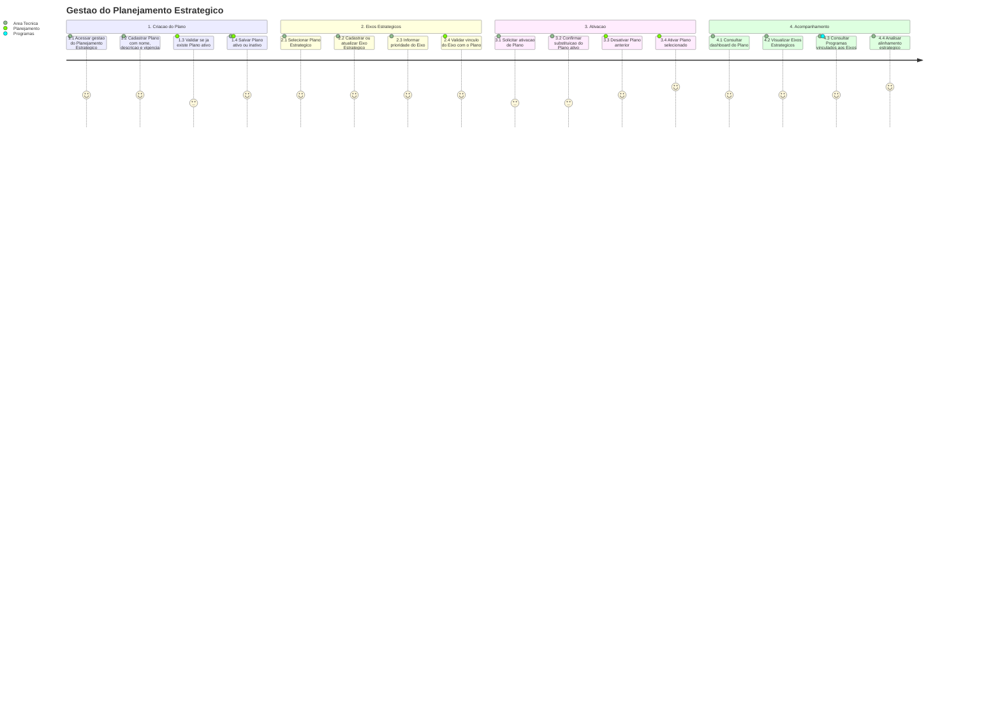

# Jornada — Gestao do Planejamento Estrategico

[← Voltar ao M010](../README.md) | [Processo](processo.md) | [Estrutural](modelo-estrutural.md) | [Comportamental](modelo-comportamental.md)

---

## Jornada do Usuario

## Etapas

| # | Etapa | Ator principal | Resultado |
|---|-------|----------------|-----------|
| 1 | Criacao do Plano | Area Tecnica | Plano Estrategico cadastrado com nome, descricao e vigencia. |
| 2 | Definicao de ativacao | Planejamento / M010 | Plano salvo como ativo quando nao houver outro Plano ativo; caso contrario, permanece inativo. |
| 3 | Cadastro de Eixos | Area Tecnica | Eixos Estrategicos cadastrados ou atualizados dentro de exatamente um Plano. |
| 4 | Priorizacao de Eixos | Area Tecnica | Ordem de prioridade definida para orientar Programas. |
| 5 | Ativacao ou substituicao | Area Tecnica / Planejamento | Plano selecionado torna-se ativo e o Plano anterior e desativado. |
| 6 | Acompanhamento | Area Tecnica | Dashboard apresenta Plano, Eixos e Programas vinculados. |

## Pontos de Atencao

| Momento | Atencao |
|---------|---------|
| Criacao do Plano | So pode haver um Plano ativo por vez. |
| Eixos Estrategicos | Cada Eixo deve pertencer a exatamente um Plano Estrategico. |
| Remocao de Eixo | A remocao deve ser bloqueada quando houver Programa orientado pelo Eixo. |
| Ativacao | A substituicao do Plano ativo deve ser confirmada para preservar clareza historica. |
| Acompanhamento | O dashboard deve evidenciar quais Programas executam cada diretriz estrategica. |

## Referencia de Regras

Regras aplicaveis: `RN01`, `RN08`, `RN09`. As definicoes oficiais ficam em [M010 — Regras de Negocio](../README.md#regras-de-negocio-consolidadas).
