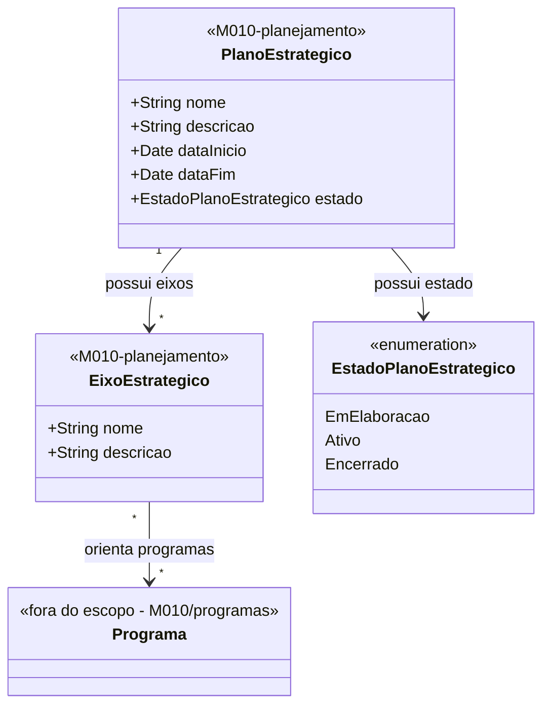

# Modelo Estrutural — Planejamento Estrategico

[← Voltar ao M010](../README.md) | [Contrato M010](../contrato.md) | [Contrato API M010](../contrato-api.md)

**Escopo**: Plano Estrategico e Eixos Estrategicos. Base para o domínio de Programas.

---

## Diagrama de Classes

## Dicionario de Dados

| Classe | Atributo | Definicao | Obrig. | Tipo | Dominio | Tamanho | Unico |
|--------|----------|-----------|--------|------|---------|---------|-------|
| **PlanoEstrategico** | nome | Nome do plano estrategico | Sim | String | Ex: Plano Estrategico 2024-2027 | 300 | Sim |
| | descricao | Descricao dos objetivos do plano | Sim | String | | 2000 | |
| | dataInicio | Data de inicio da vigencia do plano | Sim | Date | | | |
| | dataFim | Data de fim da vigencia do plano | Sim | Date | | | |
| | estado | Estado do planejamento estrategico | Sim | Enum | EmElaboracao, Ativo, Encerrado | | |
| **EixoEstrategico** | nome | Nome do eixo estrategico | Sim | String | Ex: Formacao de Recursos Humanos | 300 | |
| | descricao | Descricao do escopo e objetivos do eixo | Sim | String | | 2000 | |

## Indicadores Derivados para Dashboard

Os indicadores do dashboard nao sao atributos persistidos do Eixo; sao consolidacoes calculadas a partir dos Programas vinculados e dos valores financeiros associados aos Programas.

| Indicador | Definicao |
|-----------|-----------|
| Quantidade de Programas por Eixo | Contagem dos Programas vinculados ao Eixo Estrategico no plano selecionado. |
| Valor Investido por Eixo | Soma dos valores investidos nos Programas vinculados ao Eixo Estrategico. |
| Percentual de Participacao do Eixo | `Valor Investido por Eixo / Valor Investido Total do Plano`. |
| Valor Investido Total do Plano | Soma dos valores investidos em todos os Programas vinculados aos Eixos do Plano. |

## Consultas Derivadas para Dashboard

| Consulta | Definicao | Origem |
|----------|-----------|--------|
| Programas associados ao Eixo | Lista dos Programas vinculados ao Eixo selecionado no dashboard. | `programas/Programa` |
| Estado do Programa | Estado atual do Programa associado ao Eixo. | `programas/Programa` |
| Valor investido do Programa | Valor investido consolidado para o Programa associado ao Eixo. | `programas/Programa` e relacoes financeiras do M010 |

> O Planejamento nao duplica os dados do Programa. A tela apenas consulta e consolida os Programas associados ao Eixo selecionado.

## Regras de Negocio Aplicaveis

- **RN01** — Programa deve estar vinculado a pelo menos um eixo (aplicada em programas/)
- **RN08** — Eixo pertence a exatamente um plano estrategico
- **RN09** — Plano ativo unico por vez

## Relacoes com outros subdominios

| Destino | Relacao | Observacao |
|---------|---------|------------|
| `programas/Programa` | EixoEstrategico → Programa (N:N) | Orienta |
