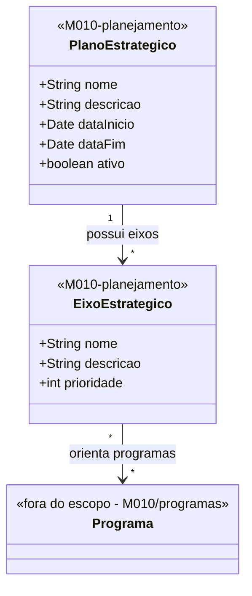

# Modelo Estrutural — Planejamento Estrategico

[← Voltar ao M010](../README.md) | [Contrato M010](../contrato.md) | [Contrato API M010](../contrato-api.md)

**Escopo**: Plano Estrategico e Eixos Estrategicos. Base para o domínio de Programas.

---

## Diagrama de Classes

## Dicionario de Dados

| Classe | Atributo | Definicao | Obrig. | Tipo | Dominio | Tamanho | Unico |
|--------|----------|-----------|--------|------|---------|---------|-------|
| **PlanoEstrategico** | nome | Nome do plano estrategico | Sim | String | Ex: Plano Estrategico 2024-2027 | 300 | Sim |
| | descricao | Descricao dos objetivos do plano | Sim | String | | 2000 | |
| | dataInicio | Data de inicio da vigencia do plano | Sim | Date | | | |
| | dataFim | Data de fim da vigencia do plano | Sim | Date | | | |
| | ativo | Indica se o plano esta ativo (so pode haver um ativo por vez — RN09) | Gerado | Boolean | true/false | | |
| **EixoEstrategico** | nome | Nome do eixo estrategico | Sim | String | Ex: Formacao de Recursos Humanos | 300 | |
| | descricao | Descricao do escopo e objetivos do eixo | Sim | String | | 2000 | |
| | prioridade | Ordem de prioridade do eixo no plano | Sim | Int | Ex: 1, 2, 3 | | |

## Regras de Negocio Aplicaveis

- **RN01** — Programa deve estar vinculado a pelo menos um eixo (aplicada em programas/)
- **RN08** — Eixo pertence a exatamente um plano estrategico
- **RN09** — Plano ativo unico por vez

## Relacoes com outros subdominios

| Destino | Relacao | Observacao |
|---------|---------|------------|
| `programas/Programa` | EixoEstrategico → Programa (N:N) | Orienta |
