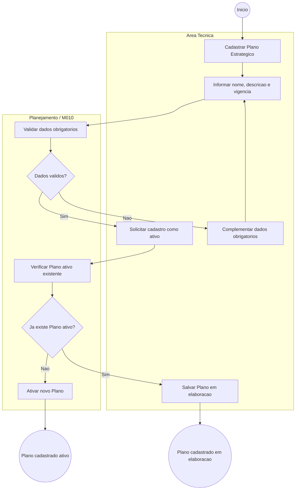
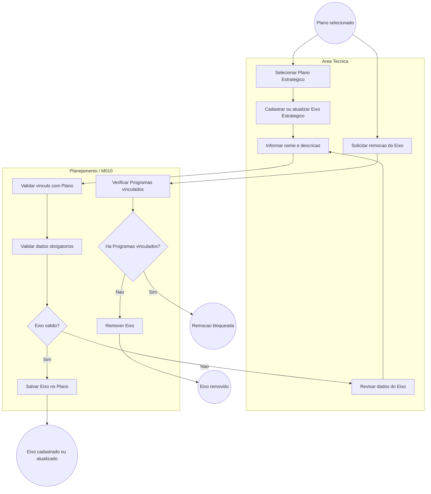
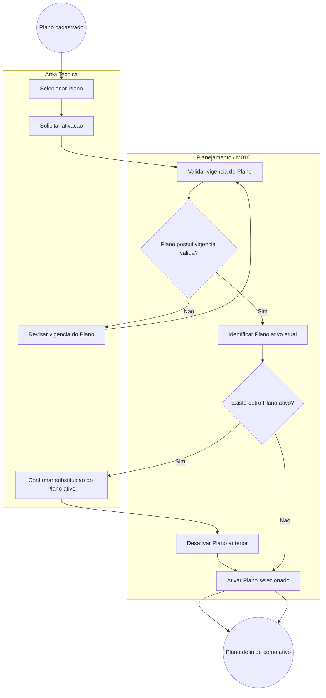
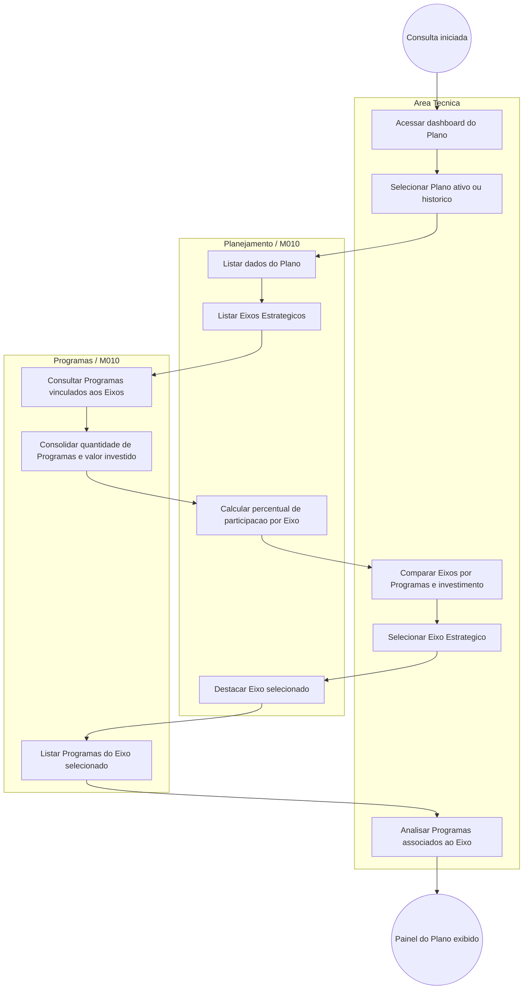

# Processo — Planejamento Estrategico

[← Voltar ao M010](../README.md) | [Estrutural](modelo-estrutural.md) | [Comportamental](modelo-comportamental.md)

---

## Visao Geral

O processo de Planejamento Estrategico organiza a criacao e manutencao dos Planejamentos Estrategicos da agencia e de seus Eixos Estrategicos. Pode haver mais de um Planejamento cadastrado para representar ciclos diferentes, mas o fluxo deve garantir que exista apenas um Plano ativo por vez e que cada Eixo pertenca a exatamente um Plano.

1. **Criacao do Plano Estrategico** — cadastro da vigencia, objetivos e definicao de ativacao.
2. **Gestao de Eixos Estrategicos** — cadastro, atualizacao e remocao de eixos vinculados ao Plano.
3. **Ativacao ou substituicao do Plano** — troca controlada do Plano ativo, respeitando unicidade.
4. **Acompanhamento do Plano** — consulta consolidada dos eixos, Programas vinculados, valor investido por Eixo e detalhamento dos Programas associados ao Eixo selecionado.

---

## Fluxo 1 — Criacao do Plano Estrategico

Este fluxo inicia quando a Area Tecnica cadastra um novo Plano Estrategico. O Plano pode nascer ativo quando nao houver outro Plano ativo; caso contrario, deve ser salvo em elaboracao ate que a ativacao seja solicitada em fluxo proprio.

### Atividades da criacao do Plano

| # | Atividade | Responsavel | Resultado |
|---|-----------|-------------|-----------|
| 1 | Cadastrar Plano Estrategico | Area Tecnica | Novo Plano iniciado. |
| 2 | Informar dados obrigatorios | Area Tecnica | Nome, descricao, data de inicio e data de fim preenchidos. |
| 3 | Validar dados obrigatorios | Planejamento / M010 | Cadastro rejeitado se houver campos obrigatorios ausentes. |
| 4 | Verificar Plano ativo | Planejamento / M010 | Garante que so exista um Plano ativo por vez (RN09). |
| 5 | Ativar ou salvar em elaboracao | Area Tecnica / Planejamento | Plano criado como ativo quando permitido ou mantido em elaboracao para ativacao posterior. |

---

## Fluxo 2 — Gestao de Eixos Estrategicos

Este fluxo trata a manutencao dos Eixos Estrategicos que organizam as diretrizes do Plano. Cada Eixo pertence a exatamente um Plano Estrategico e pode orientar um ou mais Programas.

### Atividades da gestao de Eixos

| # | Atividade | Responsavel | Resultado |
|---|-----------|-------------|-----------|
| 1 | Selecionar Plano | Area Tecnica | Plano que recebera o Eixo identificado. |
| 2 | Cadastrar ou atualizar Eixo | Area Tecnica | Nome e descricao informados. |
| 3 | Validar vinculo com Plano | Planejamento / M010 | Eixo vinculado a exatamente um Plano (RN08). |
| 4 | Salvar Eixo | Planejamento / M010 | Eixo criado ou atualizado no Plano. |
| 5 | Solicitar remocao | Area Tecnica | Pedido de remocao avaliado. |
| 6 | Verificar Programas vinculados | Planejamento / Programas | Remocao bloqueada quando houver Programa orientado pelo Eixo. |

---

## Fluxo 3 — Ativacao ou Substituicao do Plano Estrategico

Este fluxo controla a troca do Plano ativo. Quando um novo Plano e ativado, o Plano ativo anterior deve ser desativado no mesmo movimento para manter a regra de unicidade.

### Atividades da ativacao

| # | Atividade | Responsavel | Resultado |
|---|-----------|-------------|-----------|
| 1 | Selecionar Plano | Area Tecnica | Plano candidato a ativo identificado. |
| 2 | Validar vigencia | Planejamento / M010 | Datas do Plano avaliadas. |
| 3 | Identificar Plano ativo atual | Planejamento / M010 | Verifica se ha outro Plano ativo (RN09). |
| 4 | Confirmar substituicao | Area Tecnica | Troca do Plano ativo confirmada quando necessario. |
| 5 | Ativar Plano selecionado | Planejamento / M010 | Plano selecionado fica ativo e os demais ficam em elaboracao ou encerrados, conforme o ciclo correspondente. |

---

## Fluxo 4 — Acompanhamento do Plano Estrategico

Este fluxo permite acompanhar o alinhamento entre Plano, Eixos e Programas. O objetivo e dar visibilidade de quantos Programas executam cada diretriz estrategica, quanto investimento esta associado a cada Eixo e quais Programas compoem o Eixo selecionado.

### Atividades do acompanhamento

| # | Atividade | Responsavel | Resultado |
|---|-----------|-------------|-----------|
| 1 | Acessar dashboard | Area Tecnica | Consulta ao Plano iniciada. |
| 2 | Selecionar Plano | Area Tecnica | Plano ativo ou historico selecionado. |
| 3 | Listar Eixos | Planejamento / M010 | Eixos do Plano apresentados. |
| 4 | Consultar Programas vinculados | Programas / M010 | Quantidade de Programas e valor investido consolidados por Eixo. |
| 5 | Calcular participacao | Planejamento / M010 | Percentual de cada Eixo no investimento total do Plano calculado. |
| 6 | Selecionar Eixo | Area Tecnica | Eixo escolhido para detalhamento. |
| 7 | Listar Programas do Eixo | Programas / M010 | Programas associados ao Eixo exibidos com nome, estado e valor investido. |
| 8 | Analisar alinhamento | Area Tecnica | Visao consolidada e detalhada da execucao estrategica disponivel. |

## Referencia de Regras

Regras aplicaveis aos fluxos de Planejamento Estrategico: `RN01`, `RN08`, `RN09`. As definicoes oficiais ficam em [M010 — Regras de Negocio](../README.md#regras-de-negocio-consolidadas).
