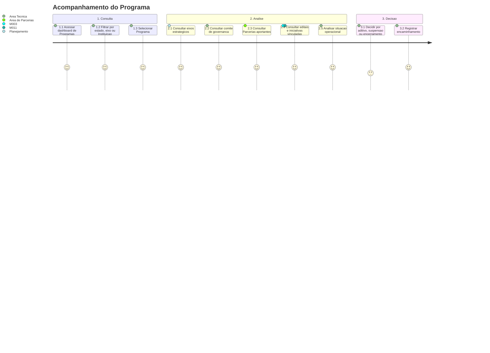

# Jornada — Acompanhamento do Programa

[← Voltar ao Indice](README.md) | [Processo](processo.md) | [Estrutural](modelo-estrutural.md) | [Comportamental](modelo-comportamental.md)

---

## Jornada do Usuario

## Etapas

| # | Etapa | Ator principal | Resultado |
|---|-------|----------------|-----------|
| 1 | Consulta | Area Tecnica | Lista de Programas filtrada. |
| 2 | Detalhamento | Area Tecnica | Programa selecionado com eixos, comite, aportes, editais e iniciativas. |
| 3 | Analise financeira | Area de Parcerias | Aportes por Parceria e total aportado ao Programa apresentados. |
| 4 | Analise operacional | M003 / M011 | Situacao de editais e iniciativas vinculadas apresentada. |
| 5 | Decisao | Area Tecnica | Encaminhamento para aditivo, retirada, suspensao, reativacao, encerramento ou remocao. |

## Referencia de Regras

Regras aplicaveis: `RN01`, `RN02`, `RN11`, `RN13`, `RN14`, `RN16`, `RI1`, `RI4`. As definicoes oficiais ficam em [M010 — Regras de Negocio](../README.md#regras-de-negocio-consolidadas).
