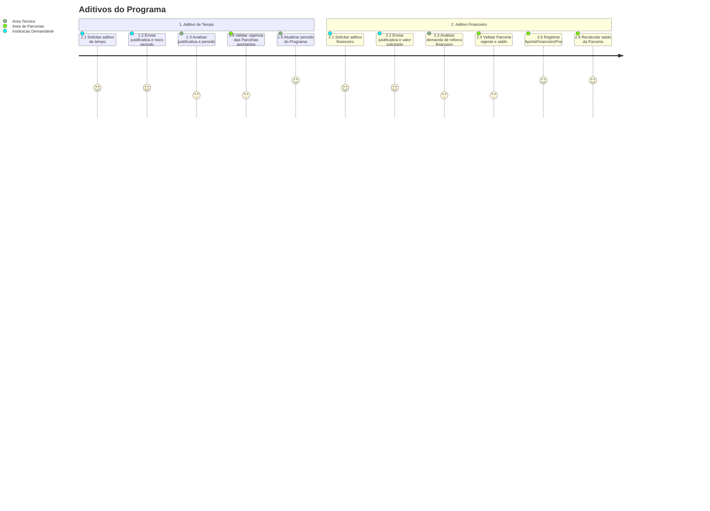

# Jornada — Aditivos do Programa

[← Voltar ao Indice](README.md) | [Processo](processo.md) | [Estrutural](modelo-estrutural.md) | [Comportamental](modelo-comportamental.md)

---

## Jornada do Usuario

## Etapas

| # | Etapa | Ator principal | Resultado |
|---|-------|----------------|-----------|
| 1 | Solicitar aditivo de tempo | Instituicao Demandante | Pedido de alteracao de prazo formalizado. |
| 2 | Validar periodo | Area Tecnica / Area de Parcerias | Novo periodo aprovado apenas se respeitar vigencias das Parcerias aportantes. |
| 3 | Solicitar aditivo financeiro | Instituicao Demandante | Pedido de reforco financeiro formalizado. |
| 4 | Validar Parceria e saldo | Area de Parcerias | Aporte permitido apenas com Parceria vigente e saldo suficiente. |
| 5 | Registrar aporte | Area de Parcerias | Recurso alocado ao Programa via `AporteFinanceiroPrograma`. |

## Referencia de Regras

Regras aplicaveis: `RN02`, `RN11`, `RN13`, `RN14`. As definicoes oficiais ficam em [M010 — Regras de Negocio](../README.md#regras-de-negocio-consolidadas).
