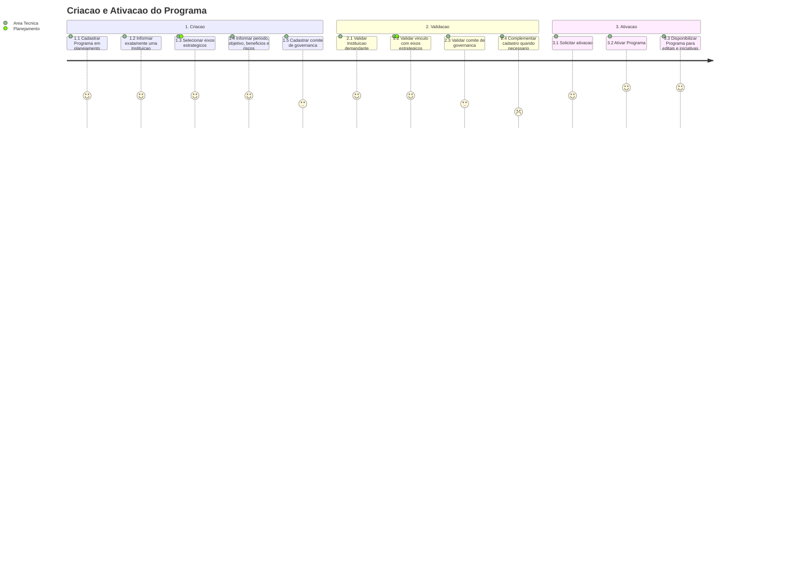

# Jornada — Criacao e Ativacao do Programa

[← Voltar ao Indice](README.md) | [Processo](processo.md) | [Estrutural](modelo-estrutural.md) | [Comportamental](modelo-comportamental.md)

---

## Jornada do Usuario

## Etapas

| # | Etapa | Ator principal | Resultado |
|---|-------|----------------|-----------|
| 1 | Criacao | Area Tecnica | Programa criado em `EM_PLANEJAMENTO`. |
| 2 | Instituicao demandante | Area Tecnica | Programa vinculado a exatamente uma Instituicao demandante. |
| 3 | Eixos estrategicos | Area Tecnica / Planejamento | Programa associado a pelo menos um eixo estrategico. |
| 4 | Governanca | Area Tecnica | Comite de governanca cadastrado. |
| 5 | Ativacao | Area Tecnica | Programa transita para `ATIVO`. |

## Referencia de Regras

Regras aplicaveis: `RN01`, `RN16`. As definicoes oficiais ficam em [M010 — Regras de Negocio](../README.md#regras-de-negocio-consolidadas).
