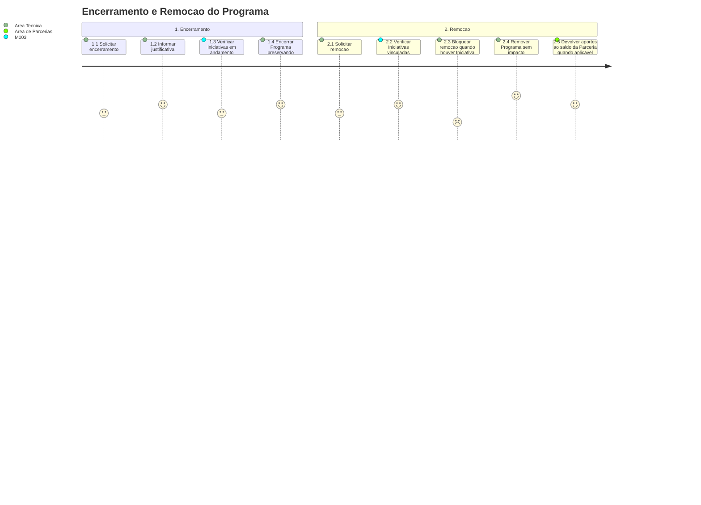

# Jornada — Encerramento e Remocao do Programa

[← Voltar ao Indice](README.md) | [Processo](processo.md) | [Estrutural](modelo-estrutural.md) | [Comportamental](modelo-comportamental.md)

---

## Jornada do Usuario

## Etapas

| # | Etapa | Ator principal | Resultado |
|---|-------|----------------|-----------|
| 1 | Solicitar encerramento | Area Tecnica | Pedido de encerramento formalizado com justificativa. |
| 2 | Verificar execucao | M003 / M011 | Iniciativas em andamento ou bloqueios operacionais sao avaliados. |
| 3 | Encerrar Programa | Area Tecnica | Programa transita para `ENCERRADO` com historico preservado. |
| 4 | Solicitar remocao | Area Tecnica | Pedido de remocao avaliado. |
| 5 | Verificar Iniciativas vinculadas | M003 | Remocao so segue quando nao ha nenhuma Iniciativa vinculada. |
| 6 | Remover Programa | Area Tecnica | Programa removido sem impacto operacional. |

## Pontos de Atencao

| Momento | Atencao |
|---------|---------|
| Remocao | Permitida sem impacto quando nao existe nenhuma Iniciativa vinculada. |
| Iniciativa vinculada | Remocao bloqueada; o caminho correto e encerramento com historico. |
| Aportes existentes | Se o Programa for removido, aportes devem retornar ao saldo da Parceria quando aplicavel. |

## Referencia de Regras

Regras aplicaveis: `RI1`, `RN14`. As definicoes oficiais ficam em [M010 — Regras de Negocio](../README.md#regras-de-negocio-consolidadas).
