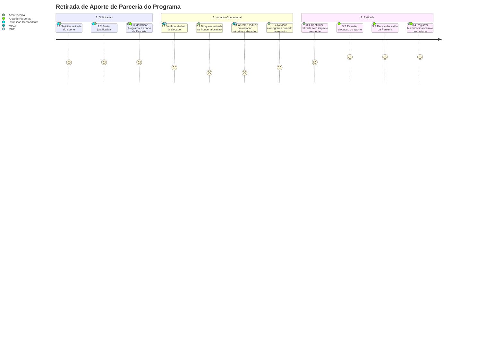

# Jornada — Retirada de Aporte do Programa

[← Voltar ao Indice](README.md) | [Processo](processo.md) | [Estrutural](modelo-estrutural.md) | [Comportamental](modelo-comportamental.md)

---

## Jornada do Usuario

## Etapas

| # | Etapa | Ator principal | Resultado |
|---|-------|----------------|-----------|
| 1 | Solicitacao | Instituicao Demandante ou Area Tecnica | Pedido de retirada formalizado com justificativa. |
| 2 | Identificacao do aporte | Area Tecnica / Area de Parcerias | `AporteFinanceiroParceriaPrograma` localizado. |
| 3 | Analise de impacto | M003 / M011 | Verifica se o dinheiro ja foi alocado em iniciativa ou execucao vinculada. |
| 4 | Ajuste operacional | M003 / M011 | Iniciativas afetadas sao canceladas, reduzidas ou realocadas quando necessario. |
| 5 | Retirada | Area de Parcerias | Aporte retirado do Programa e saldo devolvido a Parceria. |

## Pontos de Atencao

| Momento | Atencao |
|---------|---------|
| Sem alocacao operacional | A retirada pode ocorrer sem cancelamento de iniciativas. |
| Com dinheiro alocado | A retirada direta e bloqueada ate ajuste das iniciativas afetadas. |
| Impacto de prazo | O cronograma do Programa pode precisar ser revisado. |

## Referencia de Regras

Regras aplicaveis: `RN02`, `RN11`, `RN14`. As definicoes oficiais ficam em [M010 — Regras de Negocio](../README.md#regras-de-negocio-consolidadas).
