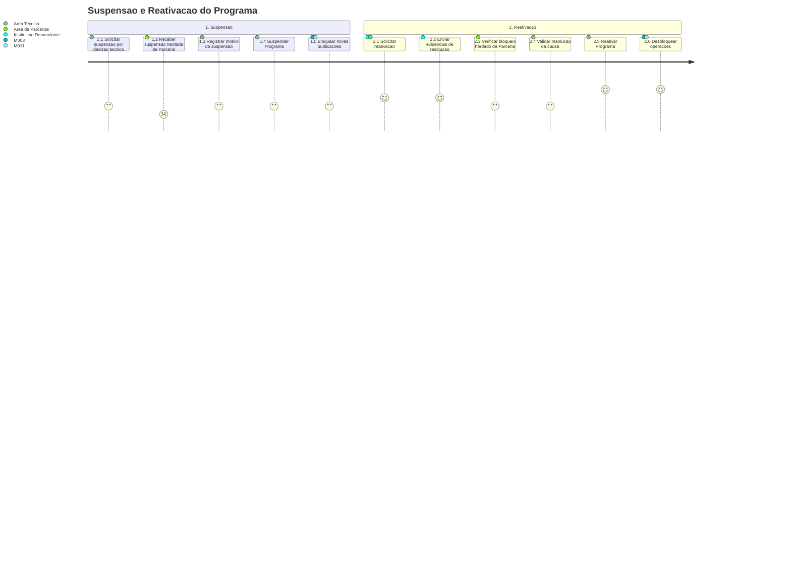

# Jornada — Suspensao e Reativacao do Programa

[← Voltar ao Indice](README.md) | [Processo](processo.md) | [Estrutural](modelo-estrutural.md) | [Comportamental](modelo-comportamental.md)

---

## Jornada do Usuario

## Etapas

| # | Etapa | Ator principal | Resultado |
|---|-------|----------------|-----------|
| 1 | Suspensao | Area Tecnica / Area de Parcerias | Programa transita para `SUSPENSO`. |
| 2 | Bloqueio operacional | M003 / M011 | Novas publicacoes e execucoes vinculadas ficam bloqueadas. |
| 3 | Solicitacao de reativacao | Instituicao Demandante / Area Tecnica | Pedido de retorno recebido. |
| 4 | Validacao | Area Tecnica / Area de Parcerias | Causa da suspensao e bloqueios herdados sao avaliados. |
| 5 | Reativacao | Area Tecnica | Programa retorna para `ATIVO`. |

## Referencia de Regras

Regras aplicaveis: `RI4`. As definicoes oficiais ficam em [M010 — Regras de Negocio](../README.md#regras-de-negocio-consolidadas).
