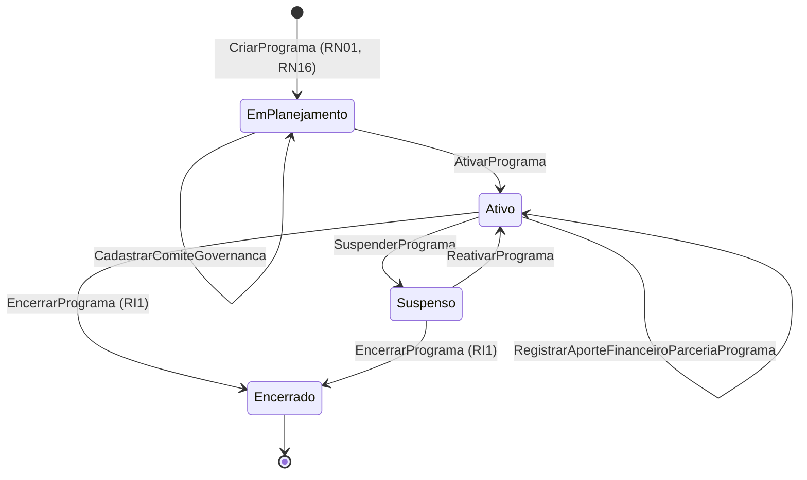

# Modelo Comportamental — Programas

[← Voltar ao M010](../README.md) | [Estrutural](modelo-estrutural.md)

---

## Ciclo de Vida: Programa

### Descricao dos estados

| Estado | Descricao |
|--------|-----------|
| **EM_PLANEJAMENTO** | Configuracao inicial. Aportes de Parcerias e comite podem ser registrados antes da ativacao. |
| **ATIVO** | Programa habilitado para criacao de editais em M011. |
| **SUSPENSO** | Novos editais bloqueados temporariamente. |
| **ENCERRADO** | Programa finalizado; historico preservado. |

### Guards e regras por transicao

| Transicao | Operacao | Pre-condicoes |
|-----------|----------|---------------|
| `[*] → EM_PLANEJAMENTO` | `CriarPrograma` | Eixo estrategico vinculado (RN01); Instituicao demandante (RN16) |
| `EM_PLANEJAMENTO → ATIVO` | `AtivarPrograma` | Eixo vinculado **e** `ComiteGovernanca` definido |
| `ATIVO → SUSPENSO` | `SuspenderPrograma` | motivo informado |
| `SUSPENSO → ATIVO` | `ReativarPrograma` | — |
| `ATIVO → ENCERRADO` / `SUSPENSO → ENCERRADO` | `EncerrarPrograma` | **RI1**: sem editais em andamento (M011) + justificativa |

### Regras invariantes relevantes

- **RN13** (temporal): ao alterar `dataInicio`/`dataFim` do Programa, se houver `AporteFinanceiroParceriaPrograma` registrado, as novas datas devem caber dentro da vigencia de toda Parceria aportante.
- **RI1** (remocao/encerramento): bloqueado quando houver editais vinculados ativos em M011.
- **Cascata por RI2**: quando a Parceria aportante e encerrada, o Programa tambem e encerrado automaticamente (ver [parcerias/modelo-comportamental.md](../parcerias/modelo-comportamental.md)).
- Editais sao configurados em M011 e gerenciados operacionalmente em M003 apos contratacao.
