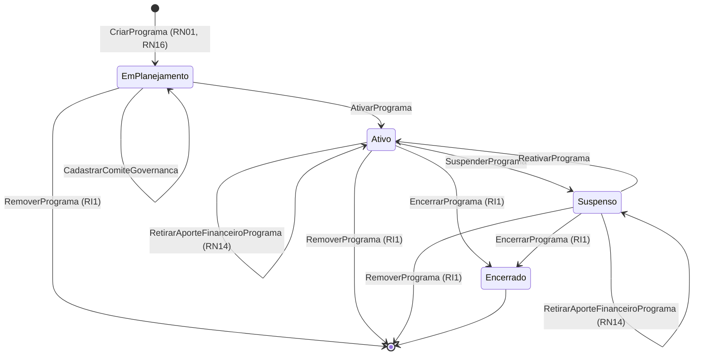

# Modelo Comportamental — Programas

[← Voltar ao M010](../README.md) | [Estrutural](modelo-estrutural.md)

---

## Ciclo de Vida: Programa

### Descricao dos estados

| Estado | Descricao |
|--------|-----------|
| **EM_PLANEJAMENTO** | Configuracao inicial. Aportes de Parcerias e comite podem ser registrados antes da ativacao. |
| **ATIVO** | Programa habilitado para criacao de editais em M011 e iniciativas em M003. |
| **SUSPENSO** | Novos editais, iniciativas e execucoes vinculadas ficam bloqueados temporariamente. |
| **ENCERRADO** | Programa finalizado; historico preservado. |

### Guards e regras por transicao

| Transicao | Operacao | Pre-condicoes |
|-----------|----------|---------------|
| `[*] → EM_PLANEJAMENTO` | `CriarPrograma` | Eixo estrategico vinculado (RN01); Instituicao demandante (RN16) |
| `EM_PLANEJAMENTO → ATIVO` | `AtivarPrograma` | Eixo vinculado **e** `ComiteGovernanca` definido |
| `EM_PLANEJAMENTO/ATIVO/SUSPENSO → mesmo estado` | `RegistrarAporteFinanceiroPrograma` | Parceria vigente, saldo suficiente e periodo do Programa dentro da vigencia da Parceria |
| `EM_PLANEJAMENTO/ATIVO/SUSPENSO → mesmo estado` | `RetirarAporteFinanceiroPrograma` | Aporte existe; se houver dinheiro alocado em iniciativa ou execucao vinculada, exige ajuste operacional previo |
| `ATIVO → SUSPENSO` | `SuspenderPrograma` | motivo informado |
| `SUSPENSO → ATIVO` | `ReativarPrograma` | causa da suspensao resolvida; bloqueio herdado de Parceria resolvido quando aplicavel |
| `ATIVO → ENCERRADO` / `SUSPENSO → ENCERRADO` | `EncerrarPrograma` | sem bloqueios operacionais por iniciativas em andamento |
| `EM_PLANEJAMENTO/ATIVO/SUSPENSO → [*]` | `RemoverPrograma` | sem nenhuma Iniciativa vinculada (RI1) |

### Referencia de Regras

Regras aplicaveis ao ciclo de vida de Programas: `RN01`, `RN11`, `RN13`, `RN14`, `RN16`, `RI1`, `RI2`, `RI4`. As definicoes oficiais ficam em [M010 — Regras de Negocio](../README.md#regras-de-negocio-consolidadas).
- Editais sao configurados em M011 e gerenciados operacionalmente em M003 apos contratacao.
