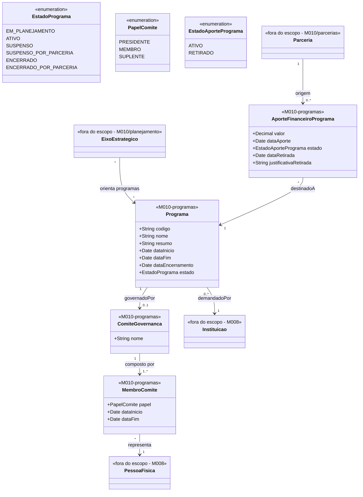

# Modelo Estrutural — Programas

[← Voltar ao M010](../README.md) | [Contrato M010](../contrato.md) | [Contrato API M010](../contrato-api.md)

**Escopo**: Programa de fomento, comite de governanca e os aportes recebidos de Parcerias.

---

## Diagrama de Classes

Leitura da relacao `demandadoPor`: uma Instituicao pode demandar zero ou muitos Programas; cada Programa deve ter exatamente uma Instituicao demandante.

## Dicionario de Dados

| Classe | Atributo | Definicao | Obrig. | Tipo | Dominio | Tamanho | Unico |
|--------|----------|-----------|--------|------|---------|---------|-------|
| **Programa** | codigo | Codigo de identificacao | Gerado | String | Ex: PRG-2025-001 | | Sim |
| | nome | Nome do programa | Sim | String | | 300 | |
| | resumo | Resumo, justificativa e objetivo | Sim | String | | 2000 | |
| | dataInicio | Data de inicio | Sim | Date | | | |
| | dataFim | Data de fim | Sim | Date | | | |
| | dataEncerramento | Data efetiva do encerramento (preenchida quando estado = `ENCERRADO` ou `ENCERRADO_POR_PARCERIA`) | Condicional | Date | | | |
| | estado | Estado atual | Gerado | EstadoPrograma | `EM_PLANEJAMENTO`/`ATIVO`/`SUSPENSO`/`SUSPENSO_POR_PARCERIA`/`ENCERRADO`/`ENCERRADO_POR_PARCERIA` | | |
| | instituicaoDemandante (relacao) | Exatamente uma Instituicao (M008) que demanda o Programa (RN16) | Sim | FK → Instituicao (M008) | Via `demandadoPor`; nao admite vazio nem multiplas Instituicoes | | |
| **ComiteGovernanca** | nome | Nome do comite (ex: "Comite Gestor PRG-2026-001") | Sim | String | | 200 | |
| **MembroComite** | papel | Papel do membro | Sim | PapelComite | `PRESIDENTE`/`MEMBRO`/`SUPLENTE` | | |
| | dataInicio | Inicio da participacao | Sim | Date | | | |
| | dataFim | Fim da participacao (aberto = ativo) | Nao | Date | | | |
| **AporteFinanceiroPrograma** | valor | Valor aportado pela parceria no programa | Sim | Decimal | Ex: 150000.00; `>= 0` (admite zero; valores negativos rejeitados) | | |
| | dataAporte | Data de efetivacao do aporte no programa | Sim | Date | | | |
| | estado | Situacao do aporte no Programa | Gerado | EstadoAportePrograma | `ATIVO`/`RETIRADO` | | |
| | dataRetirada | Data em que o aporte foi retirado do Programa | Condicional | Date | Obrigatorio quando `estado = RETIRADO` | | |
| | justificativaRetirada | Motivo da retirada do aporte do Programa | Condicional | String | Obrigatorio quando `estado = RETIRADO` | 1000 | |

## Conceitos Financeiros Normalizados

| Conceito | Definicao | Fonte |
|----------|-----------|-------|
| Valor alocado | SUM dos AportesFinanceiroPrograma em estado ATIVO destinados a este Programa. Taxa de Gestao de Parcerias ja foi deduzida na Parceria antes desta alocacao — Programa nao recalcula (RN20). | `AporteFinanceiroPrograma.valor[ATIVO]` |
| Valor consumido | Consolidacao dos valores executados nas Iniciativas (projetos) vinculadas a este Programa — inclui projetos de demanda induzida. Calculado por M003 a partir de pagamentos e compromissos registrados em M014. Programa nao armazena diretamente. | M003 + M014 |
| Saldo disponivel do Programa | `valorAlocado - valorConsumido`. Sempre `>= 0`. | Derivado |

> Evitar os termos "pago", "executado", "saldo livre" e "saldo nao executado" nas telas e contratos do Programa. Usar os termos canonicos acima.

## Referencia de Regras

`AporteFinanceiroPrograma.valor` consome `saldoAlocavelEmProgramas` da Parceria. O Programa nao recalcula Taxa de Gestao de Parcerias — ela ja foi calculada e deduzida na Parceria antes da alocacao (RN20, RN21). Aporte retirado nao compoe `valorAlocado` e devolve saldo alocavel a Parceria (RN14).

Regras aplicaveis ao modelo de Programas: `RN01`, `RN02`, `RN11`, `RN13`, `RN14`, `RN16`, `RN20`, `RN21`, `RN22`, `RI1`, `RI2`, `RI4`. As definicoes oficiais ficam em [M010 — Regras de Negocio](../README.md#regras-de-negocio-consolidadas).

## Relacoes com outros subdominios

| Destino | Relacao | Observacao |
|---------|---------|------------|
| `planejamento/EixoEstrategico` | Orienta (N:N) | Diretriz estrategica |
| `parcerias/Parceria` | Parceria origina AporteFinanceiroPrograma | Entidade vive aqui, fonte vem de parcerias |
| `M008/Instituicao` | `demandadoPor` (N:1) | Instituicao solicita o programa |
| `M008/PessoaFisica` | `representa` (N:1) via MembroComite | Pessoas do comite |
