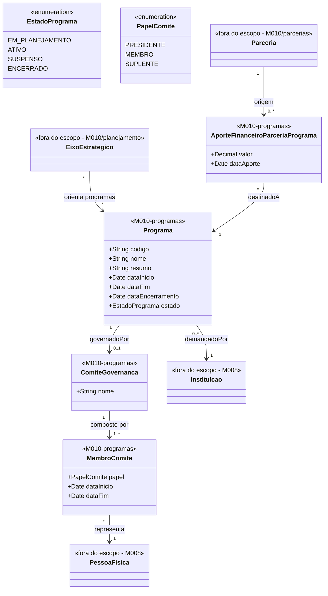

# Modelo Estrutural — Programas

[← Voltar ao M010](../README.md) | [Contrato M010](../contrato.md) | [Contrato API M010](../contrato-api.md)

**Escopo**: Programa de fomento, comite de governanca e os aportes recebidos de Parcerias.

---

## Diagrama de Classes

## Dicionario de Dados

| Classe | Atributo | Definicao | Obrig. | Tipo | Dominio | Tamanho | Unico |
|--------|----------|-----------|--------|------|---------|---------|-------|
| **Programa** | codigo | Codigo de identificacao | Gerado | String | Ex: PRG-2025-001 | | Sim |
| | nome | Nome do programa | Sim | String | | 300 | |
| | resumo | Resumo, justificativa e objetivo | Sim | String | | 2000 | |
| | dataInicio | Data de inicio | Sim | Date | | | |
| | dataFim | Data de fim | Sim | Date | | | |
| | dataEncerramento | Data efetiva do encerramento (preenchida quando estado = `ENCERRADO`) | Condicional | Date | | | |
| | estado | Estado atual | Gerado | EstadoPrograma | `EM_PLANEJAMENTO`/`ATIVO`/`SUSPENSO`/`ENCERRADO` | | |
| | instituicaoDemandante (relacao) | Instituicao (M008) que demanda o programa (RN16) | Sim | FK → Instituicao (M008) | Via `demandadoPor` | | |
| **ComiteGovernanca** | nome | Nome do comite (ex: "Comite Gestor PRG-2026-001") | Sim | String | | 200 | |
| **MembroComite** | papel | Papel do membro | Sim | PapelComite | `PRESIDENTE`/`MEMBRO`/`SUPLENTE` | | |
| | dataInicio | Inicio da participacao | Sim | Date | | | |
| | dataFim | Fim da participacao (aberto = ativo) | Nao | Date | | | |
| **AporteFinanceiroParceriaPrograma** | valor | Valor aportado pela parceria no programa | Sim | Decimal | Ex: 150000.00; `>= 0` (admite zero; valores negativos rejeitados) | | |
| | dataAporte | Data de efetivacao do aporte no programa | Sim | Date | | | |

## Regras de Negocio Aplicaveis

- **RN01** — Programa vinculado a pelo menos um eixo
- **RN02** — Parceria ↔ Programa via `AporteFinanceiroParceriaPrograma` (N:N)
- **RN11** — Parceria aporta em Programa: valor >= 0, Parceria vigente
- **RN13** — Invariante temporal: periodo do Programa contido na vigencia da Parceria aportante
- **RN16** — Programa tem exatamente uma Instituicao demandante
- **RI1** — Nao remover Programa com editais vinculados

## Relacoes com outros subdominios

| Destino | Relacao | Observacao |
|---------|---------|------------|
| `planejamento/EixoEstrategico` | Orienta (N:N) | Diretriz estrategica |
| `parcerias/Parceria` | Parceria origina AporteFinanceiroParceriaPrograma | Entidade vive aqui, fonte vem de parcerias |
| `M008/Instituicao` | `demandadoPor` (N:1) | Instituicao solicita o programa |
| `M008/PessoaFisica` | `representa` (N:1) via MembroComite | Pessoas do comite |
