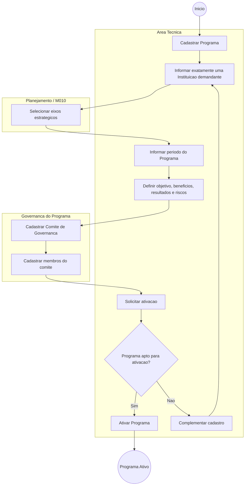
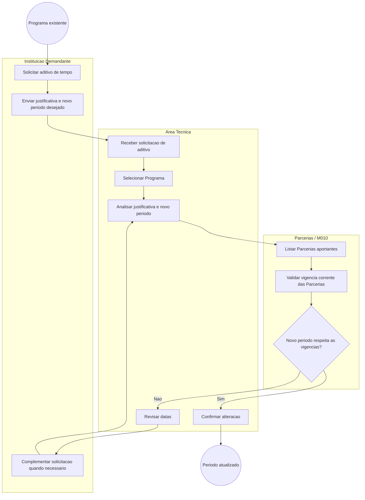
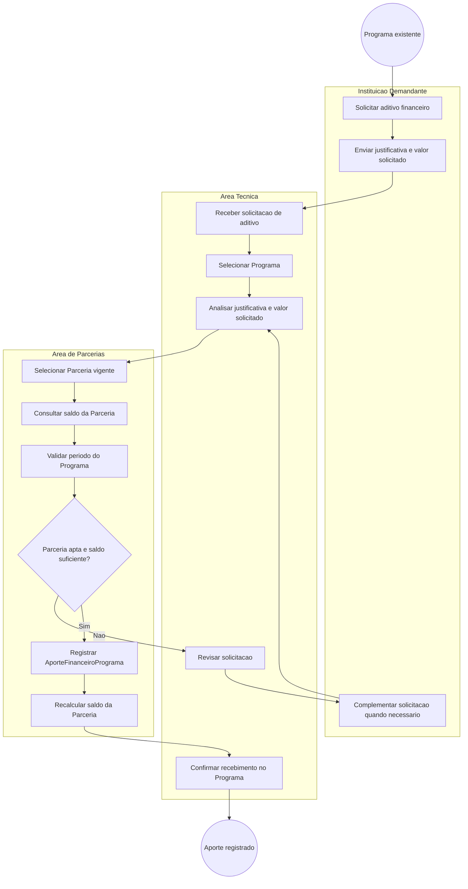
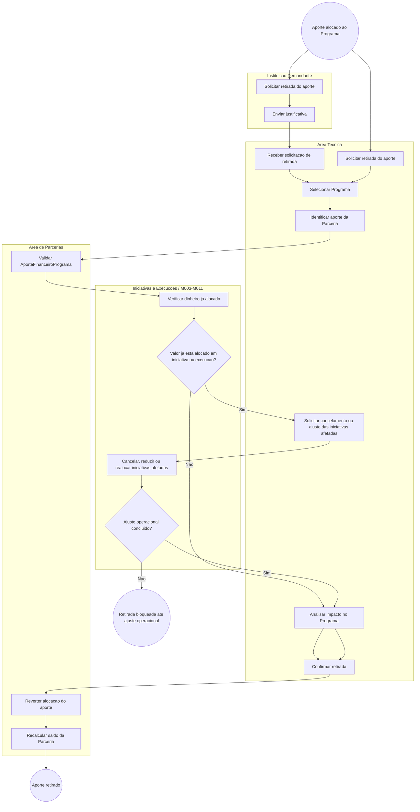
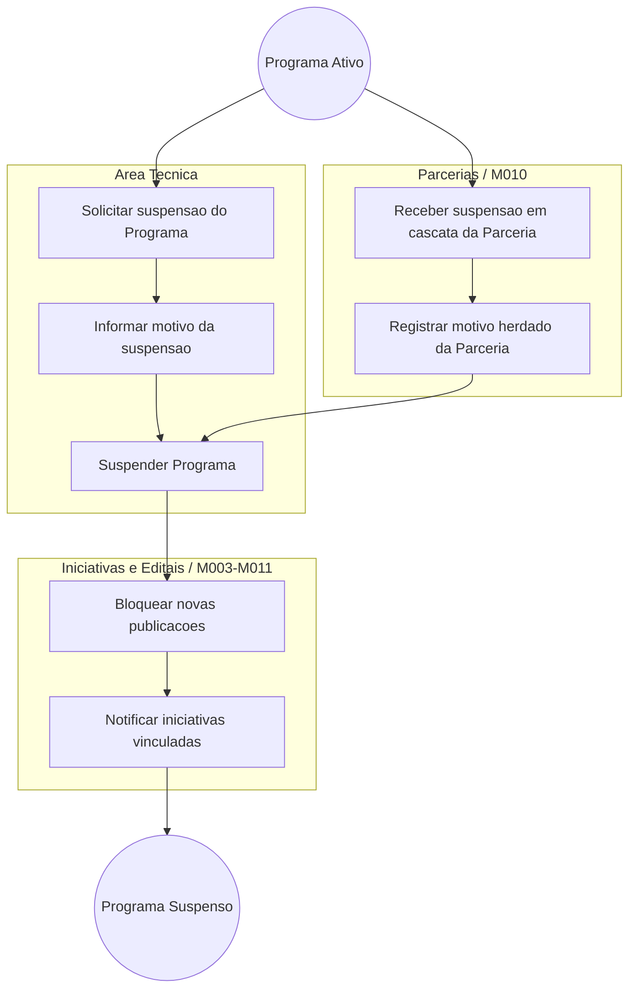
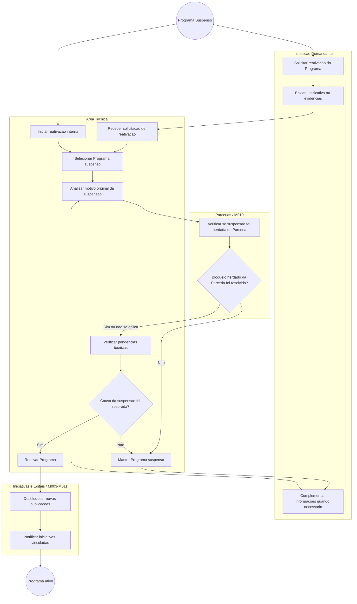
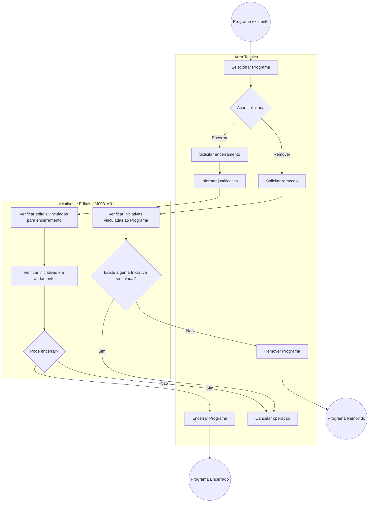
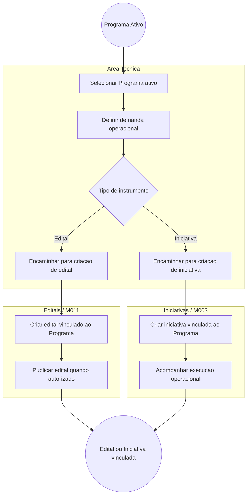
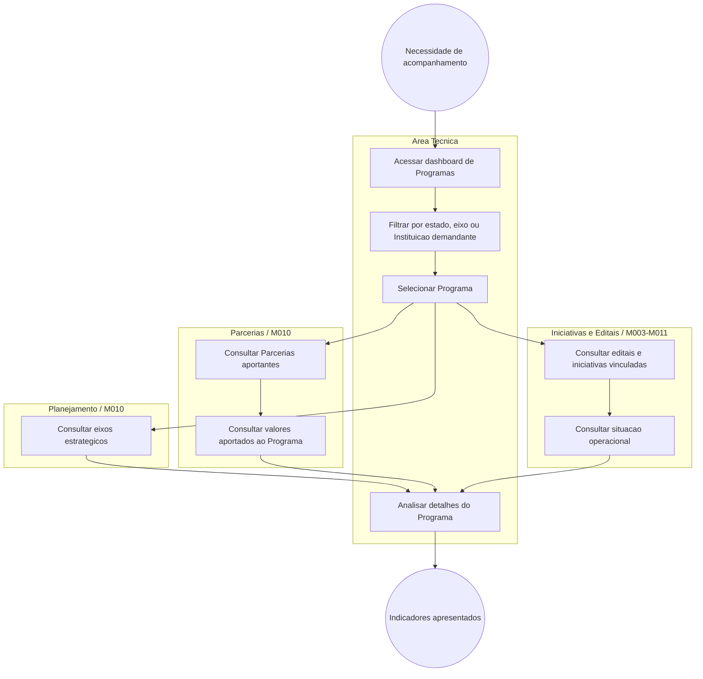

# Processo — Programas

[← Voltar ao M010](../README.md) | [Estrutural](modelo-estrutural.md) | [Comportamental](modelo-comportamental.md)

---

## Visao Geral

O processo de Programas foi dividido em fluxos independentes para explicitar as principais operacoes do ciclo de vida. Todo Programa possui exatamente uma Instituicao demandante, informada no cadastro e mantida como referencia institucional do Programa.

1. **Criacao e ativacao do Programa** — cadastro inicial, vinculacao a Instituicao demandante, eixos estrategicos e comite de governanca.
2. **Aditivo de tempo do Programa** — alteracao de datas do Programa, preservando a compatibilidade com Parcerias aportantes.
3. **Aditivo financeiro do Programa** — recebimento de aporte de uma ou mais Parcerias por meio de `AporteFinanceiroPrograma`.
4. **Retirada de aporte de Parceria do Programa** — remocao ou estorno de uma alocacao financeira quando ainda nao houver execucao vinculada.
5. **Suspensao do Programa** — interrupcao temporaria por decisao da Area Tecnica ou por cascata de Parceria.
6. **Reativacao do Programa** — retorno do Programa suspenso para `ATIVO` apos a resolucao da causa de suspensao.
7. **Encerramento ou remocao do Programa** — finalizacao do Programa ou remocao em caso permitido.
8. **Execucao operacional do Programa** — criacao ou vinculacao de editais e iniciativas a partir de um Programa ativo.
9. **Acompanhamento do Programa** — consulta de indicadores, aportes, eixos, comite e iniciativas vinculadas.

---

## Fluxo 1 — Criacao e Ativacao do Programa

Este fluxo inicia quando a Area Tecnica cria um Programa de fomento. O Programa nasce em `EM_PLANEJAMENTO` e so pode ser ativado quando possui exatamente uma Instituicao demandante, pelo menos um eixo estrategico e comite de governanca definido.

### Atividades da criacao

| # | Atividade | Responsavel | Resultado |
|---|-----------|-------------|-----------|
| 1 | Cadastrar Programa | Area Tecnica | Programa criado em `EM_PLANEJAMENTO`. |
| 2 | Informar Instituicao demandante | Area Tecnica | Programa vinculado a exatamente uma Instituicao demandante; o cadastro sem Instituicao ou com mais de uma Instituicao deve ser rejeitado. |
| 3 | Selecionar eixos estrategicos | Area Tecnica / Planejamento | Programa associado a pelo menos um eixo estrategico. |
| 4 | Informar periodo do Programa | Area Tecnica | Datas de inicio e fim registradas. |
| 5 | Cadastrar Comite de Governanca | Area Tecnica | Comite e membros definidos. |
| 6 | Ativar Programa | Area Tecnica | Programa transita para `ATIVO` e fica apto a orientar editais e iniciativas. |

---

## Fluxo 2 — Aditivo de Tempo do Programa

Este fluxo trata a alteracao do periodo do Programa a partir de uma solicitacao da Instituicao demandante. Quando o Programa ja recebeu aportes de Parcerias, a nova data de inicio e a nova data de fim precisam permanecer dentro da vigencia corrente de todas as Parcerias aportantes.

### Atividades do aditivo de tempo

| # | Atividade | Responsavel | Resultado |
|---|-----------|-------------|-----------|
| 1 | Solicitar aditivo de tempo | Instituicao Demandante | Pedido de alteracao de prazo iniciado pela Instituicao que demanda o Programa. |
| 2 | Enviar justificativa e novo periodo | Instituicao Demandante | Motivo e datas desejadas encaminhados para analise. |
| 3 | Selecionar Programa | Area Tecnica | Programa identificado para alteracao. |
| 4 | Analisar justificativa e periodo | Area Tecnica | Solicitacao validada do ponto de vista operacional. |
| 5 | Validar Parcerias aportantes | Parcerias / M010 | Verificacao da compatibilidade temporal com as Parcerias que aportam no Programa. |
| 6 | Confirmar alteracao | Area Tecnica | Periodo atualizado quando as regras forem atendidas. |

---

## Fluxo 3 — Aditivo Financeiro do Programa

Este fluxo trata o recebimento de recursos de uma Parceria a partir de uma solicitacao da Instituicao demandante. O Programa nao recebe uma relacao direta com Parceria; o vinculo financeiro e criado por `AporteFinanceiroPrograma`. Um Programa pode receber aportes de mais de uma Parceria.

### Atividades do aditivo financeiro

| # | Atividade | Responsavel | Resultado |
|---|-----------|-------------|-----------|
| 1 | Solicitar aditivo financeiro | Instituicao Demandante | Pedido de reforco financeiro iniciado pela Instituicao que demanda o Programa. |
| 2 | Enviar justificativa e valor solicitado | Instituicao Demandante | Motivo e valor desejado encaminhados para analise. |
| 3 | Selecionar Programa | Area Tecnica | Programa que recebera o aporte identificado. |
| 4 | Analisar justificativa e valor | Area Tecnica | Solicitacao validada do ponto de vista tecnico. |
| 5 | Selecionar Parceria vigente | Area de Parcerias | Parceria aportante identificada. |
| 6 | Validar saldo da Parceria | Area de Parcerias | Garante que a alocacao nao deixa saldo negativo. |
| 7 | Validar periodo do Programa | Area de Parcerias | Garante que o Programa esta dentro da vigencia da Parceria aportante. |
| 8 | Registrar `AporteFinanceiroPrograma` | Area de Parcerias | Recurso alocado ao Programa com rastreabilidade da origem. |
| 9 | Recalcular saldo da Parceria | Area de Parcerias | Saldo disponivel da Parceria atualizado. |

---

## Fluxo 4 — Retirada de Aporte de Parceria do Programa

Este fluxo trata a retirada de um `AporteFinanceiroPrograma`. A retirada pode ser solicitada pela Instituicao Demandante ou pela Area Tecnica. A retirada direta so e permitida quando o valor ainda nao foi alocado em iniciativas ou outras execucoes vinculadas ao Programa. Quando o dinheiro ja estiver alocado, a retirada deve ser bloqueada ate que as iniciativas afetadas sejam canceladas, reduzidas ou realocadas formalmente.

O principal impacto e financeiro-operacional: a retirada devolve saldo para a Parceria e reduz o total disponivel do Programa. Pode haver impacto de tempo quando a retirada exigir cancelamento ou replanejamento de iniciativas, pois o Programa pode precisar suspender publicacoes ou revisar seu cronograma antes de concluir a retirada.

### Atividades da retirada de aporte

| # | Atividade | Responsavel | Resultado |
|---|-----------|-------------|-----------|
| 1 | Solicitar retirada do aporte | Instituicao Demandante ou Area Tecnica | Pedido formalizado com justificativa. |
| 2 | Identificar aporte da Parceria | Area Tecnica / Area de Parcerias | `AporteFinanceiroPrograma` localizado no Programa. |
| 3 | Verificar dinheiro ja alocado | M003-M011 | Confirma se o valor foi comprometido em iniciativa ou execucao vinculada. |
| 4 | Bloquear retirada quando houver alocacao | Area Tecnica | Retirada direta impedida enquanto houver dinheiro alocado em iniciativas ou execucoes vinculadas. |
| 5 | Cancelar, reduzir ou realocar iniciativas afetadas | M003-M011 | Ajuste operacional realizado antes da retirada financeira. |
| 6 | Reverter alocacao do aporte | Area de Parcerias | Aporte retirado do Programa e saldo devolvido a Parceria. |
| 7 | Recalcular saldo da Parceria | Area de Parcerias | Saldo disponivel da Parceria atualizado. |
| 8 | Revisar impacto no cronograma | Area Tecnica | Cronograma do Programa e iniciativas afetadas e ajustado quando necessario. |

---

## Fluxo 5 — Suspensao do Programa

Este fluxo cobre a interrupcao temporaria do Programa. A suspensao pode ser solicitada diretamente pela Area Tecnica ou herdada da suspensao de uma Parceria aportante. Enquanto suspenso, o Programa nao deve gerar novas publicacoes ou novas execucoes vinculadas.

### Atividades da suspensao

| # | Atividade | Responsavel | Resultado |
|---|-----------|-------------|-----------|
| 1 | Solicitar suspensao | Area Tecnica ou Parcerias / M010 | Pedido de suspensao registrado. |
| 2 | Informar motivo | Area Tecnica ou Parcerias / M010 | Motivo proprio ou herdado da Parceria registrado. |
| 3 | Suspender Programa | Area Tecnica | Programa transita para `SUSPENSO`. |
| 4 | Bloquear novas publicacoes | M003-M011 | Novos editais, iniciativas ou execucoes vinculadas ficam bloqueados. |
| 5 | Notificar iniciativas vinculadas | M003-M011 | Areas responsaveis sao informadas da suspensao. |

---

## Fluxo 6 — Reativacao do Programa

Este fluxo trata o retorno de um Programa suspenso para `ATIVO`. A reativacao pode ser solicitada pela Instituicao demandante ou pela Area Tecnica. Quando a suspensao foi herdada de uma Parceria, o Programa so pode ser reativado depois que a Parceria aportante tambem estiver reativada ou nao estiver mais bloqueando a execucao.

### Atividades da reativacao

| # | Atividade | Responsavel | Resultado |
|---|-----------|-------------|-----------|
| 1 | Solicitar reativacao | Instituicao Demandante ou Area Tecnica | Pedido de retorno do Programa recebido. |
| 2 | Enviar justificativa ou evidencias | Instituicao Demandante | Comprovacao de que a causa da suspensao foi tratada. |
| 3 | Analisar motivo original | Area Tecnica | Contexto da suspensao recuperado para decisao. |
| 4 | Verificar Parcerias aportantes | Parcerias / M010 | Suspensao herdada so permite reativacao se a Parceria aportante estiver ativa ou sem bloqueio. |
| 5 | Verificar pendencias tecnicas | Area Tecnica | Confirma que nao ha impedimentos operacionais para retorno. |
| 6 | Reativar Programa | Area Tecnica | Programa transita para `ATIVO`. |
| 7 | Desbloquear publicacoes | M003-M011 | Editais e iniciativas vinculadas voltam a aceitar novas operacoes quando aplicavel. |

---

## Fluxo 7 — Encerramento ou Remocao do Programa

Este fluxo trata o encerramento definitivo do Programa e a remocao em caso de erro de cadastro. O encerramento preserva historico; a remocao pode ocorrer sem impacto quando o Programa nao possui nenhuma Iniciativa vinculada. Se ja existe Iniciativa vinculada, o Programa nao deve ser removido: deve ser encerrado para preservar a rastreabilidade operacional e financeira.

### Atividades de encerramento ou remocao

| # | Atividade | Responsavel | Resultado |
|---|-----------|-------------|-----------|
| 1 | Selecionar Programa | Area Tecnica | Programa identificado para encerramento ou remocao. |
| 2 | Informar justificativa | Area Tecnica | Motivo do encerramento registrado. |
| 3 | Verificar editais e iniciativas | M003-M011 | Bloqueios operacionais identificados antes do encerramento. |
| 4 | Encerrar Programa | Area Tecnica | Programa transita para `ENCERRADO` e preserva historico. |
| 5 | Remover Programa | Area Tecnica | Programa removido sem impacto quando nao possui nenhuma Iniciativa vinculada. |

---

## Fluxo 8 — Execucao Operacional do Programa

Este fluxo representa o uso do Programa ativo como base para editais e iniciativas. O Programa nao executa o edital em si, mas orienta e autoriza a criacao de instrumentos operacionais nos modulos responsaveis.

### Atividades da execucao operacional

| # | Atividade | Responsavel | Resultado |
|---|-----------|-------------|-----------|
| 1 | Selecionar Programa ativo | Area Tecnica | Programa apto a orientar editais e iniciativas. |
| 2 | Definir demanda operacional | Area Tecnica | Necessidade de edital ou iniciativa identificada. |
| 3 | Criar edital vinculado | M011 | Edital associado ao Programa. |
| 4 | Criar iniciativa vinculada | M003 | Iniciativa associada ao Programa. |
| 5 | Acompanhar execucao | Area Tecnica / M003-M011 | Situacao operacional refletida no acompanhamento do Programa. |

---

## Fluxo 9 — Acompanhamento do Programa

Este fluxo representa a consulta de gestao do Programa. Ele consolida informacoes de planejamento, governanca, aportes recebidos, saldo financeiro vinculado a Parcerias e iniciativas/editais associados.

### Atividades de acompanhamento

| # | Atividade | Responsavel | Resultado |
|---|-----------|-------------|-----------|
| 1 | Acessar dashboard | Area Tecnica | Visao consolidada dos Programas por estado. |
| 2 | Filtrar Programas | Area Tecnica | Lista refinada por estado, eixo ou Instituicao demandante. |
| 3 | Consultar aportes | Area Tecnica / Parcerias | Valores aportados por Parceria exibidos com rastreabilidade. |
| 4 | Consultar editais e iniciativas | Area Tecnica / M003-M011 | Situacao operacional do Programa apresentada. |
| 5 | Analisar detalhes | Area Tecnica | Base para decisao de aditivo, suspensao, reativacao ou encerramento. |

## Referencia de Regras

Regras aplicaveis aos fluxos de Programas: `RN01`, `RN02`, `RN11`, `RN13`, `RN14`, `RN16`, `RI1`, `RI2`, `RI4`. As definicoes oficiais ficam em [M010 — Regras de Negocio](../README.md#regras-de-negocio-consolidadas).
