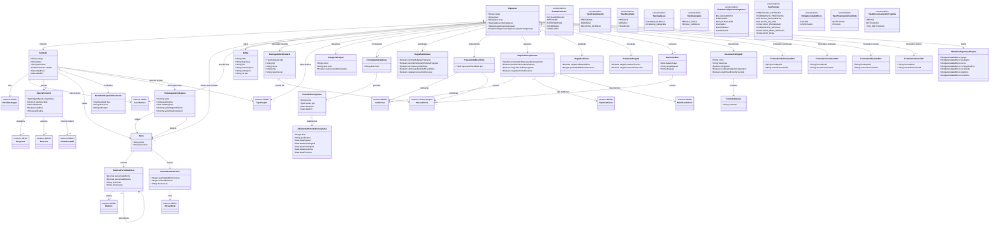

# Diagrama de Classes

```mermaid
classDiagram
    direction TB

    class Fomento {
        +String codigo
        +String titulo
        +String descricao
        +EstadoFomento estado
        +Date dataInicio
        +Date dataFim
    }

    class AporteFomento {
        +TipoOrigemAporte origemTipo
        +Decimal valorAportado
        +Date dataAporte
        +Boolean isAditivo
        +String justificativa
    }

    class Faixa {
        +String nome
        +String descricao
    }

    class RubricaPermitidaFaixa {
        +Decimal percentualMinimo
        +Decimal percentualMaximo
        +String restricoes
        +String observacao
    }

    class BolsaPermitidaFaixa {
        +Integer quantidadeMinimaCotas
        +Integer minimoBolsistas
        +String observacao
    }

    class ResultadoEsperadoFomento {
        +TipoResultado tipo
        +String descricao
        +String indicador
    }

    class RemanejamentoFaixas {
        +Decimal valor
        +String justificativa
        +Date dataRegistro
        +Decimal valorOrigemAnterior
        +Decimal valorDestinoAnterior
    }

    class Captacao {
        +String codigo
        +String titulo
        +String descricao
        +TipoCaptacao tipoCaptacao
        +TipoOutorgado tipoOutorgado
        +EstadoConfiguracaoCaptacao estadoConfiguracao
    }

    class Edital {
        +String titulo
        +String descricao
        +String link
        +String nomeArquivo
        +String urlArquivo
        +String versao
    }

    class OutorgadoDestinatario {
        +TipoOutorgado tipo
        +String cpf
        +String nome
        +String cnpj
        +String razaoSocial
    }

    class CategoriaProjeto {
        +String nome
        +String descricao
        +Boolean selecionavelNoCadastro
    }

    class MatrizConfiguracaoProjeto {
        +ObrigatoriedadeBloco equipe
        +ObrigatoriedadeBloco resultados
        +ObrigatoriedadeBloco riscos
        +ObrigatoriedadeBloco cronogramaProj
        +ObrigatoriedadeBloco orcamento
        +ObrigatoriedadeBloco objetivos
        +ObrigatoriedadeBloco beneficios
    }

    class CronogramaCaptacao {
        +String descricao
    }

    class PeriodoCronograma {
        +String nome
        +TipoPeriodo tipo
        +Date dataInicio
        +Date dataFim
    }

    class AdiamentoPeriodoCronograma {
        +Integer dias
        +String justificativa
        +Date dataRegistro
        +Date dataInicioOriginal
        +Date dataFimOriginal
        +Date dataInicioNova
        +Date dataFimNova
    }

    class RegraSubmissao {
        +Boolean permiteMultiplasPropostas
        +Boolean permiteParticiparEmOutraProposta
        +Boolean permiteAcumularBolsa
        +Boolean submissaoRestritaAEscolhidos
        +Boolean exigeAprovacaoInstitucional
    }

    class ProponenteEscolhido {
        +TipoProponenteEscolhido tipo
    }

    class RequisitoProponente {
        +TipoDirecionamentoProposta direcionamento
        +Boolean permiteParceriaInstituicoes
        +Boolean exigeVinculoEmpregaticio
        +Boolean exigeGestorInstitucional
    }

    class RegraAvaliacao {
        +Boolean exigeAvaliacaoAdHoc
        +Integer quantidadeMinimaRevisores
    }

    class PrestacaoExigida {
        +Boolean exigePrestacaoTecnica
        +Boolean exigePrestacaoFinanceira
    }

    class RevisorAdHoc {
        +Date dataInclusao
        +String areaAtuacao
        +String titulacao
    }

    class DocumentoExigido {
        +String nome
        +String descricao
        +Boolean obrigatorio
        +Boolean reutilizarCadastroCorporativo
        +Boolean exigirNovoEnvioSeVencido
    }

    class FormatoArquivo {
        +String extensao
    }

    class FormularioSubmissaoRef {
        +String formularioId
        +String versaoFormularioId
    }

    class FormularioAvaliacaoRef {
        +String formularioId
        +String versaoFormularioId
    }

    class FormularioRevisaoRef {
        +String formularioId
        +String versaoFormularioId
    }

    class FormularioAnexoRef {
        +String formularioId
        +String versaoFormularioId
    }

    class EstadoFomento {
        <<enumeration>>
        EM_ELABORACAO
        APROVADO
        INTERROMPIDO
        ENCERRADO
        CONCLUIDO
    }

    class TipoOrigemAporte {
        <<enumeration>>
        PROGRAMA
        PARCERIA
        RECURSO_INTERNO
    }

    class TipoResultado {
        <<enumeration>>
        PRODUTO
        SERVICO
        PROCESSO
    }

    class TipoCaptacao {
        <<enumeration>>
        CHAMADA_PUBLICA
        DEMANDA_INDUZIDA
    }

    class TipoOutorgado {
        <<enumeration>>
        PESSOA_FISICA
        PESSOA_JURIDICA
    }

    class EstadoConfiguracaoCaptacao {
        <<enumeration>>
        EM_ANDAMENTO
        PUBLICADO
        NAO_PUBLICADO
        PAUSADO
        ENCERRADO
        CANCELADO
    }

    class TipoPeriodo {
        <<enumeration>>
        PUBLICACAO_CAPTACAO
        RECEBIMENTO_PROPOSTAS
        AVALIACAO_DOCUMENTAL
        AVALIACAO_AD_HOC
        RESULTADO_PRELIMINAR
        RECEBIMENTO_REVISAO
        RESULTADO_APOS_REVISAO
        RESULTADO_FINAL
    }

    class ObrigatoriedadeBloco {
        <<enumeration>>
        EXIGIDO
        DISPENSADO
    }

    class TipoProponenteEscolhido {
        <<enumeration>>
        INSTITUICAO
        PESSOA
    }

    class TipoDirecionamentoProposta {
        <<enumeration>>
        ABERTA
        INSTITUICAO
        TIPO_INSTITUICAO
    }

    class Programa {
        <<externo M010>>
    }

    class Parceria {
        <<externo M010>>
    }

    class EixoEstrategico {
        <<externo M010>>
    }

    class AreaTecnica {
        <<externo M008>>
    }

    class TipoProjeto {
        <<externo M008>>
    }

    class Rubrica {
        <<externo M008>>
    }

    class Instituicao {
        <<externo M008>>
    }

    class TipoInstituicao {
        <<externo M008>>
    }

    class NivelAcademico {
        <<externo M008>>
    }

    class PessoaFisica {
        <<externo shared.people>>
    }

    class VersaoNivel {
        <<externo M001>>
    }

    class ContaContabil {
        <<externo M016>>
    }

    Fomento "1" --> "1" EixoEstrategico : eixo
    Fomento "1" --> "1" AreaTecnica : area tecnica
    Fomento "1" --> "1..*" AporteFomento : aportes
    Fomento "1" --> "1..*" Faixa : faixas
    Fomento "1" --> "*" ResultadoEsperadoFomento : resultados
    Fomento "1" --> "*" RemanejamentoFaixas : remanejamentos
    Fomento "*" --> "1" TipoProjeto : tipos de projeto
    AporteFomento "*" --> "0..1" Programa : programa
    AporteFomento "*" --> "0..1" Parceria : parceria
    AporteFomento "*" --> "0..1" ContaContabil : recurso interno
    Faixa "1" --> "*" RubricaPermitidaFaixa : rubricas
    Faixa "1" --> "*" BolsaPermitidaFaixa : bolsas
    RubricaPermitidaFaixa "*" --> "1" Rubrica : rubrica
    RubricaPermitidaFaixa "0..1" --> "*" RubricaPermitidaFaixa : subrubricas
    BolsaPermitidaFaixa "*" --> "1" VersaoNivel : nivel
    RemanejamentoFaixas "*" --> "1" Faixa : origem
    RemanejamentoFaixas "*" --> "1" Faixa : destino

    Captacao "1" --> "1" Fomento : fomento
    Captacao "1" --> "1..*" Faixa : faixas selecionadas
    Captacao "1" --> "1" AreaTecnica : area tecnica
    Captacao "1" --> "1" Edital : edital
    Captacao "1" --> "0..1" OutorgadoDestinatario : demanda induzida
    Captacao "1" --> "1..*" TipoProjeto : tipos aceitos
    Captacao "1" --> "1..*" CategoriaProjeto : categorias
    Captacao "1" --> "1" CronogramaCaptacao : cronograma
    Captacao "1" --> "1" RegraSubmissao : submissao
    Captacao "1" --> "*" ProponenteEscolhido : proponentes
    Captacao "1" --> "1" RequisitoProponente : requisitos
    Captacao "1" --> "1" RegraAvaliacao : avaliacao
    Captacao "1" --> "1" PrestacaoExigida : prestacao
    Captacao "1" --> "1..*" RevisorAdHoc : revisores
    Captacao "1" --> "*" DocumentoExigido : documentos
    Captacao "1" --> "1" FormularioSubmissaoRef : formulario submissao
    Captacao "1" --> "1" FormularioAvaliacaoRef : formulario avaliacao
    Captacao "1" --> "1" FormularioRevisaoRef : formulario revisao
    Captacao "1" --> "0..1" FormularioAnexoRef : formulario anexos
    Captacao "1" --> "1" MatrizConfiguracaoProjeto : matriz

    CronogramaCaptacao "1" --> "8" PeriodoCronograma : periodos
    PeriodoCronograma "1" --> "*" AdiamentoPeriodoCronograma : adiamentos
    OutorgadoDestinatario "0..1" --> "1" PessoaFisica : contato PF
    ProponenteEscolhido "*" --> "0..1" Instituicao : instituicao
    ProponenteEscolhido "*" --> "0..1" PessoaFisica : pessoa
    RequisitoProponente "0..1" --> "1" Instituicao : instituicao
    RequisitoProponente "0..1" --> "1" TipoInstituicao : tipo instituicao
    RequisitoProponente "0..1" --> "1" NivelAcademico : nivel minimo
    DocumentoExigido "*" --> "*" FormatoArquivo : formatos
    RevisorAdHoc "*" --> "1" PessoaFisica : pessoa
```
